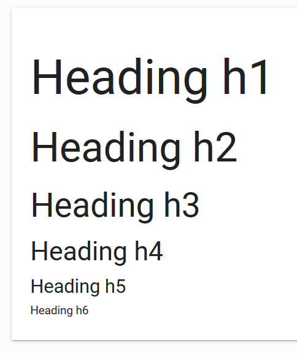
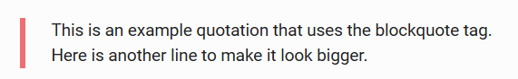

# Roboto2.0字体

Material Design使用的标准字体是Roboto。我们已经在我们的框架中包括了字体文件。

# 标题

框架修改了`<h1>`至`<h6>`的样式，使其显示效果更好。



# 引用

```html
<blockquote>
  This is an example quotation that uses the blockquote tag.
</blockquote>
```



# 响应式问题

flowtext能够让文字根据屏幕自动调整大小。

```html
<p class="flow-text">I am Flow Text</p>
```
