# 徽章

徽章是一个辅助提示信息，如：提示有4条新消息，就用一个徽章显示出来。

```html
<div class="collection">
  <a href="#!" class="collection-item"><span class="badge">1</span>Alan</a>
  <a href="#!" class="collection-item"><span class="new badge">4</span>Alan</a>
  <a href="#!" class="collection-item">Alan</a>
  <a href="#!" class="collection-item"><span class="badge">14</span>Alan</a>
</div>
```

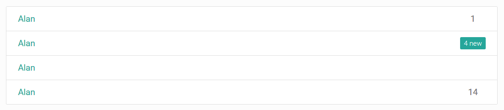

## 定制徽章文字

直接在html元素上使用`data-badge-caption`属性设置徽章的显示文字。

```html
<span class="new badge red" data-badge-caption="hello">4</span>
```

注意：上面代码中还指定了颜色为红色。

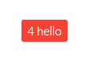

# 按钮

`btn`指定了按钮。

## 按钮水波纹

按钮可以用`waves-effect`指定点击水波纹效果。

```html
<a class="waves-effect waves-orange btn">button</a>
<a class="waves-effect waves-light btn red">button</a>
```

注意：

1. 按钮也可以直接指定颜色。
2. 除了`waves-light`，`waves-orange`，还有若干水波纹效果可选。

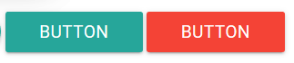

## 浮起按钮

注意，浮起按钮就是圆形的，通常用来调出系统菜单。

```html
<a class="waves-effect waves-orange btn">button</a>
<a class="waves-effect waves-light btn red btn-floating"><i class="material-icons">add</i></a>
<a class="waves-effect waves-light btn yellow">button</a>
```

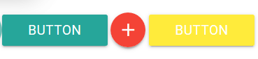

浮起按钮通常悬浮在页面右下角，不随页面滚动而滚动。框架直接提供了一个浮起菜单的完整实现，可以这样指定：

```html
<div class="fixed-action-btn">
  <a class="btn-floating btn-large red">
    <i class="large material-icons">mode_edit</i>
  </a>
  <ul>
    <li><a class="btn-floating red"><i class="material-icons">insert_chart</i></a></li>
    <li><a class="btn-floating yellow darken-1"><i class="material-icons">format_quote</i></a></li>
    <li><a class="btn-floating green"><i class="material-icons">publish</i></a></li>
    <li><a class="btn-floating blue"><i class="material-icons">attach_file</i></a></li>
  </ul>
</div>
```

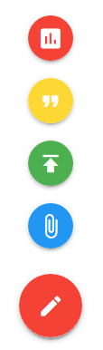

鼠标悬停在红色按钮上，能够直接呼出按钮菜单。

除此之外，上面代码里菜单是竖直的，也可以使用水平菜单：

```html
<div class="fixed-action-btn horizontal">
```

还可以指定，点击才呼出菜单，而不是鼠标悬停：

```html
<div class="fixed-action-btn horizontal click-to-toggle">
```

## 大按钮

btn-large指定较大的按钮。

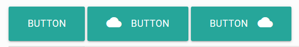

## 按钮禁用

CSS属性disabled可以禁用按钮。

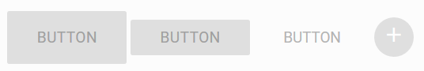

# 路径条

```html

<nav>
  <div class="nav-wrapper">
    <div class="col s12">
      <a href="#!" class="breadcrumb">First</a>
      <a href="#!" class="breadcrumb">Second</a>
      <a href="#!" class="breadcrumb">Third</a>
    </div>
  </div>
</nav>
```

用于显示路径层级。

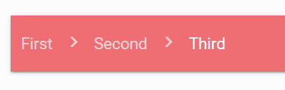

# 卡片

## 基本卡片

```html
<div class="row">
  <div class="col s12 m6">
    <div class="card blue-grey darken-1">
      <div class="card-content white-text">
        <span class="card-title">Card Title</span>
        <p>I am a very simple card. I am good at containing small bits of information.
        I am convenient because I require little markup to use effectively.</p>
      </div>
      <div class="card-action">
        <a href="#">This is a link</a>
        <a href="#">This is a link</a>
      </div>
    </div>
  </div>
</div>
```

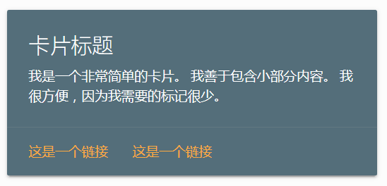

## 图像卡片

```html
<div class="row">
  <div class="col s12 m7">
    <div class="card">
      <div class="card-image">
        
        <span class="card-title">Card Title</span>
      </div>
      <div class="card-content">
        <p>I am a very simple card. I am good at containing small bits of information.
        I am convenient because I require little markup to use effectively.</p>
      </div>
      <div class="card-action">
        <a href="#">This is a link</a>
      </div>
    </div>
  </div>
</div>
```

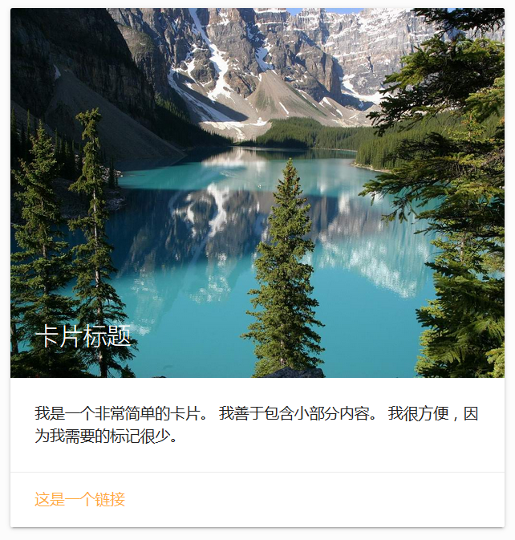

## 带悬浮按钮的图像卡片

```html
<div class="row">
  <div class="col s12 m6">
    <div class="card">
      <div class="card-image">
        
        <span class="card-title">Card Title</span>
        <a class="btn-floating halfway-fab waves-effect waves-light red"><i class="material-icons">add</i></a>
      </div>
      <div class="card-content">
        <p>I am a very simple card. I am good at containing small bits of information. I am convenient because I require little markup to use effectively.</p>
      </div>
    </div>
  </div>
</div>
```

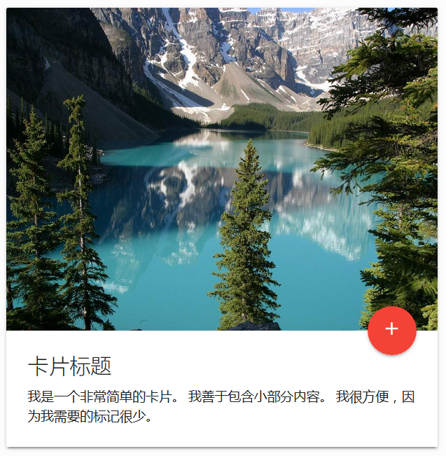

## 水平卡片

```html
<div class="col s12 m7">
  <h2 class="header">Horizontal Card</h2>
  <div class="card horizontal">
    <div class="card-image">
      
    </div>
    <div class="card-stacked">
      <div class="card-content">
        <p>I am a very simple card. I am good at containing small bits of information.</p>
      </div>
      <div class="card-action">
        <a href="#">This is a link</a>
      </div>
    </div>
  </div>
</div>
```

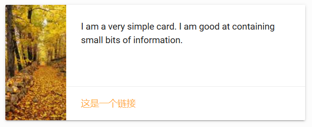

## 带弹出式文字的卡片

```html
<div class="card">
  <div class="card-image waves-effect waves-block waves-light">
    
  </div>
  <div class="card-content">
    <span class="card-title activator grey-text text-darken-4">Card Title<i class="material-icons right">more_vert</i></span>
    <p><a href="#">This is a link</a></p>
  </div>
  <div class="card-reveal">
    <span class="card-title grey-text text-darken-4">Card Title<i class="material-icons right">close</i></span>
    <p>Here is some more information about this product that is only revealed once clicked on.</p>
  </div>
</div>
```


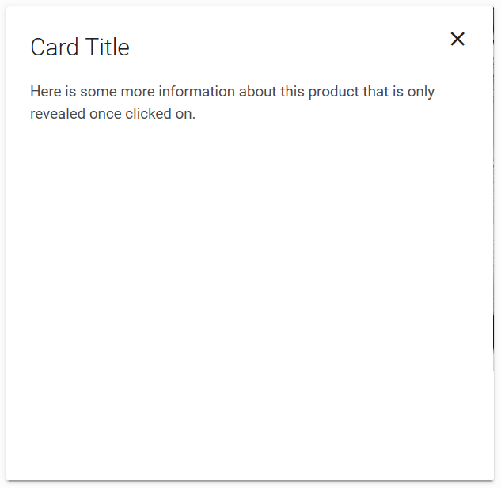

## 带tab的卡片

```html
<div class="card">
  <div class="card-content">
    <p>I am a very simple card. I am good at containing small bits of information. I am convenient because I require little markup to use effectively.</p>
  </div>
  <div class="card-tabs">
    <ul class="tabs tabs-fixed-width">
      <li class="tab"><a href="#test4">Test 1</a></li>
      <li class="tab"><a class="active" href="#test5">Test 2</a></li>
      <li class="tab"><a href="#test6">Test 3</a></li>
    </ul>
  </div>
  <div class="card-content grey lighten-4">
    <div id="test4">Test 1</div>
    <div id="test5">Test 2</div>
    <div id="test6">Test 3</div>
  </div>
</div>
```

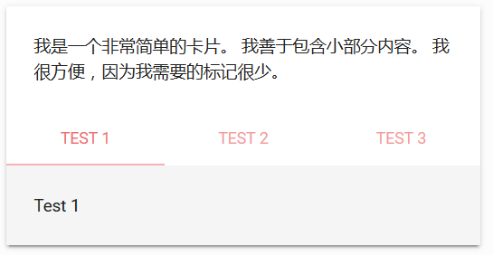

## card-panel

card-panel是一个简洁的卡片，只带有内容。

```html
<div class="row">
  <div class="col s12 m5">
    <div class="card-panel teal">
      <span class="white-text">I am a very simple card. I am good at containing small bits of information.
      I am convenient because I require little markup to use effectively. I am similar to what is called a panel in other frameworks.
      </span>
    </div>
  </div>
</div>
```

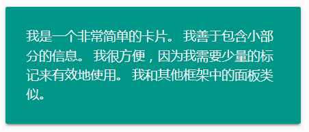

# 薯片

比如笔记软件的标签，其实就是薯片（chip）。

```html
<div class="chip">
  Tag
  <i class="close material-icons">close</i>
</div>
```

注意close，它使得该chip能关闭。

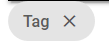


# 表格

表格默认有一套无边框样式。

```html
<table>
  <thead>
    <tr>
        <th>Name</th>
        <th>Item Name</th>
        <th>Item Price</th>
    </tr>
  </thead>

  <tbody>
    <tr>
      <td>Alvin</td>
      <td>Eclair</td>
      <td>$0.87</td>
    </tr>
    <tr>
      <td>Alan</td>
      <td>Jellybean</td>
      <td>$3.76</td>
    </tr>
    <tr>
      <td>Jonathan</td>
      <td>Lollipop</td>
      <td>$7.00</td>
    </tr>
  </tbody>
</table>
```

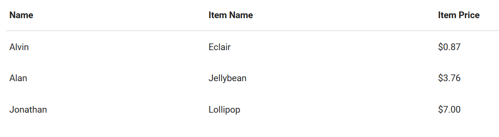

## 其他表格样式

`bordered`属性能使表格带边框。

```html
<table class="bordered">
```

`striped`使表格带条纹。

```html
<table class="striped">
```

`highlight`使鼠标滑过有反应。

```html
<table class="highlight">
```

`centered`使表格内容中心对齐。

```html
<table class="centered">
```

`responsive-table`使表格大小自动调整。

```html
<table class="responsive-table">
```

# 列表

列表是一组`<ul>`。具有`collection`和`collection-item`。

```html
<ul class="collection">
  <li class="collection-item">Alvin</li>
  <li class="collection-item">Alvin</li>
  <li class="collection-item">Alvin</li>
  <li class="collection-item">Alvin</li>
</ul>
```

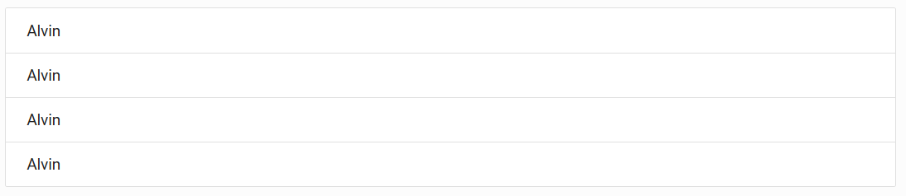

## div和a可以组成链接组

```html
<div class="collection">
  <a href="#!" class="collection-item">Alvin</a>
  <a href="#!" class="collection-item active">Alvin</a>
  <a href="#!" class="collection-item">Alvin</a>
  <a href="#!" class="collection-item">Alvin</a>
</div>
```

注意active添加了一种激活的样式。

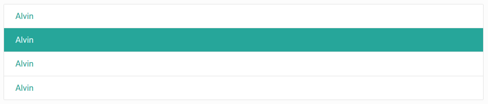

## 列表大标题

```html
<ul class="collection with-header">
  <li class="collection-header"><h4>First Names</h4></li>
  <li class="collection-item">Alvin</li>
  <li class="collection-item">Alvin</li>
  <li class="collection-item">Alvin</li>
  <li class="collection-item">Alvin</li>
</ul>
```

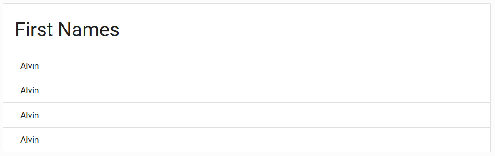

## 列表次要内容

```html
<ul class="collection with-header">
  <li class="collection-header"><h4>First Names</h4></li>
  <li class="collection-item"><div>Alvin<a href="#!" class="secondary-content"><i class="material-icons">send</i></a></div></li>
  <li class="collection-item"><div>Alvin<a href="#!" class="secondary-content"><i class="material-icons">send</i></a></div></li>
  <li class="collection-item"><div>Alvin<a href="#!" class="secondary-content"><i class="material-icons">send</i></a></div></li>
  <li class="collection-item"><div>Alvin<a href="#!" class="secondary-content"><i class="material-icons">send</i></a></div></li>
</ul>
```

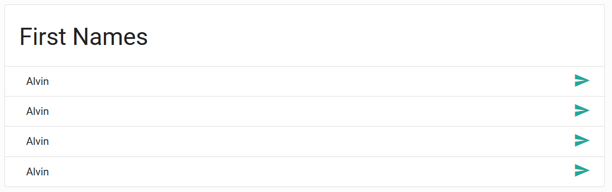

# 页面底部

```html
<footer class="page-footer">
  <div class="container">
    <div class="row">
      <div class="col l6 s12">
        <h5 class="white-text">Footer Content</h5>
        <p class="grey-text text-lighten-4">You can use rows and columns here to organize your footer content.</p>
      </div>
      <div class="col l4 offset-l2 s12">
        <h5 class="white-text">Links</h5>
        <ul>
          <li><a class="grey-text text-lighten-3" href="#!">Link 1</a></li>
          <li><a class="grey-text text-lighten-3" href="#!">Link 2</a></li>
          <li><a class="grey-text text-lighten-3" href="#!">Link 3</a></li>
          <li><a class="grey-text text-lighten-3" href="#!">Link 4</a></li>
        </ul>
      </div>
    </div>
  </div>
  <div class="footer-copyright">
    <div class="container">
    © 2014 Copyright Text
    <a class="grey-text text-lighten-4 right" href="#!">More Links</a>
    </div>
  </div>
</footer>
```

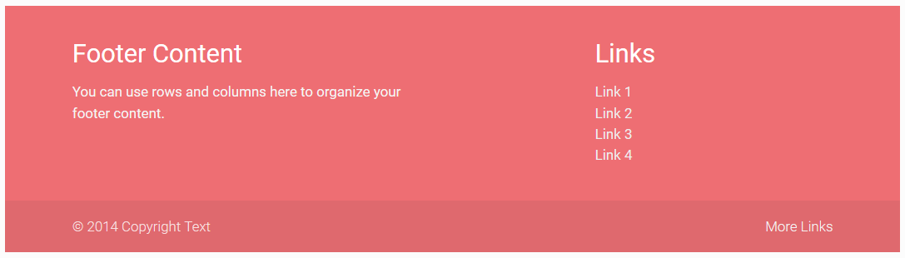

# 图标

前面例子一直在使用。

例如
```html
<i class="material-icons">add</i>
```

其效果就是一个加号，一般用在悬浮按钮上。

# 分页按钮

```html
<ul class="pagination">
  <li class="disabled"><a href="#!"><i class="material-icons">chevron_left</i></a></li>
  <li class="active"><a href="#!">1</a></li>
  <li class="waves-effect"><a href="#!">2</a></li>
  <li class="waves-effect"><a href="#!">3</a></li>
  <li class="waves-effect"><a href="#!">4</a></li>
  <li class="waves-effect"><a href="#!">5</a></li>
  <li class="waves-effect"><a href="#!"><i class="material-icons">chevron_right</i></a></li>
</ul>
```

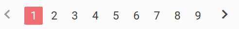

# 进度条

## 线性进度条

```html
<div class="progress">
    <div class="determinate" style="width: 70%"></div>
</div>
```

```html
<div class="progress">
    <div class="indeterminate"></div>
</div>
```

`determinate`就是确定进度的进度条，`indeterminate`则会一直滚动。

## 环形进度条

```html
<div class="preloader-wrapper big active">
  <div class="spinner-layer spinner-blue-only">
    <div class="circle-clipper left">
      <div class="circle"></div>
    </div><div class="gap-patch">
      <div class="circle"></div>
    </div><div class="circle-clipper right">
      <div class="circle"></div>
    </div>
  </div>
</div>
```

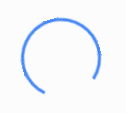

环形进度条只能是自动转动的。

* big指定了大小，不指定为中型，small为小型
* spinner-blue-only指定为蓝色，还可以指定红色，绿色。
* 如果颜色指定为spinner-blue，表示初始颜色是蓝色，但转动时颜色是变化的。
