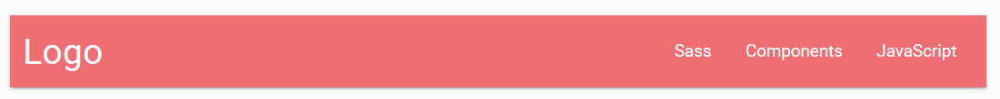
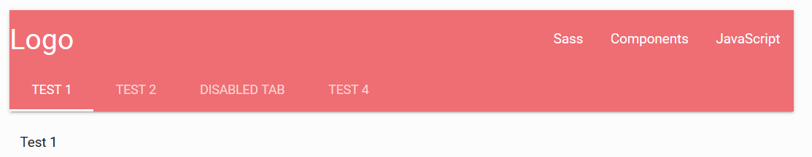
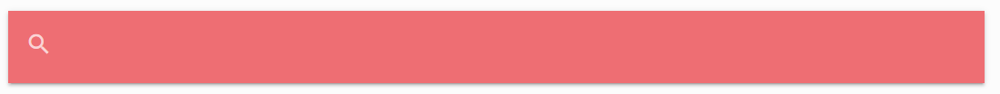
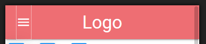

# 导航条

注意：导航条不要放进`container`。否则会显示错误。

## 右对齐式导航条

```html
<nav>
  <div class="nav-wrapper">
    <a href="#" class="brand-logo">Logo</a>
    <ul id="nav-mobile" class="right hide-on-med-and-down">
      <li><a href="sass.html">Sass</a></li>
      <li><a href="badges.html">Components</a></li>
      <li><a href="collapsible.html">JavaScript</a></li>
    </ul>
  </div>
</nav>
```



如果给`<li>`标签加上`class="active"`那个链接就会变成选中状态。

## 自带标签页的导航栏

```html
<nav class="nav-extended">
  <div class="nav-wrapper">
    <a href="#" class="brand-logo">Logo</a>
    <a href="#" data-activates="mobile-demo" class="button-collapse"><i class="material-icons">menu</i></a>
    <ul id="nav-mobile" class="right hide-on-med-and-down">
      <li><a href="sass.html">Sass</a></li>
      <li><a href="badges.html">Components</a></li>
      <li><a href="collapsible.html">JavaScript</a></li>
    </ul>
    <ul class="side-nav" id="mobile-demo">
      <li><a href="sass.html">Sass</a></li>
      <li><a href="badges.html">Components</a></li>
      <li><a href="collapsible.html">JavaScript</a></li>
    </ul>
  </div>
  <div class="nav-content">
    <ul class="tabs tabs-transparent">
      <li class="tab"><a href="#test1">Test 1</a></li>
      <li class="tab"><a class="active" href="#test2">Test 2</a></li>
      <li class="tab disabled"><a href="#test3">Disabled Tab</a></li>
      <li class="tab"><a href="#test4">Test 4</a></li>
    </ul>
  </div>
</nav>
<div id="test1" class="col s12">Test 1</div>
<div id="test2" class="col s12">Test 2</div>
<div id="test3" class="col s12">Test 3</div>
<div id="test4" class="col s12">Test 4</div>
```



下方的四个div可以被自动切换。

## 顶部固定的导航

```html
<div class="navbar-fixed">
  <nav>
    <div class="nav-wrapper">
      <a href="#!" class="brand-logo">Logo</a>
      <ul class="right hide-on-med-and-down">
        <li><a href="sass.html">Sass</a></li>
        <li><a href="badges.html">Components</a></li>
      </ul>
    </div>
  </nav>
</div>
```

`navbar-fixed`指定了顶部固定。

## 带下拉菜单的导航

```html
<!-- Dropdown Structure -->
<ul id="dropdown1" class="dropdown-content">
  <li><a href="#!">one</a></li>
  <li><a href="#!">two</a></li>
  <li class="divider"></li>
  <li><a href="#!">three</a></li>
</ul>
<nav>
  <div class="nav-wrapper">
    <a href="#!" class="brand-logo">Logo</a>
    <ul class="right hide-on-med-and-down">
      <li><a href="sass.html">Sass</a></li>
      <li><a href="badges.html">Components</a></li>
      <!-- Dropdown Trigger -->
      <li><a class="dropdown-button" href="#!" data-activates="dropdown1">Dropdown<i class="material-icons right">arrow_drop_down</i></a></li>
    </ul>
  </div>
</nav>
```

```javascript
$(document).ready(function ()
{
  $(".dropdown-button").dropdown();
});
```

注意`id="dropdown1"`，和`data-activates`属性的对应。不要忘记初始化的JavaScript代码。

## 带搜索框的导航

```html
<nav>
  <div class="nav-wrapper">
    <form>
      <div class="input-field">
        <input id="search" type="search" required>
        <label class="label-icon" for="search"><i class="material-icons">search</i></label>
        <i class="material-icons">close</i>
      </div>
    </form>
  </div>
</nav>
```



## 响应式布局的搜索框

```html
<nav>
  <div class="nav-wrapper">
    <a href="#!" class="brand-logo">Logo</a>
    <a href="#" data-activates="mobile-demo" class="button-collapse"><i class="material-icons">menu</i></a>
    <ul class="right hide-on-med-and-down">
      <li><a href="sass.html">Sass</a></li>
      <li><a href="badges.html">Components</a></li>
      <li><a href="collapsible.html">Javascript</a></li>
      <li><a href="mobile.html">Mobile</a></li>
    </ul>
    <ul class="side-nav" id="mobile-demo">
      <li><a href="sass.html">Sass</a></li>
      <li><a href="badges.html">Components</a></li>
      <li><a href="collapsible.html">Javascript</a></li>
      <li><a href="mobile.html">Mobile</a></li>
    </ul>
  </div>
</nav>
```

```javascript
$(document).ready(function ()
{
  $(".button-collapse").sideNav();
});
```

注意：必须加上这句代码进行初始化，否则侧滑菜单不会生效。



小屏幕和中屏幕，导航栏会缩短，并显示一个按钮。点击会显示侧滑菜单。
