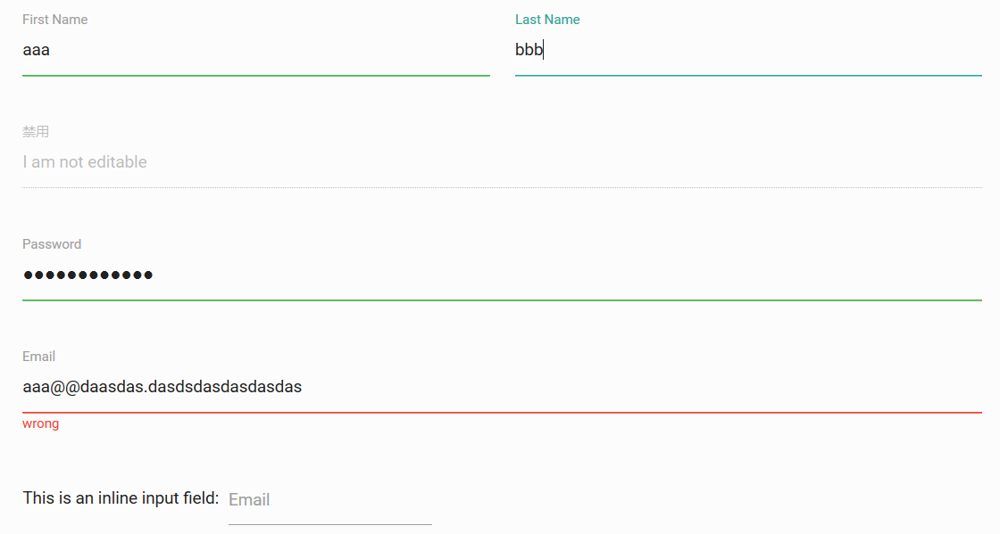
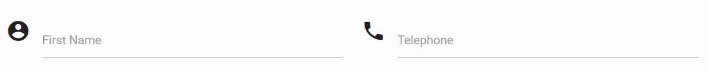
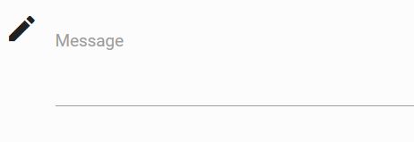
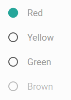
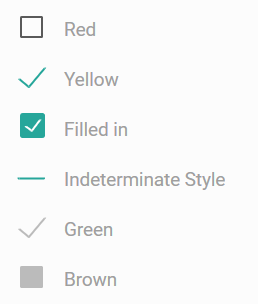
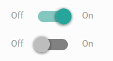
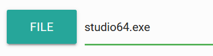
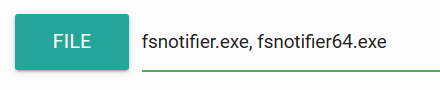
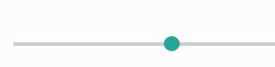
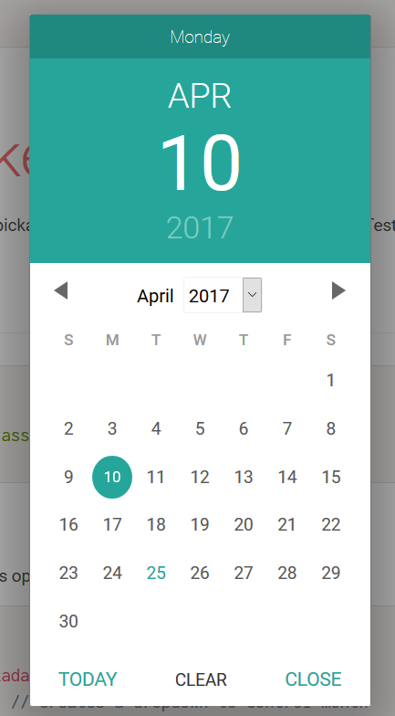

# 表单

## 输入框

```html
<div class="row">
  <form class="col s12">
    <div class="row">
      <div class="input-field col s6">
        <input placeholder="Placeholder" id="first_name" type="text" class="validate">
        <label for="first_name">First Name</label>
      </div>
      <div class="input-field col s6">
        <input id="last_name" type="text" class="validate">
        <label for="last_name">Last Name</label>
      </div>
    </div>
    <div class="row">
      <div class="input-field col s12">
        <input disabled value="I am not editable" id="disabled" type="text" class="validate">
        <label for="disabled">Disabled</label>
      </div>
    </div>
    <div class="row">
      <div class="input-field col s12">
        <input id="password" type="password" class="validate">
        <label for="password">Password</label>
      </div>
    </div>
    <div class="row">
      <div class="input-field col s12">
        <input id="email" type="email" class="validate">
        <label for="email">Email</label>
      </div>
    </div>
    <div class="row">
      <div class="col s12">
        This is an inline input field:
        <div class="input-field inline">
          <input id="email" type="email" class="validate">
          <label for="email" data-error="wrong" data-success="right">Email</label>
        </div>
      </div>
    </div>
  </form>
</div>
```



上面代码中，输入框结合了栅格系统。每个输入框以`input-field`包裹，注意`<label>`是必须的，而且标签上有动画效果。

注意`validate`，它结合了html5的验证功能，如果验证出错，输入框会自动变红。

### 自定义验证提示信息

```html
<div class="row">
  <form class="col s12">
    <div class="row">
      <div class="input-field col s12">
        <input id="email" type="email" class="validate">
        <label for="email" data-error="wrong" data-success="right">Email</label>
      </div>
    </div>
  </form>
</div>
```

`data-error`和`data-success`定义了自动校验的提示信息。

### 预装填的输入框

例如用户注册时，注册失败表单要回显数据，这时可能发现输入框的内容被`<label>`盖住了，这需要在label上使用`class="active"`激活该输入框。

```javascript
Materialize.updateTextFields();
```

这句代码可以重新初始化所有`<label>`状态。

### 带图标的输入框

```html
<div class="row">
  <form class="col s12">
    <div class="row">
      <div class="input-field col s6">
        <i class="material-icons prefix">account_circle</i>
        <input id="icon_prefix" type="text" class="validate">
        <label for="icon_prefix">First Name</label>
      </div>
      <div class="input-field col s6">
        <i class="material-icons prefix">phone</i>
        <input id="icon_telephone" type="tel" class="validate">
        <label for="icon_telephone">Telephone</label>
      </div>
    </div>
  </form>
</div>
```



`prefix`指定了图标是输入框的提示标签。

## 文本域

```html
<div class="row">
  <form class="col s12">
    <div class="row">
      <div class="input-field col s12">
        <textarea id="textarea1" class="materialize-textarea"></textarea>
        <label for="textarea1">Textarea</label>
      </div>
    </div>
  </form>
</div>
```


文本域能够自动加长。

```javascript
$('#textarea1').val('New Text');
$('#textarea1').trigger('autoresize');
```

注意：如果使用JQuery改变了文本域的值，必须使用上述代码重新初始化文本域的显示效果。

### 带图标前缀的文本域

```html
<div class="row">
  <form class="col s12">
    <div class="row">
      <div class="input-field col s6">
        <i class="material-icons prefix">mode_edit</i>
        <textarea id="icon_prefix2" class="materialize-textarea"></textarea>
        <label for="icon_prefix2">First Name</label>
      </div>
    </div>
  </form>
</div>
```



### 输入框和文本域的最大长度限制

```html
<div class="row">
  <form class="col s12">
    <div class="row">
      <div class="input-field col s6">
        <input id="input_text" type="text" data-length="10">
        <label for="input_text">Input text</label>
      </div>
    </div>
    <div class="row">
      <div class="input-field col s12">
        <textarea id="textarea1" class="materialize-textarea" data-length="120"></textarea>
        <label for="textarea1">Textarea</label>
      </div>
    </div>
  </form>
</div>
```

注意`data-length`，限制了输入框和文本域的最大长度。使用这个属性，会在输入框下方显示一个计数器。

## 下拉选框

```html
<!--普通的下拉选择框-->
<div class="input-field col s12">
	<select>
		<option value="" disabled selected>Choose your option</option>
		<option value="1">Option 1</option>
		<option value="2">Option 2</option>
		<option value="3">Option 3</option>
	</select>
	<label>Materialize Select</label>
</div>
<!--多选下拉选框-->
<div class="input-field col s12">
	<select multiple>
		<option value="" disabled selected>Choose your option</option>
		<option value="1">Option 1</option>
		<option value="2">Option 2</option>
		<option value="3">Option 3</option>
	</select>
	<label>Materialize Multiple Select</label>
</div>
<!--分组下拉选框-->
<div class="input-field col s12">
	<select multiple>
		<optgroup label="team 1">
			<option value="1">Option 1</option>
			<option value="2">Option 2</option>
		</optgroup>
		<optgroup label="team 2">
			<option value="3">Option 3</option>
			<option value="4">Option 4</option>
		</optgroup>
	</select>
	<label>Optgroups</label>
</div>
<!--带圆形图片的下拉选框-->
<div class="input-field col s12 m6">
	<select class="icons">
		<option value="" disabled selected>Choose your option</option>
		<option value="" data-icon="images/sample-1.jpg" class="circle">example 1</option>
		<option value="" data-icon="images/office.jpg" class="circle">example 2</option>
		<option value="" data-icon="images/yuna.jpg" class="circle">example 3</option>
	</select>
	<label>Images in select</label>
</div>
<!--带圆形图片的下拉选框-->
<div class="input-field col s12 m6">
	<select class="icons">
		<option value="" disabled selected>Choose your option</option>
		<option value="" data-icon="images/sample-1.jpg" class="left circle">example 1</option>
		<option value="" data-icon="images/office.jpg" class="left circle">example 2</option>
		<option value="" data-icon="images/yuna.jpg" class="left circle">example 3</option>
	</select>
	<label>Images in select</label>
</div>
<!--浏览器风格的下拉选框-->
<label>Browser Select</label>
<select class="browser-default">
	<option value="" disabled selected>Choose your option</option>
	<option value="1">Option 1</option>
	<option value="2">Option 2</option>
	<option value="3">Option 3</option>
</select>
```

注意：不要忘记初始化，否则显示一团糟。

```javascript
$(document).ready(function ()
{
  $(document).ready(function() {
    $('select').material_select();
  });
});
```

除此之外，在select上加disabled，可以禁用这个下拉选框。通过JavaScript代码更改下拉选框内容后，也必须重新初始化下拉选框。

## 单选按钮

```html
<form action="#">
  <p>
    <input name="group1" type="radio" id="test1" />
    <label for="test1">Red</label>
  </p>
  <p>
    <input name="group1" type="radio" id="test2" />
    <label for="test2">Yellow</label>
  </p>
  <p>
    <input class="with-gap" name="group1" type="radio" id="test3"  />
    <label for="test3">Green</label>
  </p>
  <p>
    <input name="group1" type="radio" id="test4" disabled="disabled" />
    <label for="test4">Brown</label>
  </p>
</form>
```



注意，`<label>`是必须的。

## 多选按钮

```html
<form action="#">
  <p>
    <input type="checkbox" id="test5" />
    <label for="test5">Red</label>
  </p>
  <p>
    <input type="checkbox" id="test6" checked="checked" />
    <label for="test6">Yellow</label>
  </p>
  <p>
    <input type="checkbox" class="filled-in" id="filled-in-box" checked="checked" />
    <label for="filled-in-box">Filled in</label>
  </p>
  <p>
    <input type="checkbox" id="indeterminate-checkbox" />
    <label for="indeterminate-checkbox">Indeterminate Style</label>
  </p>
  <p>
    <input type="checkbox" id="test7" checked="checked" disabled="disabled" />
    <label for="test7">Green</label>
  </p>
  <p>
    <input type="checkbox" id="test8" disabled="disabled" />
    <label for="test8">Brown</label>
  </p>
</form>
```



## 开关

```html
<!-- Switch -->
<div class="switch">
  <label>
    Off
    <input type="checkbox">
    <span class="lever"></span>
    On
  </label>
</div>

<!-- Disabled Switch -->
<div class="switch">
  <label>
    Off
    <input disabled type="checkbox">
    <span class="lever"></span>
    On
  </label>
</div>
```



## 文件上传框

### 文件上传单选

```html
<form action="#">
  <div class="file-field input-field">
    <div class="btn">
      <span>File</span>
      <input type="file">
    </div>
    <div class="file-path-wrapper">
      <input class="file-path validate" type="text">
    </div>
  </div>
</form>
```



### 文件上传多选

```html
<form action="#">
  <div class="file-field input-field">
    <div class="btn">
      <span>File</span>
      <input type="file" multiple>
    </div>
    <div class="file-path-wrapper">
      <input class="file-path validate" type="text" placeholder="Upload one or more files">
    </div>
  </div>
</form>
```



## 滑动条

```html
<form action="#">
  <p class="range-field">
    <input type="range" id="test5" min="0" max="100" />
  </p>
</form>
```



## 日期选择器

```html
<input type="date" class="datepicker">
```

```javascript
$('.datepicker').pickadate({
  selectMonths: true, // 创建下拉菜单控制月份
  selectYears: 15 // 年的选择范围是15年
});
```


