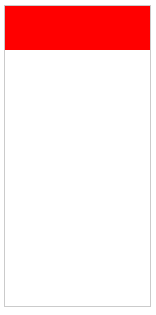

# DIV固定宽高比

实际开发中，可能遇到这样一种奇怪的需求：要求一个包裹在父元素中的`<div>`保持一个固定的宽高比，比如固定宽高比为`3:1`。



## CSS实现

实际上，这种情况不需要用JavaScript来手动计算，CSS可以实现。下面是一个例子：

```html
<div class="container">
    <div class="app"></div>
</div>
```

```css
.container {
    width: 30%;
    height: 300px;
    border: 1px solid #cbcbcb;
}

.app {
    width: 100%;
    padding-top: 30%;
    background-color: red;
}
```

大家可能会很惊讶，`padding-top`为什么会根据宽度而不是高度来计算呢？但事实就是这样。
