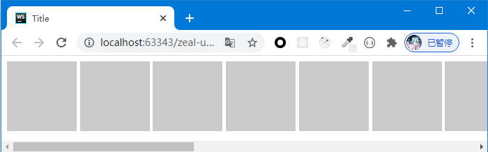

# 内联元素禁止换行

当我们的容器中有多个`display`为`inline`或`inline-block`的元素时，它们默认会自动换行，但有时，在多级的布局时，这可能造成未预期的换行问题，此时我们不希望自动换行发生，希望它们能够强制保持同一行。

可以为外层元素指定一个`white-space: nowrap;`，下面是一个例子：

```html
<!DOCTYPE html>
<html lang="en">
<head>
    <meta charset="UTF-8">
    <title>Title</title>
</head>
<style>
    .container {
        white-space: nowrap;
    }

    .item {
        display: inline-block;
        width: 100px;
        height: 100px;
        background-color: #cbcbcb;
    }
</style>
<body>
<div class="container">
    <div class="item"></div>
    <div class="item"></div>
    <div class="item"></div>
    <div class="item"></div>
    <div class="item"></div>
    <div class="item"></div>
    <div class="item"></div>
    <div class="item"></div>
    <div class="item"></div>
    <div class="item"></div>
    <div class="item"></div>
    <div class="item"></div>
    <div class="item"></div>
    <div class="item"></div>
    <div class="item"></div>
    <div class="item"></div>
    <div class="item"></div>
</div>
</body>
</html>
```


