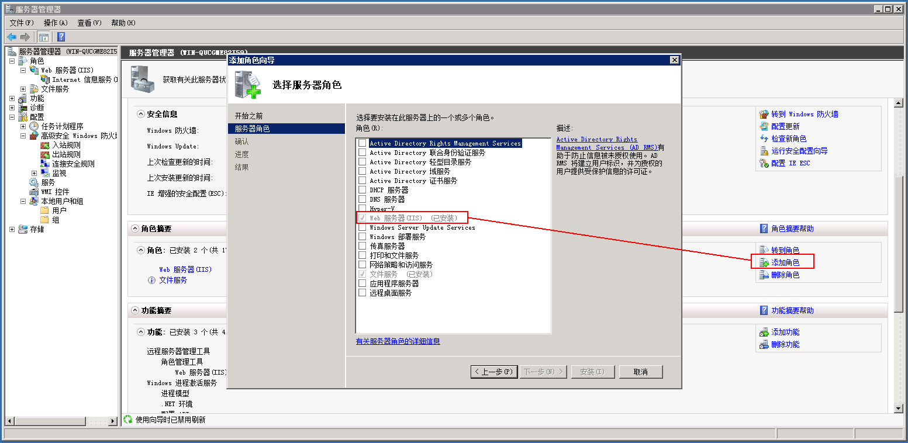
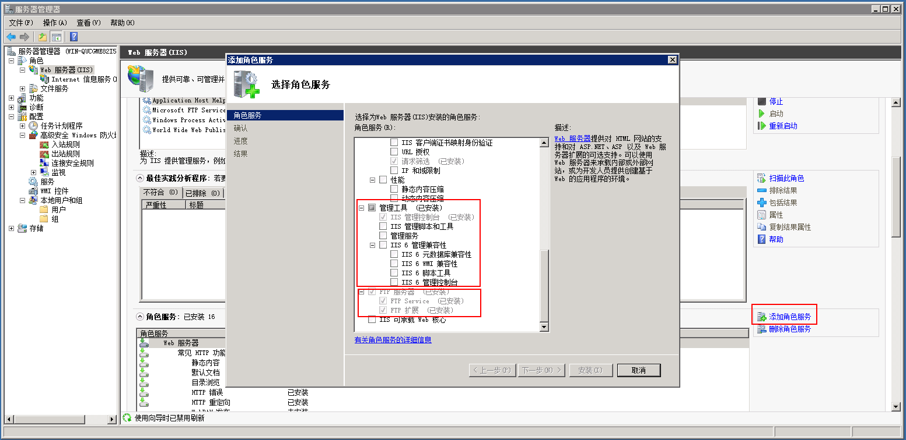
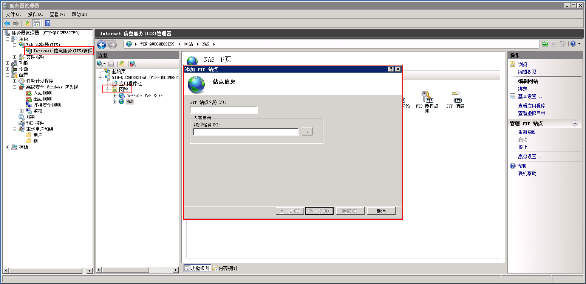
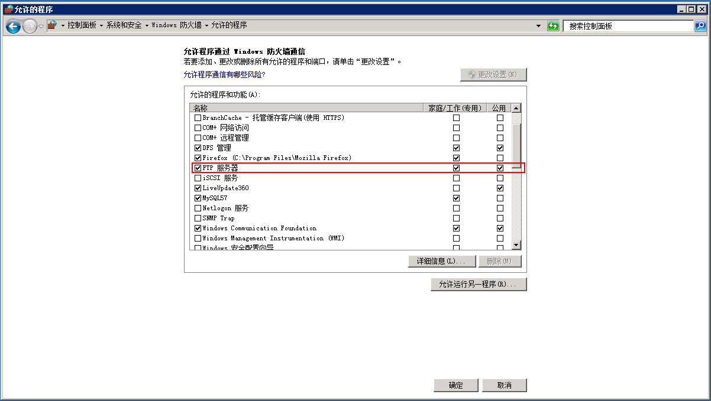
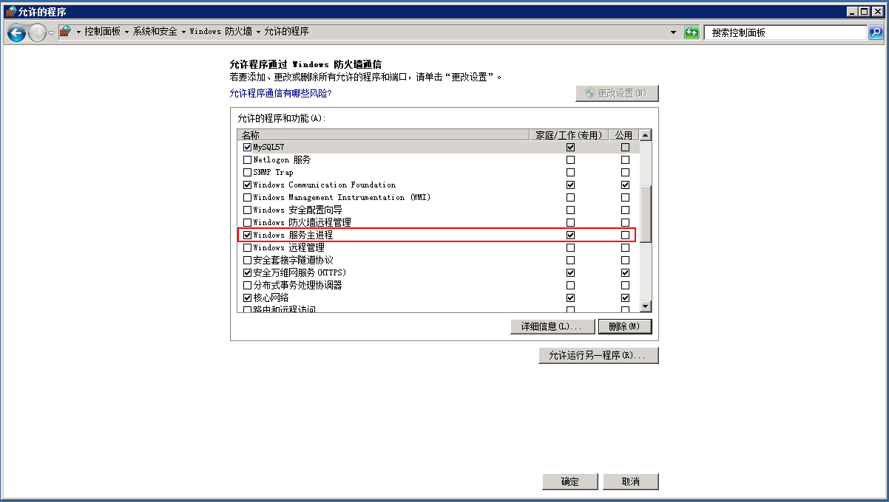
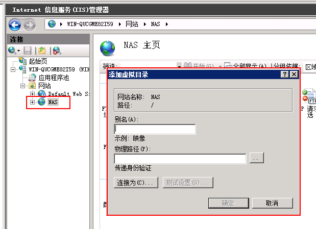

# windows下FTP服务器搭建

这篇笔记记录在Windows Server 2008 R2下，如何搭建FTP服务器，用于文件共享服务。

## 开启FTP服务器功能

首先，我们需要开启IIS服务，在服务器管理器界面中，点击`添加角色`，然后选择`Web服务器（IIS）`。

安装完成后，打开左侧列表的`Web服务器（IIS）`，点击面板右侧的`添加角色服务`，然后安装`IIS管理控制台`和`FTP服务器`，至少安装这两个选项我们才能配置FTP服务器。

完成安装后，点击左侧列表的`Internet信息服务`管理器，然后右击`网站`->`添加FTP站点...`，接下来按要求填写IP等信息，FTP站点就创建完成了。

## 开启FTP服务器后防火墙的设置

安装好FTP服务后，系统会默认设置防火墙，允许FTP服务器联网（下图），但是如果用其他IP访问服务器，就会发现无法连接FTP服务器。

我们需要把`C:\\Windows\System32\svchost.exe`加进防火墙的允许列表。加入后，列表会显示为`Windows 服务主进程`。这样配置后，FTP站点就可以在其他电脑上正常访问了。

## 添加虚拟目录

有时候，我们需要一个FTP站点包括服务器上多个文件夹的内容，而我们创建FTP服务器时，只指定了一个目录，此时添加虚拟目录就行了。在站点上右键选择`添加虚拟目录`，然后按要求填写即可。

例如，我们填写的别名为`aaa`，那么访问FTP服务器的URL改为`ftp://[host]:[port]/aaa`即可访问虚拟目录了。
