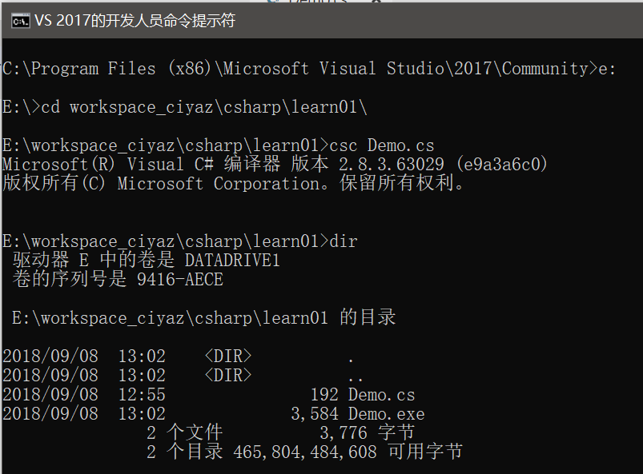
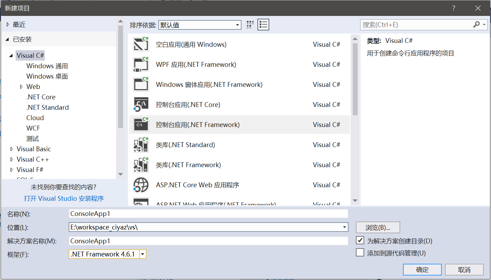

# C#简介和环境搭建

## C#语言简介

C#是微软仿照Java设计的应用程序开发语言，在各个方面都和Java非常神似，而且由于出现晚、应用场景不多、生态圈较小等各种原因，C#没什么历史包袱。发展至今，C#的语言特性比庞大臃肿的Java评价更好。

## .Net Framework简介

C#仅仅是一门语言，而.Net Framework是一个平台，它支持包括C#、VB.Net在内的多种语言，开发时需要用到.Net Framework提供的基础类库，而C#编译器生成的中间代码IL（微软设计的一种中间代码）需要执行在.Net Framework的运行时环境CLR（作用相当于Java中的JVM，但两者不是同一个系统层次的东西）上。这也和Java很相似，Java开发时需要使用JDK，Java、Groovy等多种语言都可以编译成为Java字节码在JVM上执行。

除此之外，开源项目Mono则是兼容.Net Framework的一个跨平台环境，通过Mono能够让.Net程序运行在其他操作系统中。

## .Net Framework和C#的应用场景

.Net Framework主要应用于：

* ASP.Net开发运行于WindowsServer的Web应用程序
* winform、WPF 开发Windows桌面应用程序

尽管有Mono存在可以让.Net程序跨平台运行，但ASP.Net还是由于历史原因被大多数程序员“鄙视”，使用的人少发展就会更加乏力，这是一个恶性循环。再加上中国的情况和国际不太一样，地球使用人数最多的汉语却不是国际交流的通用语言，意味着使用人数较少的技术缺乏中文教程，这也使得这门技术更加的冷门了。但实际上，ASP.Net还是很有学习和参考价值的。

至于Windows桌面应用程序的开发，没什么可说的，如果专用于Windows平台，C#是绝对的首选。如果希望能够跨平台，那么就要考虑Qt或者Java了。至于MFC之类的，现在新项目一般不予考虑了。

目前.Net程序绝大多数都是使用C#语言开发，这也是很多人混淆了.Net和C#关系的原因。实际上，C#作为一门设计优秀的语言，在Java圈子中评价还是非常好的。C#支持的许多特性Java都没有，其实实际上是因为CLR支持的许多特性JVM都不支持，这也造成难以在JVM上实现一个C#，然而Mono出现较晚、应用不多因此大家又都觉得不太靠谱，而Java早已先入为主了，这就造成了C#设计良好却不像Java一样火。微软最新推出了跨平台的.Net Core，它是一个更加现代化的“.Net Framework”，但是似乎也并没有让微软技术栈火起来。

近些年来，微软花大力气推出了Windows Phone但是彻底失败了，微软试图靠WindowsPhone和Windows10中让UWP和Windows应用商店火起来，但是用户并不买账，可以说Windows应用商店也已经凉了，不少用户（包括我）甚至觉得Windows应用商店这个鸡肋把一个好好的桌面操作系统搞得不伦不类，这也造成了C#这门语言的尴尬地位。

## C#开发环境搭建

### 文本编辑器和命令行工具

在学习阶段，我们应该使用文本编辑器编写C#，这样有助于我们了解整个开发的流程：我们编写的应用程序如何从一个个源代码文件编译、打包，成为一个可用于生产环境的应用程序。文本编辑器推荐使用Visual Studio Code，微软自家的编辑器对C#支持非常好。学习时使用的操作系统推荐使用Windows，以免踩坑。

但是不管怎样，我们都要安装Visual Studio，因为我们需要安装编译器等各种工具，Visual Studio包含了这些工具，我们这里安装的是Visual Studio 2017，安装好后，打开“VS 2017的开发人员命令提示符”，从这里打开cmd可以为我们自动设定一些VS2017的环境变量，我们不修改系统的环境变量，因为我们电脑上可能安装了不止一个版本的Visual Studio。

```csharp
using System;

namespace CiyaZ
{
    public class Demo
    {
        static void Main(string[] args)
        {
            Console.WriteLine("Hello, world!");
        }
    }
}
```

`csc`命令可以编译C#源代码文件：



编译完成后会生成一个`exe`文件，直接在控制台中运行即可。如果有多个源代码文件，`csc`后接多个文件名即可。

### 使用Visual Studio

尽管Visual Studio号称地球最好的IDE，但是它给我的印象不太好，主要原因就是配置比较繁琐、混乱，而且许多中文翻译都十分怪异。好在用Visual Studio编写C#还是比较简单的。

这里创建一个Visual C#工程，选用`.Net Framework`。



创建完成后，会自动生成一个`Program.cs`，我们在其上修改，编译运行即可。
