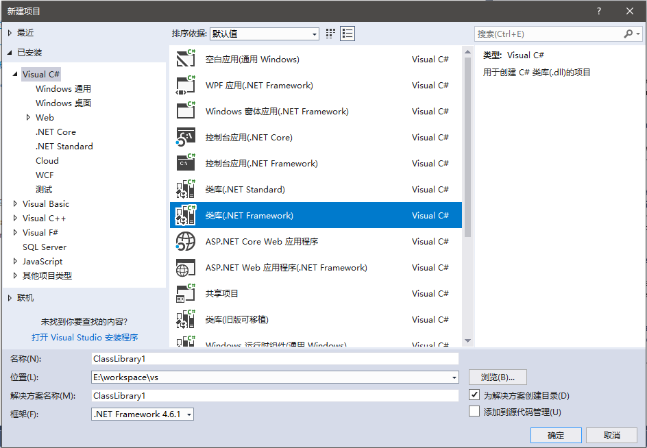
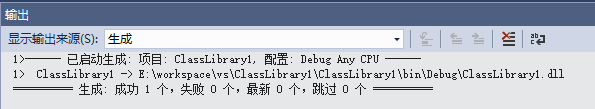
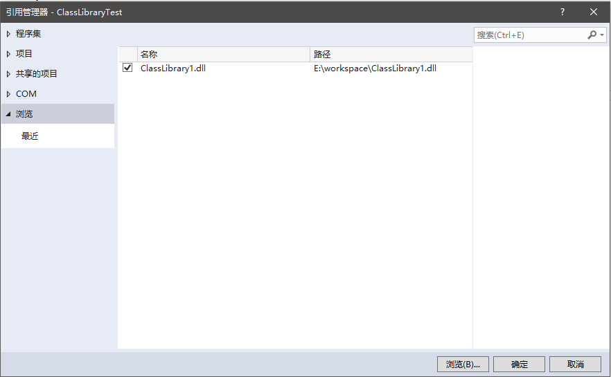

# 构建程序库

本篇笔记记录C#中如何创建和引用dll动态链接库。

## 创建动态链接库

在Visual Studio中可以创建一个类库工程。



下面写一些例子代码，供其他位置调用：

```csharp
using System;

namespace CiyaZ.Demo
{
    public class DemoClass
    {
        public void SayHello()
        {
            Console.WriteLine("Hello, world!");
        }
    }
}
```

构建类库：


类库生成成功的信息：



## 引用动态链接库

创建一个新C#工程，点击`项目`->`添加引用`，选择我们生成好的`dll`文件。



在代码中就可以正常调用了。

```csharp
using CiyaZ.Demo;

namespace ClassLibraryTest
{
    class Program
    {
        static void Main(string[] args)
        {
            DemoClass dc = new DemoClass();
            dc.SayHello();
        }
    }
}
```
