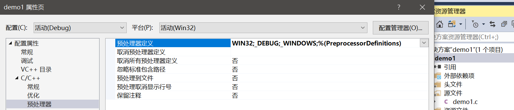
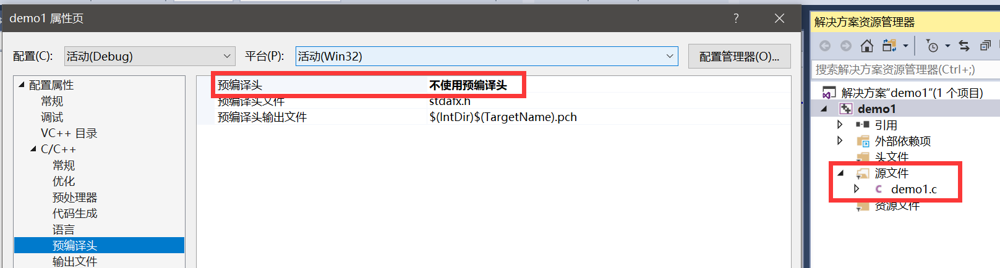

# WindowsAPI简介和环境搭建

本系列笔记的参考书籍是《Windows程序设计 第五版珍藏版》，使用C语言调用Windows操作系统API的方式，对Windows的上层应用架构进行简单的了解。微软的开发环境通常有非常良好的文档，遇到问题查阅MSDN即可。

由于原书作者使用的操作系统还是Windows98，珍藏版出版时现已淘汰的Windows7才刚刚发布，但如今Windows10都已经更新了好几个版本，这里我们使用的开发环境是Windows10和Visual Studio 2017，关于书中对16位兼容的相关内容这里也不再过多提及。

## 使用Visual Studio 2017搭建环境

首先要了解一点，在Visual Studio中创建的`C/C++`项目分为两种：

* 控制台程序
* Windows桌面应用程序

针对这两种项目，Visual Studio会进行不同的编译预处理和链接方式，因此两者编写是有区别的，最明显的不同就是入口函数都不一样。控制台程序的入口函数是`main()`，而桌面程序的入口函数是`WinMain()`。

创建不同的项目时，Visual Studio会生成不同的默认预编译配置：



这里我们新建一个Windows桌面应用程序，然后取消预编译头文件（我们仅仅是写个Demo不要搞太复杂），把自动生成的一堆头文件，C++源文件，资源文件统统删掉，然后创建一个C语言源文件。



## Hello World

下面是书中一个最简单的Windows桌面程序，程序运行弹出一个对话框，显示一些文字信息。

```cpp
#include <windows.h>

int WINAPI WinMain(HINSTANCE hInstance, HINSTANCE hPrevInstance, LPSTR lpCmdLine, int nShowCmd)
{
	MessageBox(NULL, TEXT("Hello, world!"), TEXT("标题"), MB_OK);
	return 0;
}
```


当你点击对话框的确定按钮时，程序会退出。

### windows.h 头文件

这个头文件包含了许多其它头文件，我们引入这个文件就能使用Windows API中的众多函数。

### WinMain 入口函数

* `int`类型的返回值：程序退出的返回值
* `WINAPI`：它是`_stdcall`的宏定义，WindowsAPI的函数约定都是使用`stdcall`形式进行参数传递的

注：`stdcall`是一种函数调用约定，发生函数调用时，其参数从左至右通过栈传递

函数参数：

* hInstance：唯一标识我们程序的句柄
* hPrevInstance：现已不用该参数，永远是NULL，因历史原因保留
* lpCmdLine：运行该程序的命令行参数
* nShowCmd：指定程序起始时如何显示，最大化、正常显示、还是最小化到任务栏

### MessageBox 生成一个对话框

像这种GUI界面的API函数，我们一般查询MSDN文档即可。我们可以在Visual Studio中，在该函数上按`F1`，就会自动打开浏览器，为我们跳转到这个函数的在线文档。

以下是文档中的定义：

```cpp
int MessageBox(
  HWND    hWnd,
  LPCTSTR lpText,
  LPCTSTR lpCaption,
  UINT    uType
);
```

* hWnd：拥有该对话框的父窗口，没有传NULL
* lpText：对话框显示的文字
* lpCaption：对话框的标题
* uType：对话框的行为，文档中有一系列十六进制代码定义了这些行为，如代码中用到的`MB_OK`表示该对话框拥有一个确认按钮，多个行为适用按位与`|`进行连接（Qt中的QMessageBox和这个设计一样）

### TEXT宏

上面代码中，我们还用到了`TEXT`宏，它方便我们在使用Unicode的Windows系统上定义和处理Unicode字符串，如果系统不使用Unicode，定义和API函数处理的则是ANSI字符串。
