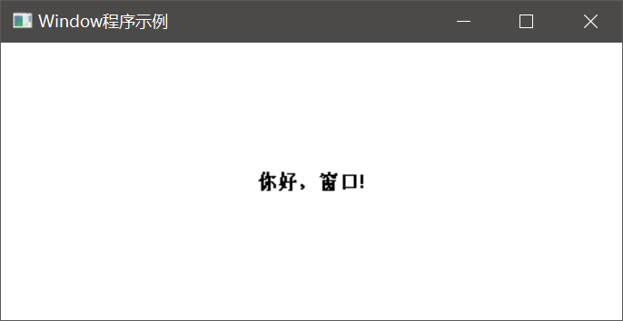

# 初始化窗口

这篇笔记我们直接通过一个略微复杂的例子，概括的展示了Windows的窗口和消息机制如何使用。虽然代码很长，但其实所有代码都是API调用，如果有充足的GUI程序开发经验，结合文档观看并不难理解。

```cpp
#include <windows.h>

// 声明窗口的处理逻辑
LRESULT CALLBACK WndProc(HWND, UINT, WPARAM, LPARAM);

int WINAPI WinMain(HINSTANCE hInstance, HINSTANCE hPrevInstance, LPSTR lpCmdLine, int nCmdShow)
{
	LPCTSTR appName = TEXT("HelloWin");

	// 注册窗口类
	WNDCLASS wndclass;												// 声明WNDCLASS，其为包含窗口许多属性的结构体，具体可参考MSDN
	wndclass.style = CS_HREDRAW | CS_VREDRAW;						// 客户区移动或调整水平大小时重绘 | 客户区移动或调整垂直大小时重绘
	wndclass.lpfnWndProc = WndProc;									// 窗口处理函数的函数指针
	wndclass.cbClsExtra = 0;										// 和下一个参数都用于：窗口结构体后额外多分配若干字节内存（以用于其他用途），一般传0
	wndclass.cbWndExtra = 0;
	wndclass.hInstance = hInstance;									// 传入应用程序的句柄（由WinMain接收）
	wndclass.hIcon = LoadIcon(NULL, IDI_APPLICATION);				// 窗口图标
	wndclass.hCursor = LoadCursor(NULL, IDC_ARROW);					// 窗口光标
	wndclass.hbrBackground = (HBRUSH)GetStockObject(WHITE_BRUSH);	// 用于在窗口中绘制的背景颜色
	wndclass.lpszMenuName = NULL;									// 窗口菜单栏
	wndclass.lpszClassName = appName;								// 窗口类名称
	
	if (!RegisterClass(&wndclass))									// 注册窗口
	{
		MessageBox(NULL, TEXT("This program requires Windows NT!"), appName, MB_ICONERROR);
		return 0;
	}

	// 创建窗口
	HWND hwnd;					// 声明窗口的句柄
	hwnd = CreateWindow(
		appName,				// 窗口类名称
		TEXT("Window程序示例"),	// 窗口标题
		WS_OVERLAPPEDWINDOW,	// 窗口风格
		CW_USEDEFAULT,			// 初始X坐标
		CW_USEDEFAULT,			// 初始Y坐标
		CW_USEDEFAULT,			// 初始宽度
		CW_USEDEFAULT,			// 初始高度
		NULL,					// 父窗口句柄
		NULL,					// 窗口菜单句柄
		hInstance,				// 应用程序实例句柄
		NULL					// 创建参数
	);

	// 显示窗口（窗口句柄，显示参数），hwnd即窗口句柄，nCmdShow用于指定正常显示，最大化显示，还是最小化显示
	ShowWindow(hwnd, nCmdShow);
	
	// 重绘（窗口句柄）
	UpdateWindow(hwnd);

	// 开启消息循环
	MSG msg;								// 窗口接收的消息对象
	while (GetMessage(&msg, NULL, 0, 0))	// 循环接收消息，无消息时阻塞等待
	{
		TranslateMessage(&msg);				// 将虚拟键消息转换为字符消息，一般如此固定写法
		DispatchMessage(&msg);				// 将UI线程的消息分派给窗口
	}
	return msg.wParam;
}

// 窗口的消息处理函数，固定参数：接收消息的窗口句柄，标识消息的数字，后两个参数是消息包含的信息
LRESULT CALLBACK WndProc(HWND hwnd, UINT message, WPARAM wParam, LPARAM lParam)
{
	HDC hdc;
	PAINTSTRUCT ps;
	RECT rect;

	switch (message)
	{
	case WM_PAINT:
		// 收到WM_PAINT消息，调用GDI绘制文字
		hdc = BeginPaint(hwnd, &ps);
		GetClientRect(hwnd, &rect);
		DrawText(hdc, TEXT("你好，窗口!"), -1, &rect,
			DT_SINGLELINE | DT_CENTER | DT_VCENTER);
		EndPaint(hwnd, &ps);
		return 0;
	case WM_DESTROY:
		// 收到WM_DESTROY，即窗口上点击关闭按钮时，向UI线程发送一个WM_QUIT消息，携带返回值'0'，使得应用程序从WinMain退出
		PostQuitMessage(0);
		return 0;
	default:
		// 其它我们不关心的消息，交给默认消息处理函数
		return DefWindowProc(hwnd, message, wParam, lParam);
	}
}
```

运行结果：



## 代码分析

观察代码，其实我们可以发现，代码分为几个大块：

1. 调用`RegisterClass`注册窗口，传入许多配置信息，包括窗口的消息处理函数
2. 调用`CreateWindow`创建窗口，并获取窗口句柄
3. 调用`ShowWindow`和`UpdateWindow`显示窗口和立即重绘一次
4. 开启消息循环

下面我们再具体分析一下代码的执行流程。

首先，程序进入Windows窗体程序的主函数`WinMain`，并初始化了一个窗口。我们实际可以发现，初始化一个窗口的参数是极其复杂的，这些初始化参数分为`WNDCLASS`的成员变量，`CreateWindow`函数的参数两个部分。这种封装形式其实是为了更好的进行复用。`WNDCLASS`的参数需要用`RegisterClass`函数进行注册，`CreateWindow`参数直接传入即可。

通过`CreateWindow`我们就可以得到新创建的窗口的句柄了，紧接着我们调用了`ShowWindow`和`UpdateWindow`这两个函数，用于显示窗口以及作为初始化时的重绘。实际上，`UpdateWindow`并不真的重绘窗口，而是发送一个`WM_PAINT`消息。

之后我们用`while`开启了消息循环，当收到`WM_QUIT`消息时，`GetMessage`会返回`0`，程序退出。

`WndProc`是我们自己定义的窗口处理逻辑，其本质实际上就是处理一些窗口收到的消息，这里我们处理了三种消息：

* `WM_PAINT`：窗口重绘时发出，这里我们在窗口上使用GDI绘制文字（有关GDI的内容将在后文记述）
* `WM_DESTROY`：窗口关闭时发出，这里我们发出`WM_QUIT`，指示`GetMessage`返回，以退出应用程序

注意`DefWindowProc`，调用这个函数以执行对其它未处理消息的默认处理逻辑，否则你的窗口会有大量消息不能正确响应。
