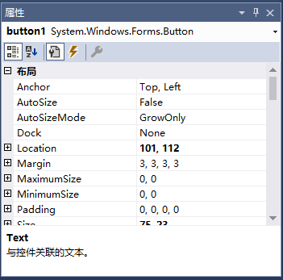

# Winform窗体应用程序入门

C#和Winform是Windows下开发传统GUI应用程序的首选，借助Visual Studio，使用Winform开发会非常简单，而C#和.net平台也有优秀的生态。这篇笔记我们使用Visual Studio 2017编写一个简单的Winform例子程序，以了解C#和Winform开发的基本知识和工作流程。

## 关于各种GUI框架的选择

总而言之，如果你打算开发Windows系统下的一个小工具首选C#；如果你打算开发一款开源工具，它比较复杂而且需要跨平台，就用Qt或Swing；如果你打算卡爆用户的电脑，或者像我一样并不在意Chromium吃掉几百兆内存，首选Electron。

## 创建项目

打开Visual Studio，创建一个「Windows 窗体应用」。


创建完成后，如下图所示，这是一个窗口的界面设计器。我们可以把「工具箱」固定到IDE左侧，方便把控件往窗口上拖。


这里我们先不着急往下做，先看一眼Visual Studio为我们生成的工程结构，如下图：


* Form1.cs 其中`Form1`就是对应一个窗体的类，我们编写的控件事件处理函数就会写在这里
* Form1.Designer.cs 其中是一个`Form1`的`partial class`，其中是Visual Studio设计器为我们自动生成的一些代码
* Form1.resx 它相当于一个资源文件的索引，我们引用的图片等资源就是通过这个配置文件加载的，XML格式，不需要手动修改
* Program.cs 这个是程序的入口文件，其中包含`Main()`函数，应用程序的整体设置可以写在这里

接下开，我们继续窗体设计，我们大致拖几个控件进去，组成一个「登录框」。


在右下角中修改各种属性，这个并没有什么难度，Visual Studio中甚至都有属性的中文说明，这里就不展开介绍了，属性很多，不认识的可以参考文档。



我们把窗体大致修改成这个样子。


为按钮绑定事件处理函数，可以双击设计器拖进去的按钮控件，这会跳转到按钮的默认事件处理函数，或者点击右下角的闪电图标，双击`Click`事件，Visual Studio为我们生成了对应的回调函数，其命名规则为`控件名_事件名`，而不是通常的帕斯卡命名法，这是历史原因造成的，我们遵循即可。

``` csharp
private void buttonLogin_Click(object sender, EventArgs e) {}
```

我们假装写一个登录的逻辑：
```csharp
private void buttonLogin_Click(object sender, EventArgs e)
{
    string username = this.textBoxUsername.Text;
    string password = this.textBoxPassword.Text;
    if(username == "root" && password == "123456")
    {
        // 登陆成功
        MessageBox.Show("登陆成功");
    }
    else
    {
        // 登录失败
        MessageBox.Show("登陆失败");
    }
}
```

点击「运行」：


