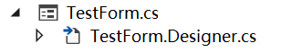

# Form窗口

Winform代码中，一个窗口其实就是对应一个Form对象，这和Swing中的JForm差不多。创建一个Winform工程后，VisualStudio已经帮我们创建了一个默认的`Form1.cs`。我们也可以继续创建新的窗口，以模态或非模态形式实例化并显示。

## 设计器和逻辑代码的关系

我们在VisualStudio中拖控件，这些布局内容放置在`XXForm.Designer.cs`中，而我们针对按钮点击等处理逻辑，放在`XXForm.cs`中，虽然分写在两个文件中，但实际上它们是一个类，后者是前者的`partial class`，分开写是为了不让设计器自动生成的代码和我们手写的代码混杂在一起，互相干扰。



## 多窗体

正常开发中，我们的程序很有可能拥有不止一个窗口，比如一个业务系统，可能会以弹出窗口的形式让用户填写一个表单，这在传统软件中很常见。在工程上点击右键，选择`添加->Windows窗体`即可。


显示新窗口时分为模态和非模态，从经验上来说，一个应用程序的非主窗口通常性质类似于对话框，因此都是模态的，真正的多主操作窗口通常使用虚拟窗口，例如Winform中的MDI，或是Java中的JDesktopPane。

显示一个模态窗口：
```csharp
private void button1_Click(object sender, EventArgs e)
{
    Form2 fm2 = new Form2();
    fm2.ShowDialog(this);
}
```

显示一个非模态窗口：
```csharp
private void button1_Click(object sender, EventArgs e)
{
    Form2 fm2 = new Form2();
    fm2.Show(this);
}
```
