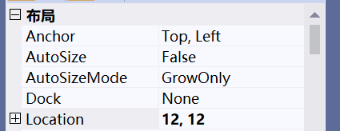
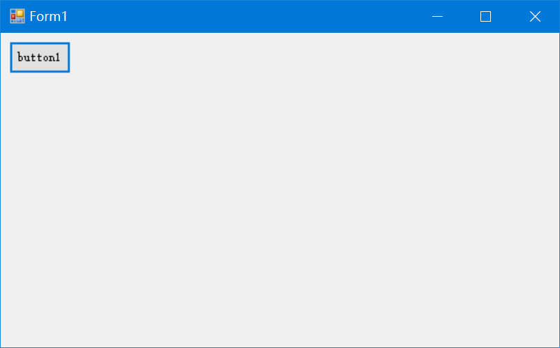
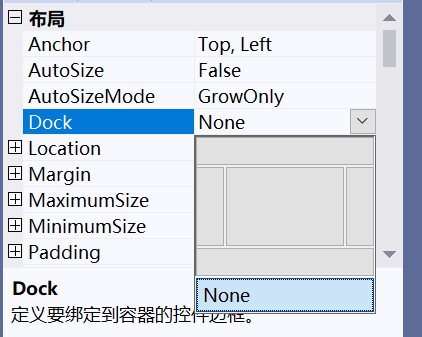
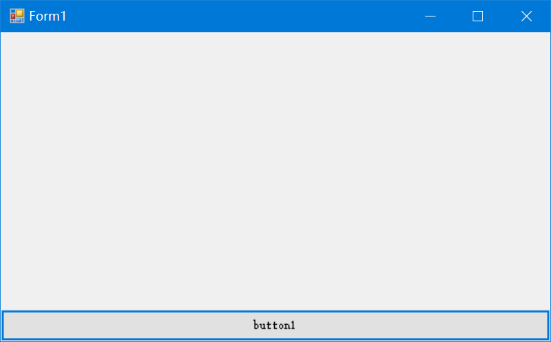

# 界面布局

我们在使用Qt、Swing等框架时，一个重要的概念就是布局管理器（Layout Manager），布局管理器能够帮我们针对窗口长宽的改变动态适配控件的位置。然而，Winform由于比较古老了，是没有这种机制的。

Winform中，实现布局管理有这么几种方式：

1. 无视布局管理，直接用Visual Studio拖绝对布局
2. 使用Dock和Anchor属性实现简单的动态布局适配
3. 手写代码实现布局管理器

实际上，Winform由于适用场景的原因，前两种方式是最为常见的。我们这里简单了解一下Anchor和Dock属性。

## 设置Anchor和Dock属性

我们向窗体上拖入一个控件，在右侧属性中可以找到Anchor和Dock属性的设置。

Anchor表示锚定到窗体，锚定的相对位置是窗体左上角；Dock表示停靠到窗体的某一边缘，它类似Swing中的BorderLayout，能够实现东西南北中的布局形式。要注意，Anchor和Dock只能设置一个。

## Anchor

下面是一个锚定到（12，12）的按钮：

无论我们怎么拖拽窗口，该按钮都不会相对窗体左上角改变位置。

## Dock

选择Dock时，会弹出一个停靠边缘的选择，这个形状和我们熟知的BorderLayout很像。

下面时一个停靠到窗体底部边缘的按钮：

