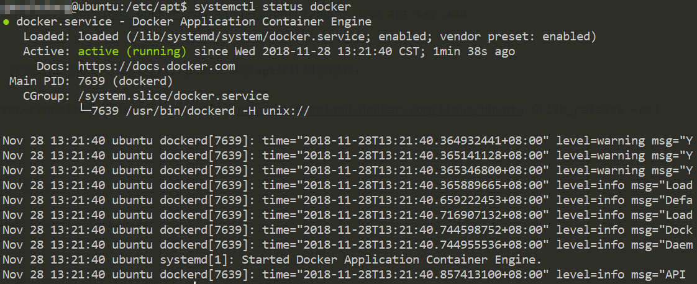
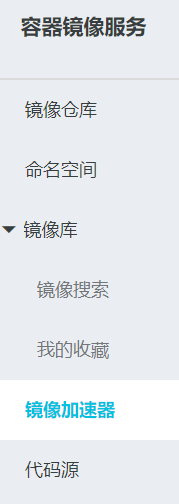

# Docker简介和实验环境搭建

本系列笔记的参考书籍是《Docker技术入门与实战》，主要介绍了Docker的使用和容器化思想。


## 什么是Docker

Docker最初是dotCloud公司的一个内部项目，在当时由于其想法新颖，具有技术前瞻性，Docker开源之后引起了广泛的讨论和关注。总的来说，Docker是一种虚拟化方式，和传统的VMWare等虚拟机不同，Docker应用进程直接运行于宿主的内核，容器内不存在硬件虚拟，因此Docker和虚拟机相比更加轻量级。

我们可以这样理解：

* 运行中的虚拟机：虚拟硬件并在其上安装一个完整的操作系统，软件层面和真实主机完全一致
* 运行中的Docker容器：真实主机里的一个附带了完整运行时的进程，并且它运行在隔离环境中

相比虚拟机，Docker利用系统资源更加高效，启动更快，便于持续交付、部署和迁移。

## Docker的基本概念

* 镜像：Docker镜像是一个特殊的文件系统，提供运行于容器的程序、库、资源、配置文件、运行时参数等，不包含任何动态数据。
* 容器：镜像是静态定义的，容器就是镜像运行时的实体，容器的实质是运行在一个隔离环境里的进程。
* 仓库：Docker仓库类似Maven或NPM这种包管理工具，用于集中存储、分发镜像，和Maven坐标类似，Docker仓库使用`<仓库名>:<标签>`的形式定义，默认标签为`latest`。最常用的公开Docker镜像仓库是Docker Hub，我们也可以搭建私有的Docker仓库。

## Docker环境搭建

这里我们采用UbuntuServer 16.04进行Docker实验环境的搭建。

首先我们要知道的是，Docker分为Docker CE（社区版）和Docker EE，这里我们采用社区版，安装可以参考官网文档：[https://docs.docker.com/install/linux/docker-ce/ubuntu/](https://docs.docker.com/install/linux/docker-ce/ubuntu/)

官网提供了三种安装方式：

* 使用APT源安装
* 手动下载deb包安装
* 直接执行安装脚本

这里我们选用第一种方式。

注：docker的APT源，以及公共镜像仓库在国内访问经常报错，这类命令建议使用proxychains之类的工具代理一下。

安装前置工具：
```
sudo apt-get install apt-transport-https ca-certificates curl software-properties-common
```

添加Docker官方GPG公钥：
```
curl -fsSL https://download.docker.com/linux/ubuntu/gpg | sudo apt-key add -
```

安装apt源，安装之后记得使用`apt-get update`刷新apt软件列表缓存：
```
sudo add-apt-repository "deb [arch=amd64] https://download.docker.com/linux/ubuntu $(lsb_release -cs) stable"
```

安装Docker社区版：
```
sudo apt-get install docker-ce
```

安装完成后，我们就可以通过`systemctl`命令管理Docker服务了。




## 配置Docker镜像加速器

在国内，从Docker Hub拉取镜像的速度非常之慢，即使挂上代理也非常慢，这里我们可以使用阿里云免费的Docker镜像加速器，配置之后速度就非常快了。

我们可以在阿里云的容器镜像服务中找到这个功能，按照上面的说明配置即可。



## 使用docker用户组

默认情况下，只有root用户和docker组用户才能操作docker命令。通常情况下，root权限一般不会直接使用，因此我们可以把我们自己的用户加入docker用户组，实验环境中我们也可以这样操作，省去每条docker命令都要sudo了。

```
sudo groupadd docker
sudo usermod -aG docker ciyaz
```

添加完成后，需要重新登录用户，以及重启docker服务。
