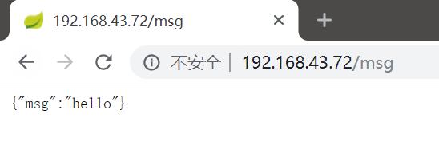

# 使用Dockerfile定制镜像

Dockerfile相当于一个构建脚本，我们通过在其中编写指令，来生成我们定制的Docker镜像。这里我们学习Dockerfile的各种指令，并通过一个例子学习如何构建Docker镜像。

## Dockerfile指令

### FROM 指定基础镜像

例如：`FROM nginx`，这条指令指定我们在`nginx`这个Docker镜像的基础之上进行定制。

基础镜像是必须指定的，而且必须是Dockerfile的第一条指令。在Dockerhub上，有大量的基础镜像可用，有`mysql`、`mongo`、`nginx`这种基础设施服务，也有`openjdk`、`python`这种方便开发、构建、运行各种语言应用的镜像，除此之外也有`ubuntu`等基础的操作系统镜像，甚至可以使用`scratch`这个空白镜像。

注：对于Linux下用C、Golang等静态编译的程序，并不需要再在Docker容器层提供一个操作系统的运行时支持，这种情况下可以基于`scratch`镜像进行构建，这种方式的好处是镜像比较小巧。

### RUN 执行命令

RUN是最常用的指令，用于直接执行shell命令或运行一个带参数的可执行二进制文件，RUN指令有两种格式：

* shell格式：`RUN <shell命令>`
* exec格式：`RUN ["可执行文件","参数1","参数2"...]`

举个例子，现在我们为一个Node程序构建Docker镜像，做法是把整个工程源码拷进Docker镜像然后在其中编译，我们知道Node程序构建时需要运行`npm install`，它的RUN指令就是这么写的：

```
RUN npm install --silent --no-cache
```

Docker中，每一个指令都会建立一个层，`RUN`指令也是这样的，如果有多个RUN指令，每一条都会新建立一个层，在其上执行指定的命令，执行结束后，commit这一层的修改，构成新的镜像。我们不要随随便便的写出很多条RUN指令，代表同一“层”的shell命令一定要合并成一条RUN指令，我们可以用`\`进行shell命令换行，用`&&`连接多条命令，用`#`进行单行注释，千万不要把RUN指令误用，下面是一个典型的错误例子：

```
FROM node:latest

WORKDIR /usr/src/app/

COPY package.json ./
RUN npm install --silent --no-cache

COPY ./ ./

RUN apt-get update
RUN apt-get install -yq gconf-service libasound2 libatk1.0-0 libc6 libcairo2 libcups2 libdbus-1-3 \
  libexpat1 libfontconfig1 libgcc1 libgconf-2-4 libgdk-pixbuf2.0-0 libglib2.0-0 libgtk-3-0 libnspr4 \
  libpango-1.0-0 libpangocairo-1.0-0 libstdc++6 libx11-6 libx11-xcb1 libxcb1 libxcomposite1 \
  libxcursor1 libxdamage1 libxext6 libxfixes3 libxi6 libxrandr2 libxrender1 libxss1 libxtst6 \
  ca-certificates fonts-liberation libappindicator1 libnss3 lsb-release xdg-utils wget

RUN npm run test:all

CMD ["npm", "run", "build"]
```

注：这个反例来自阿里开源的后台管理模板antd-pro。

### COPY 拷贝文件指令

格式：`COPY "源路径" "目标路径"`

注意：

1. 源路径可以是多个，可以是通配符，可以是文件夹。
2. 源路径是基于构建上下文的，这个上下文路径参数在`docker build`命令中指定，一般我们都会组织项目的目录结构，使得这个上下文路径是当前目录，否则比较麻烦。
3. 目标路径可以是绝对路径，也可以是`WORKDIR`的相对路径，这个可以用`WORKDIR`指令进行指定（如上面antd-pro的例子）。

例子：
```
COPY package.json /usr/src/app/
```

### CMD 容器启动指令

CMD和RUN指令格式一样，也有shell和exec两种，但是CMD和RUN指令的意义不同，RUN是构建容器需要的shell命令，CMD指定的是默认的容器主进程的启动命令。在运行容器时，我们可以通过命令行指定其他的启动命令，覆盖CMD指令的默认命令。

例子：
```
CMD ["npm", "run", "build"]
```

这个表示该镜像的容器启动时（即使用`docker run -it 镜像名`），容器内会自动运行`npm run build`，CMD指令推荐使用exec格式。

注意：Docker中的应用应该全部前台执行，容器只是一个进程，容器内没有后台服务的概念，像`CMD service nginx start`这种操作是无效的，启动Nginx正确的写法应为`CMD ["nginx", "-g", "daemon off;"]`。

### ENV 设置环境变量指令

许多程序需要依赖环境变量传递启动参数，ENV指令可以设置环境变量。

* `ENV <key> <value>`
* `ENV <key1>=<value1> <key2>=<value2>...`

## 手动构建一个SpringBoot的Docker镜像

这里我们以SpringBoot程序为例，构建一个Docker镜像并运行。

注意：实际上Java程序我们可以结合使用Maven或Gradle插件进行自动镜像构建，这里仅仅是举个例子。

创建一个SpringBoot项目，随便写点东西：

MainController.java
```java
package com.example.demo.controller;

import org.springframework.web.bind.annotation.GetMapping;
import org.springframework.web.bind.annotation.RestController;

import java.util.HashMap;
import java.util.Map;

/**
 * @author CiyaZ
 */
@RestController
public class MainController {
    @GetMapping(value = "/msg")
    public Map<String, String> getMsg() {
        Map<String, String> result = new HashMap<>();
        result.put("msg", "hello");
        return result;
    }
}
```

因为这里我们是手动构建Docker镜像，所以我们先手动打包：
```
mvn clean package
```

这里假设我们把打包好的jar包放在`~/sb-demo`下，我们要创建一个叫做`sb-demo`的Docker镜像。我们需要在这个目录下编写Dockerfile。

Dockerfile
```
FROM openjdk:8-jdk-alpine
COPY ./demo-0.0.1-SNAPSHOT.jar app.jar
CMD ["java","-jar","/app.jar"]
```

这里我们基于`openjdk:8-jdk-alpine`进行定制，这个镜像自带了OpenJDK8的运行环境，方便起见，这里直接把打包好的SpringBoot工程jar包放在根目录`/`，默认启动命令为`java -jar /app.jar`。

注：Alpine是一个适用于Docker容器的Linux发行版。

运行打包命令：
```
 docker build -t sb-demo
```

* `-t`：用于指定生成的镜像名

打包过程中，会自动下载依赖镜像`openjdk:8-jdk-alpine`，我们不用单独手动pull。打包完成后，我们可以用`docker images`命令查看本地已经安装了的镜像：

```
ciyaz@ubuntu:~/sb-demo$ docker images
REPOSITORY          TAG                 IMAGE ID            CREATED             SIZE
sb-demo             latest              ffa11fa15509        3 minutes ago       119MB
```

创建并执行Docker容器：
```
docker run -d -p 80:8080 sb-demo
```

* `-d`：指定在后台运行
* `-p 宿主机端口：容器内端口`：将容器内的端口映射出来

运行起来后，我们可以通过`docker ps`查看运行中的容器：

```
ciyaz@ubuntu:~/sb-demo$ docker ps
CONTAINER ID        IMAGE               COMMAND                CREATED             STATUS
  PORTS                  NAMES
3bc4875be784        sb-demo             "java -jar /app.jar"   11 minutes ago      Up 11 minutes
  0.0.0.0:80->8080/tcp   xenodochial_cocks
```

在另一台电脑上，我们可以用浏览器访问Docker的宿主机，可以看到Docker容器中的程序已经成功运行了：


