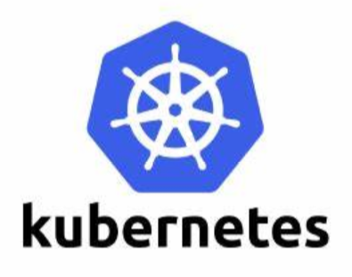

# k8s简介和环境搭建

Kubernetes（之后简称k8s）是Google开源的一个容器编排工具。本系列笔记简单记录k8s的部署和使用，感受一下k8s这类工具为敏捷开发和软件系统快速迭代带来的优势。



## k8s适用场景

为了简化应用部署的各种麻烦，我们首先有了Docker等容器化技术，开发人员的程序最终打包为一个Docker镜像。运维人员在部署上线应用程序时，只需要基于镜像启动一组Docker容器即可，省去了具体安装语言运行时环境、依赖库、启动各种中间件操作的麻烦。

但如何管理这些Docker容器的问题依然存在，如果分布式应用的工作节点非常多，运维人员还是需要具体在各个服务器上操作部署Docker容器，在应对横向扩容、缩容的需求时，也要手动管理，大量重复性工作繁琐而且容易出错。

使用k8s能够自动化的帮我们解决这些问题。

## 部署服务器和网络环境

这里使用三台服务器搭建k8s学习环境，操作系统均为Ubuntu Server 16.04，对应的IP和主机名如下。我这里将这些对应关系加入各服务器的`hosts`以方便使用。

```
192.168.43.254 k8s-master
192.168.43.130 k8s-worker1
192.168.43.188 k8s-worker2
```

服务器节点需要关闭`swap`，k8s是服务器集群上的容器编排工具，意味着内存这种硬件资源本来就是无限横向扩容的，显然不该用上虚拟内存，k8s也没有实现对虚拟内存的处理逻辑。如果开启swap，集群初始化时无法通过预检查。

关闭swap：
```
swapoff -a
```

此外还需要取消swap分区的开机自动挂载，直接在`/etc/fstab`文件中，将swap分区那一行内容注释掉即可。

## 安装Docker

k8s支持Docker、RKT等容器技术，目前来说Docker使用最为广泛，也是k8s最开始支持的，后续均以Docker为例介绍。

检查安装前置工具：
```
sudo apt-get install apt-transport-https ca-certificates curl software-properties-common
```

添加Docker官方GPG公钥：
```
curl -fsSL https://download.docker.com/linux/ubuntu/gpg | sudo apt-key add -
```

添加Docker源到`apt`源列表中：
```
sudo add-apt-repository "deb [arch=amd64] https://download.docker.com/linux/ubuntu $(lsb_release -cs) stable"
```

安装Docker社区版：
```
sudo apt-get update
sudo apt-get install docker-ce
```

将当前用户（这里用户名为ubuntu）加入docker用户组，省区每次操作Docker都使用`sudo`的麻烦：
```
sudo groupadd docker
sudo usermod -aG docker ubuntu
```

Dockerhub在国内使用非常缓慢，这里可以配置阿里云的Docker镜像加速器，参考阿里云文档。

其余有关Docker的内容这里不再具体介绍，具体参考`/互联网应用架构和中间件/Docker`章节。

## 安装Kubernetes

具体有关Kubernetes部署可以参考官方文档，由于Google的服务在国内均被墙，下面命令使用的是阿里云的镜像进行安装。

添加k8s源的GPG公钥：
```
curl https://mirrors.aliyun.com/kubernetes/apt/doc/apt-key.gpg | apt-key add -
```

添加k8s源到`apt`源列表中：
```
echo 'deb https://mirrors.aliyun.com/kubernetes/apt/ kubernetes-xenial main' | sudo tee /etc/apt/sources.list.d/kubernetes.list
```

安装k8s：
```
sudo apt-get update
sudo apt-get install kubelet kubeadm kubectl
```

## Master节点配置

这里我们首先进行Master节点的配置，其余工作节点在Master节点启动后，再依次加入即可。

启动Master节点：
```
sudo kubeadm init --pod-network-cidr=192.168.0.0/16 --apiserver-advertise-address=192.168.43.254
```

* `--pod-network-cidr`：指定Pod的网络范围
* `--apiserver-advertise-address`：

```
docker pull registry.cn-hangzhou.aliyuncs.com/google_containers/kube-controller-manager:v1.15.1
docker pull registry.cn-hangzhou.aliyuncs.com/google_containers/kube-scheduler:v1.15.1
docker pull registry.cn-hangzhou.aliyuncs.com/google_containers/kube-proxy:v1.15.1
docker pull registry.cn-hangzhou.aliyuncs.com/google_containers/kube-apiserver:v1.15.1
docker pull registry.cn-hangzhou.aliyuncs.com/google_containers/pause:3.1
docker pull registry.cn-hangzhou.aliyuncs.com/google_containers/etcd:3.3.10
docker pull registry.cn-hangzhou.aliyuncs.com/google_containers/coredns:1.3.1


docker tag registry.cn-hangzhou.aliyuncs.com/google_containers/kube-controller-manager:v1.15.1 k8s.gcr.io/kube-controller-manager:v1.15.1
docker tag registry.cn-hangzhou.aliyuncs.com/google_containers/kube-scheduler:v1.15.1 k8s.gcr.io/kube-scheduler:v1.15.1
docker tag registry.cn-hangzhou.aliyuncs.com/google_containers/kube-proxy:v1.15.1 k8s.gcr.io/kube-proxy:v1.15.1
docker tag registry.cn-hangzhou.aliyuncs.com/google_containers/kube-apiserver:v1.15.1 k8s.gcr.io/kube-apiserver:v1.15.1
docker tag registry.cn-hangzhou.aliyuncs.com/google_containers/pause:3.1 k8s.gcr.io/pause:3.1
docker tag registry.cn-hangzhou.aliyuncs.com/google_containers/etcd:3.3.10 k8s.gcr.io/etcd:3.3.10
docker tag registry.cn-hangzhou.aliyuncs.com/google_containers/coredns:1.3.1 k8s.gcr.io/coredns:1.3.1
```