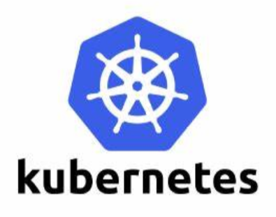
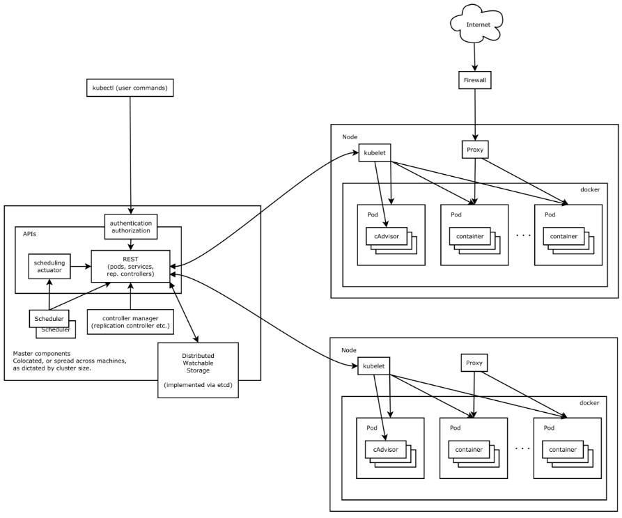

# k8s简介和集群搭建



学习过Docker之后，我们可以感受到容器部署的好处。然而，在实际开发工作中，如果一个分布式项目非常庞大，运维人员需要管理的容器就非常多，如果手动管理还是非常的困难。此时，我们就需要一个容器编排管理工具，来自动化的管理大量容器。

Kubernetes（简称k8s）是Google开源的一个容器编排管理工具，能够对容器进行自动化部署、伸缩，k8s本身有一定的学习成本，但对于大型分布式项目来说，能够节省很多运维开支，因此近年来逐渐成为了一种主流趋势。

另外，k8s还集成了负载均衡、服务发现、计划任务等额外功能，和SpringCloud这类技术有一定的重叠之处，具体使用时如何选择，还需要应用架构的设计者具体考量。

## k8s的基本架构



搭建k8s集群环境至少需要两台服务器（或虚拟机），一台为master节点，另一台为worker节点。

master节点负责管理整个集群，包含`apiserver`、`scheduler`、`controller-manager`等组件，集群信息使用`etcd`进行存储。不过不需要担心，这些组件都能以镜象方式，很容易的进行部署。

worker节点也就是工作节点，包含`kublet`、`kube-proxy`，以及运行于Docker之上的我们的应用程序（以容器组的方式存在）。

在实际生产环境中，master节点通常并不只有一个，而是有多个组成高可用的集群，worker节点则根据实际需要，一般都有数十至数百个。因此可想而知，这种规模的项目如果没有k8s，而需要手动管理，将是多么困难的事。

### 使用Minikube搭建学习环境

前面提到搭建k8s集群至少要有两台机器，但如果仅用于学习和开发，我们可以使用`Minikube`工具搭建一个单机版的k8s环境。

[Minikube官方文档](https://minikube.sigs.k8s.io/docs/start/)

[Minikube - Kubernetes本地实验环境-阿里云开发者社区 (aliyun.com)](https://developer.aliyun.com/article/221687)

这里因为网络问题，国内建议使用阿里云提供的Minikube版本进行学习。

#### step1 安装kubectl

`kubectl`是k8s的命令行控制工具，部署应用、查看集群状态等操作都需要使用`kubectl`。

[kubectl](https://kubernetes.io/docs/tasks/tools/?spm=a2c6h.12873639.0.0.ab2020432ze8Ki)

#### step2 安装虚拟平台驱动

Linux下Minicube可以基于Docker运行，也支持VirtualBox或KVM方式；Windows环境下，Minikube支持基于VirtualBox或Hyper-V运行。

我们需要根据自己的需要，安装相关的软件。

#### step3 安装Minikube

我们直接在阿里云提供的说明页面上找到相关链接，下载二进制可执行文件即可，下载后将其加入环境变量。

#### step4 启动Minikube

执行如下命令即可启动：

```
minikube start --image-mirror-country cn
```

* `--image-mirror-country`：这里需要指定中国镜象，否则因为网络问题无法使用
* `--no-vtx-check`：如果你的CPU不支持`VT-X`虚拟化指令集，或支持但Minikube无论如何都报错（估计是Bug），可指定该参数将其忽略

#### step5 打开k8s控制台

k8s提供了一个图形界面的控制台，Minikube集成了该组件。

k8s集群启动成功后，我们可以执行下方命令，在默认浏览器中将其打开。

```
minikube dashboard
```

### 搭建集群环境

k8s搭建生产环境集群，主要有两种方式：

* 通过`kubeadm`工具自动搭建
* 手动搭建

这里后者比较复杂，我们简单介绍下前者。

注：这里搭建时我们也全部使用阿里云镜象。

#### 服务器硬件要求

如果我们开虚拟机用于学习，那么至少准备2台Linux操作系统的虚拟机（一台作为master节点，一台作为worker节点），配置至少2C2G，当然如果内存充足，分配的节点数、内存、处理器核心都是越多越好。我这里使用的是UbuntuServer16.04，使用CentOS等操作也差不多。至于生产环境，master节点一般至少是8C16G，且以集群方式部署。

我这里创建了四台虚拟机：

```
k8smaster   192.168.1.107    2C4G
k8sworker1  192.168.1.123    2C2G
k8sworker2  192.168.1.124    2C2G
k8sworker3  192.168.1.125    2C2G
```

注：如果低于最低要求，k8s也可以忽略一些配置检查强行部署，但总是会出一些奇奇怪怪的问题，因此不推荐这样做。

#### 操作系统配置

1. 关闭防火墙（Ubuntu使用的ufw默认关闭）
2. 关闭selinux（Ubuntu未预装该程序）
3. 关闭Swap分区，如果服务器有Swap分区，临时可用`swapoff -a`命令关闭，或者注释掉`/etc/fstab`中的Swap分区并重启
4. 设置主机名以便于区分，命令：`hostnamectl set-hostname <主机名>`，比如设置为：`k8smaster`，`k8sworker1`，`k8sworker2`
5. 将上一步设置的主机名加入hosts文件`/etc/hosts`

#### 前置安装

1. 安装docker服务并配置阿里云镜象，具体可参考`互联网应用架构和中间件/Docker`相关章节
2. 安装`kubeadm`、`kubelet`、`kubectl`

第二步需要我们在系统中添加`k8s`源，首先安装gpg公钥：

```
curl https://mirrors.aliyun.com/kubernetes/apt/doc/apt-key.gpg | apt-key add -
```

然后在`/etc/apt/sources.list.d/kubernetes.list`中添加源：

```
deb https://mirrors.aliyun.com/kubernetes/apt/ kubernetes-xenial main
```

刷新apt缓存：

```
apt-get update
```

最后执行安装：

```
apt-get install kubectl kubelet kubeadm
```

#### 部署master节点

首先确认master节点安装了`kubeadm`工具，然后执行：

```
kubeadm init --apiserver-advertise-address=192.168.1.107 --image-repository registry.aliyuncs.com/google_containers --service-cidr=10.96.0.0/12 --pod-network-cidr=10.244.0.0/16
```

* `--apiserver-advertise-address`：master节点的实际IP地址
* `--image-repository`：k8s容器镜象
* `--service-cidr`：服务的虚拟网段
* `--pod-network-cidr`：容器组的虚拟网段

执行该命令后，可以看到`kubeadm`拉取了k8s的master节点必要的镜象，并配置运行。执行成功后，会看到如下信息：

```
Your Kubernetes control-plane has initialized successfully!

To start using your cluster, you need to run the following as a regular user:

  mkdir -p $HOME/.kube
  sudo cp -i /etc/kubernetes/admin.conf $HOME/.kube/config
  sudo chown $(id -u):$(id -g) $HOME/.kube/config

Alternatively, if you are the root user, you can run:

  export KUBECONFIG=/etc/kubernetes/admin.conf

You should now deploy a pod network to the cluster.
Run "kubectl apply -f [podnetwork].yaml" with one of the options listed at:
  https://kubernetes.io/docs/concepts/cluster-administration/addons/

Then you can join any number of worker nodes by running the following on each as root:

kubeadm join 192.168.1.107:6443 --token bo7shu.5rxaan9emzrms6jb \
        --discovery-token-ca-cert-hash sha256:063112fabf202bb5e54b632710254e409cc1aa755f5ad5a72a38a1683b14d879
```

首先我们按照要求，将相关配置复制到用户目录：

```
mkdir -p $HOME/.kube
sudo cp -i /etc/kubernetes/admin.conf $HOME/.kube/config
sudo chown $(id -u):$(id -g) $HOME/.kube/config
```

然后还需要在master节点配置网络插件，这里使用flannel：

(https://github.com/flannel-io/flannel)[https://github.com/flannel-io/flannel]

按照官网说明，我们需要部署如下配置：

```
kubectl apply -f https://raw.githubusercontent.com/coreos/flannel/master/Documentation/kube-flannel.yml
```

注：如果网络问题无法访问，可以先将上面`yml`配置文件下载下来，再传到服务器上执行。

这样，master节点就配置好了。

#### 部署worker节点

按照之前的提示，我们在worker节点的虚拟机上执行如下命令，即可将worker节点加入集群：

```
kubeadm join 192.168.1.107:6443 --token bo7shu.5rxaan9emzrms6jb \
        --discovery-token-ca-cert-hash sha256:063112fabf202bb5e54b632710254e409cc1aa755f5ad5a72a38a1683b14d879
```

加入成功后可看到如下提示：

```
This node has joined the cluster:
* Certificate signing request was sent to apiserver and a response was received.
* The Kubelet was informed of the new secure connection details.

Run 'kubectl get nodes' on the control-plane to see this node join the cluster.
```

在master节点上执行`kubectl get nodes`，可看到如下信息：

```
NAME         STATUS   ROLES                  AGE    VERSION
k8smaster    Ready    control-plane,master   11h    v1.21.1
k8sworker1   Ready    <none>                 130m   v1.21.1
k8sworker2   Ready    <none>                 129m   v1.21.1
k8sworker3   Ready    <none>                 128m   v1.21.1
```

`Ready`整明集群状态就绪。

在master节点上执行`kubectl get cs`，可看到组件状态：

```
NAME                 STATUS    MESSAGE             ERROR
controller-manager   Healthy   ok
scheduler            Healthy   ok
etcd-0               Healthy   {"health":"true"}
```

注：这里默认安装后，`controller-manager`和`scheduler`组件可能会报错`connection refused`，这是因为一个端口配置导致的，可以修改配置文件`/etc/kubernetes/manifests/kube-scheduler.yaml`、`/etc/kubernetes/manifests/kube-controller-manager.yaml`，注释掉其中`--port=0`一行即可。
