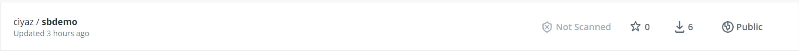
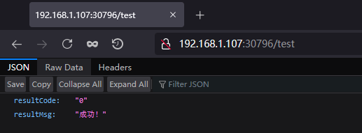

# 工程部署实例

前一篇笔记中，我们学习了如何搭建一个k8s集群，但尚未具体在上面部署应用。这篇笔记我们还是先跳过复杂的理论概念，以一个例子的方式，简单了解如何在k8s集群上部署应用程序。

## 制作Docker镜象

这里我们部署一个简单的Java（SpringBoot）工程，名为`sbdemo`，在开发环境编译为`sbdemo-0.0.1-SNAPSHOT.jar`后，基于`openjdk:8-jdk-alpine`进行打包。

注：具体制作方法可以参考`/互联网应用架构和中间件/Docker`相关章节。

Dockerfile
```
FROM openjdk:8-jdk-alpine
COPY ./sbdemo-0.0.1-SNAPSHOT.jar app.jar
CMD ["java","-jar","/app.jar"]
```

制作完成后，我们需要将镜象上传至DockerHub。在k8s集群部署时，默认会从DockerHub拉取镜象。



这里注意，DockerHub在国内并不能访问内，我们可以使用代理的方式，或者直接使用境外的服务器来上传。下载则可以使用阿里云的镜像加速服务，比较容易。实际开发工作中，我们都是使用私有的DockerHub仓库，应该不存在网络问题。

## 部署容器组

上传镜像后，我们就可以在集群中部署了。在k8s中部署内容，都是通过一个`.yaml`配置文件来描述的，然后使用`kubectl apply -f <文件名>`来具体执行部署。

那么配置文件怎样编写呢？我们可以用如下方式：

```
kubectl create deployment sbdemo --image=ciyaz/sbdemo --dry-run -o yaml > deploy.yaml
```

* `sbdemo`：该部署对象的具体名
* `--image`：需要部署镜象的全称
* `--dry-run`：不具体执行部署，只是将部署对象导出
* `-o`：指定导出格式，这里我们选择`yaml`格式

这里我们将部署对象以`yaml`格式导出，然后将其输出到`deploy.yaml`中。

deploy.yaml
```yml
apiVersion: apps/v1
kind: Deployment
metadata:
  creationTimestamp: null
  labels:
    app: sbdemo
  name: sbdemo
spec:
  replicas: 1
  selector:
    matchLabels:
      app: sbdemo
  strategy: {}
  template:
    metadata:
      creationTimestamp: null
      labels:
        app: sbdemo
    spec:
      containers:
      - image: ciyaz/sbdemo
        name: sbdemo
        resources: {}
status: {}
```

这样我们就可以基于此模板进行修改了，非常方便。修改完成后，正式执行部署：

```
kubectl apply -f deploy.yaml
```

部署过程中，k8s会自动拉取镜像、创建Pod，并将其分配到worker节点，然后运行容器，我们不需要任何干预。Pod运行起来后，就可以使用`kubectl get pod`来查看当前所有Pod的运行状态：

例子（这里我对`sbdemo`创建了两个副本）：
```
NAME                    READY   STATUS    RESTARTS   AGE
sbdemo-595fc9df-d5t59   1/1     Running   0          58m
sbdemo-595fc9df-jpd7x   1/1     Running   0          58m
```

此外，我们也可以使用`kubectl describe pod`来查看Pod的详细信息，比如其在哪个节点上等。

## 部署服务

上面我们部署了Pod后，此时仍不能对其提供的服务进行访问，还需要让Pod暴露相应的端口。在此之前，我们需要了解几个k8s的相关概念：

* `targetPort`：制作容器时暴露的端口
* `port`：暴露在clusterIP上的端口，只有集群内才能访问
* `nodePort`：暴露在外部的端口

我们这里需要在集群外部访问服务，因此需要配置一个`nodePort`。

和创建部署时一样，我们同样是使用`--dry-run`参数，通过一条不实际执行的命令，来生成`yaml`模板，再对其进行修改。

```
kubectl expose deployment sbdemo --port=8080 --target-port=8080 --type=NodePort --dry-run -o yaml > svc.yaml
```

svc.yaml
```yaml
apiVersion: v1
kind: Service
metadata:
  creationTimestamp: null
  labels:
    app: sbdemo
  name: sbdemo
spec:
  ports:
  - port: 8080
    protocol: TCP
    targetPort: 8080
  selector:
    app: sbdemo
  type: NodePort
status:
  loadBalancer: {}
```

根据我们的需求修改后再具体执行：

```
kubectl apply -f svc.yaml
```

执行完成后，可以通过`kubectl get svc`查看服务：

```
NAME         TYPE        CLUSTER-IP     EXTERNAL-IP   PORT(S)          AGE
kubernetes   ClusterIP   10.96.0.1      <none>        443/TCP          19h
sbdemo       NodePort    10.101.34.30   <none>        8080:30796/TCP   3s
```

我们可以看到，这里我们创建的服务NodePort为`30796`，因此在集群外，我们就可以通过该端口来访问服务了。



注：NodePort方式默认只能指定`30000`以上的端口，我们可以在`yaml`中配置一个固定值，或者让k8s自动分配一个随机值。
