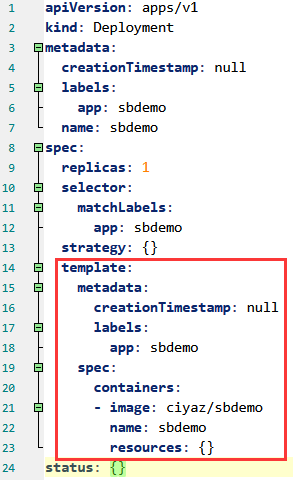
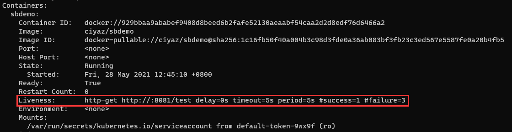

# Pod容器组

在前面章节的例子中，我们使用k8s来部署过应用程序的docker镜象，部署完成后，我们使用`kubectl get pod`来列出部署结果，k8s在节点上自动部署了我们指定个数的Pod（容器组）。那么，Pod是什么，和docker容器又是什么关系呢？

## Pod的定义

Pod是k8s中最小的可部署单元。

Pod实际上一般并不是单个的容器，而是包含了一组（1个或多个）容器，但这些容器共享网络（因此可以使用`localhost`来互相通信），也可以挂载同一组共享的数据卷。

## Pod的使用

k8s的设计上，Pod是一个短生命周期的组件，例如当应用程序意外宕机，k8s本身可以将Pod删除并在其它节点重建。

因此Pod宕机重启、更新、回滚等，都应该由k8s来自动调度，我们是不会手动创建Pod（尽管可以这样做）。之前的例子中，我们便是通过定义Deployment（部署）的方式，来让k8s自动创建包含应用程序容器的Pod。



图中是上一篇笔记中，我们创建Deployment的`yaml`配置文件，其中`template`部分就是Pod的定义。

## Pod常用操作

查看所有Pod状态：
```
kubectl get pod
```

查看Pod详细信息：
```
kubectl describe pod <Pod名>
```

如果Pod出现异常情况，我们可以根据以上命令的返回结果来排除故障。

查看Pod日志（标准输出的内容）：
```
kubectl logs <Pod名>
```

对于一般的应用程序，日志通常不是直接打印在标准输出上的，而是记录在日志文件中，这种情况一般需要进入容器查看，或者去挂载的日志目录查看。

进入Pod执行Bash命令：
```
kubectl exec -it <Pod名> bash
```

至于Pod的创建、删除、伸缩等操作，一般都是通过操作Deployment来实现，Pod的具体操作由k8s来自动执行。

## Pod常用配置

下面介绍一些有关Pod的常用配置。

### 镜象拉取策略

`imagePullPolicy`可以指定容器镜象的拉取策略。

* spec.containers[].imagePullPolicy

例子：
```yaml
containers:
- name: ...
  image: ...
  imagePullPolicy: Always
```

* `Always`：默认值，永远从远程仓库拉取
* `IfNotPresent`：如果本地不存在该镜象，再从远程仓库拉取
* `Never`：不从远程仓库拉取

### 资源限制

资源限制能够指定容器的上限和下限，k8s调度Pod时会根据这些限制来选择部署的Node（节点）。

* spec.containers[].resources.limits.cpu
* spec.containers[].resources.limits.memory
* spec.containers[].resources.requests.cpu
* spec.containers[].resources.requests.memory

例子：
```yaml
containers:
- name: ...
  image: ...
  resources:
    requests:
      memory: "64Mi"
      cpu: "250m"
    limits:
      memory: "128Mi"
      cpu: "500m"
```

* request：指定容器所需的最低资源配置
* limit：指定容器所需的最大资源配置

注：`500m`可以将其理解为占用`0.5`个CPU核。

### 重启机制

重启机制指定容器运行运行结束后，是否重启容器。

* spec.restartPolicy

例子：
```yaml
spec:
  containers: ...
  restartPolicy: Always
```

* `Always`：默认值，永远重启容器
* `OnFailure`：当容器异常结束（ExitCode不为0）时重启
* `Never`：永不重启

### 健康检查

健康检查用于检测Pod是否能够正常工作，如果不能正常工作，k8s将自动进行调度，删除无法使用的Pod并创建新Pod。

健康检查支持三种方式：

* `ExecAction`：在容器内执行特定命令，如果ExitCode为0则认为健康
* `TCPSocketAction`：使用TCP连接指定端口，如果握手成功则认位健康
* `HTTPGetAction`：对指定端口执行HTTP GET，如果响应码大于等于200且小于400，则认位健康

例子：
```yaml
containers:
- name: ...
  image: ...
  livenessProbe:
    httpGet:
      path: /test
      port: 8081
    timeoutSeconds: 5
    periodSeconds: 5
```

上面例子中，我们配置了一个HTTP检测，每隔5秒对`http://localhost:8081/test`发起一个GET请求。

我们可以通过`kubectl describe pod`来查看有关健康检查的详细信息。



### 节点选择器

有时我们希望特定的应用程序Pod部署到特定类型的Node上，比如IO密集型程序我们希望将其部署在具有SSD的服务器上，但其它Pod没有该要求，这可以通过节点选择器实现。

Node可以配置标签，在部署Pod时可以指定一个标签，使Pod部署到特定Node上。

对节点设置标签：
```
kubectl label node <节点名> <标签键>=<标签值> 
```

例如：`kubectl label node k8sworker1 disk-type=ssd`

在Pod定义中，我们可以指定该标签：

* spec.nodeSelector

例子：
```
spec:
  containers: ...
  nodeSelector: 
    disk-type: ssd
```

在上面例子中，这样配置后，该Pod就只会被调度到`k8sworker1`上了。
