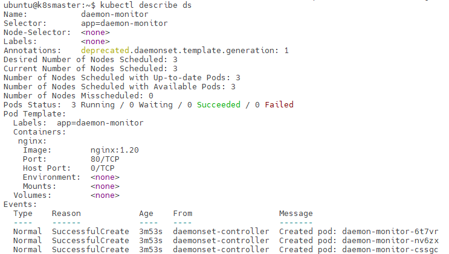

# DaemonSet节点守护进程

我们知道，Pod部署在哪个节点上是完全由k8s来决定的，那么如果我们现在要实现这样一个功能：部署一组Pod到集群中，用来监控集群节点的CPU、内存能性能指标，这就要求其中每个集群节点需要分配一个Pod，那么显然默认的Deployment方式部署的Pod不能满足该要求。

k8s中，提供了守护进程（DaemonSet）的概念。DaemonSet能够保证在k8s集群的每个符合条件的节点上，运行一个相同的Pod，其典型应用就是节点监控和日志收集。

注：DeamonSet也支持通过标签方式，只在特定一组节点上运行，比如只监控有标签disk=ssd的存储节点。

## DeamonSet的特点

1. 为集群中每个符合条件的节点分配相同的守护进程Pod
2. 符合条件的节点增加，自动部署守护进程Pod

## DaemonSet的例子

下面是一个DaemonSet的示例配置文件：

```yaml
apiVersion: apps/v1
kind: DaemonSet
metadata:
  name: daemon-monitor
spec:
  selector:
    matchLabels:
      app: daemon-monitor
  template:
    metadata:
      labels:
        app: daemon-monitor
    spec:
      containers:
      - name: nginx
        image: nginx:1.20
        ports:
        - containerPort: 80
```

可以看到，DeamonSet的配置和Deployment大同小异，只不过是k8s对其调度有特殊的处理。

部署后，我们可以查看到相关信息：



这里我们的k8s集群有3个节点，因此该守护进程的Pod就部署了3个副本。

注：这里使用的`nginx:1.20`镜象没有特殊意义，仅仅是为了测试。

## DaemonSet的相关操作

通过yaml配置文件添加DaemonSet：
```
kubectl apply -f <yaml配置文件>
```

查看当前所有DaemonSet：
```
kubectl get ds
```

查看DaemonSet详细信息：
```
kubectl describe ds <DaemonSet名称>
```

删除DaemonSet：
```
kubectl delete ds <DaemonSet名称>
```

注：删除DaemonSet后，对应Pod会自动销毁、删除。
