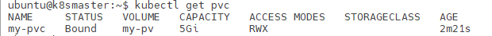

# 持久化存储

k8s自动调度的Pod是一种短生命周期的组件，在进行滚动升级、扩缩容等操作时，都会造成Pod的销毁和重新创建。那么如果我们需要持久化保存数据，比如用户上传的文件、应用程序日志等，此时就不能直接将数据放在Pod容器内了。

针对此问题，可以通过挂载外部的存储目录解决，比较简单的方式就是直接挂载nfs目录，更进一步，也可以通过k8s提供的pv、pvc的概念，来实现更为复杂的自动挂载。

## 基于nfs

基于nfs实现持久化存储比较简单，我们直接将nfs目录挂载到Pod内就行了。有关nfs服务的详细内容，可以参考nfs相关章节。

注意：在具体挂载nfs目录之前，相关节点上必须安装nfs客户端，否则挂载时将报错。

例子：

```yaml
apiVersion: apps/v1
kind: Deployment
metadata:
  name: nginx-deploy
  labels:
    k8s-app: nginx-demo
spec:
  selector:
    matchLabels:
      app: nginx
  replicas: 3
  template:
    metadata:
      labels:
        app: nginx
    spec:
      containers:
      - name: nginx
        image: nginx:1.20
        ports:
        - containerPort: 80
        volumeMounts:
        - name: wwwroot
          mountPath: /usr/share/nginx/html
      volumes:
        - name: wwwroot
          nfs:
            server: 192.168.1.107
            path: /home/ubuntu/nfs
```

上面例子中，我们将容器中的`/usr/share/nginx/html`挂载为nfs服务器`192.168.1.107`的`/home/ubuntu/nfs`目录。

## 基于pv和pvc

直接挂载nfs目录，实际上我们需要手动指定IP、挂载路径，同样不方便维护。通过定义pv和pvc，我们可以实现存储资源的自动选择和挂载。

* PV（Persistent Volume）：对存储资源的抽象
* PVC（Persistent Volumes Claim）：申请存储资源的声明

例子：

```yaml
apiVersion: v1
kind: PersistentVolume
metadata:
  name: my-pv
spec:
  capacity:
    storage: 5Gi
  accessModes:
    - ReadWriteMany
  nfs:
    server: 192.168.1.107
    path: /home/ubuntu/nfs
```

上面配置定义了pv，其中依然是使用nfs作为底层存储。除此之外，还指定了其大小限制为`5Gi`。

```yaml
apiVersion: apps/v1
kind: Deployment
metadata:
  name: nginx-deploy
  labels:
    k8s-app: nginx-demo
spec:
  selector:
    matchLabels:
      app: nginx
  replicas: 3
  template:
    metadata:
      labels:
        app: nginx
    spec:
      containers:
      - name: nginx
        image: nginx:1.20
        ports:
        - containerPort: 80
        volumeMounts:
        - name: wwwroot
          mountPath: /usr/share/nginx/html
      volumes:
        - name: wwwroot
          persistentVolumeClaim:
            claimName: my-pvc

---

apiVersion: v1
kind: PersistentVolumeClaim
metadata:
  name: my-pvc
spec:
  accessModes:
    - ReadWriteMany
  resources:
    requests:
      storage: 5Gi
```

这里定义了两个组件：一个是我们的应用程序，它需要挂载一个持久化的路径，但和之前不同，我们这里指定的是通过pvc方式，由k8s自动选择存储资源来挂载。之后配置定义了pvc，并指定需要`5Gi`大小的存储空间。

指定如上配置文件后，我们可以通过`kubectl get pvc`来查看相关情况：



可以看到，`my-pvc`自动绑定了`my-pv`这个存储资源，此时Pod也能够正常使用相关的存储资源了。

其实使用pv、pvc的方式，我们也是需要手动指定nfs的IP和存储路径，但这样我们可以将维护pv的工作交给平台维护的运维人员，而负责应用部署的运维人员只需要维护pvc，这样划分比直接给容器挂载nfs目录要合理的多。

## 如何绑定pvc到特定的pv上

前面的例子中，我们的pvc实际上是根据存储容量和权限，自动匹配pvc并绑定的。如果我们希望pvc绑定到指定pv上，可以通过标签选择器来实现，这里就不多说了。
