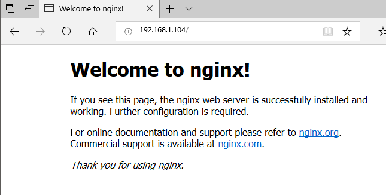

# Nginx安装和简介

Nginx是一个开源、高性能、可靠的HTTP中间件和代理服务。

其他同类产品有：Microsoft IIS，Apache httpd，Google GWS等。和同类产品相比，Nginx主要有以下优点：

1. 基于BSD协议开源
2. 轻量级，模块化的设计
3. 通过epoll实现了IO多路复用，性能较高
4. CPU亲和，能够充分利用多核CPU，worker进程和CPU核心绑定
5. 使用sendfile机制，处理静态文件不通过用户态而直接使用内核态，性能较高

## Nginx安装

这里我们使用的是Ubuntu Server 16.04操作系统。

安装apt中的Nginx预编译包：
```
apt-get install nginx
```

安装完成后，我们可以通过`systemctl`命令对Nginx服务进行管理。

我们可以用浏览器访问服务器的80端口，可以看到Nginx启动成功后，显示的默认网页：



## 关于目录结构的说明

在Ubuntu下：

* 配置文件目录：`/etc/nginx`
* 日志目录：`/var/log/nginx`

我们主要关注配置文件的目录：


* `nginx.conf`：主配置文件
* `conf.d`：为了方便管理，我们可以将配置文件分开存放，这里存放子配置文件
* `sites-available`：存放的也是子配置文件，但是这里专门存放对应一个站点的配置
* `sites-enabled`：里面的文件都是site-available中配置文件的软链接

注：有关`sites-available`和`sites-enabled`的区别是这样的：我们查看主配置文件`nginx.conf`，会发现这样的配置文件引用：
```
include /etc/nginx/conf.d/*.conf;
include /etc/nginx/sites-enabled/*;
```

因此把对应站点的配置文件分割成`sites-available`和`sites-enabled`完全是为了方便管理站点，所有站点配置都放在`sites-available`中，需要启动一个配置就创建一个软链接，不需要就删除软链接。

## 不同发行版中的Nginx区别

如果使用不同的Linux发行版，比如CentOS，可能配置文件、日志的目录和Ubuntu不同，这是因为我们使用`apt`或是`yum`安装的是软件源中的预编译包，编译的时候指定了一些参数，因此每种发行版安装的Nginx可能都有一点区别（除此之外，安装的Nginx版本不同也是一个因素）。我们可以用这个命令查看Nginx编译时指定了哪些参数：

```
nginx -V
```

在Ubuntu Server 16.04中的输出：
```
nginx version: nginx/1.10.3 (Ubuntu)
built with OpenSSL 1.0.2g  1 Mar 2016
TLS SNI support enabled
configure arguments: --with-cc-opt='-g -O2 -fPIE -fstack-protector-strong -Wformat -Werror=format-security -Wdate-time -D_FORTIFY_SOURCE=2' --with-ld-opt='-Wl,-Bsymbolic-functions -fPIE -pie -Wl,-z,relro -Wl,-z,now' --prefix=/usr/share/nginx --conf-path=/etc/nginx/nginx.conf --http-log-path=/var/log/nginx/access.log --error-log-path=/var/log/nginx/error.log --lock-path=/var/lock/nginx.lock --pid-path=/run/nginx.pid --http-client-body-temp-path=/var/lib/nginx/body --http-fastcgi-temp-path=/var/lib/nginx/fastcgi --http-proxy-temp-path=/var/lib/nginx/proxy --http-scgi-temp-path=/var/lib/nginx/scgi --http-uwsgi-temp-path=/var/lib/nginx/uwsgi --with-debug --with-pcre-jit --with-ipv6 --with-http_ssl_module --with-http_stub_status_module --with-http_realip_module --with-http_auth_request_module --with-http_addition_module --with-http_dav_module --with-http_geoip_module --with-http_gunzip_module --with-http_gzip_static_module --with-http_image_filter_module --with-http_v2_module --with-http_sub_module --with-http_xslt_module --with-stream --with-stream_ssl_module --with-mail --with-mail_ssl_module --with-threads
```

其中包含了很多信息：Nginx的版本，编译器参数，编译的模块（`--withs`指定的）等等。
