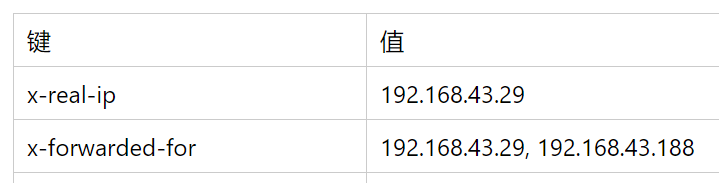

# 客户端IP的获取

我们的应用服务器可能需要获取用户客户端的IP地址，用于实现访问统计、主动防御等需求，但现在已经很少有客户端直接请求应用服务器的情况了。在应用服务器之前，可能有代理加速的CDN，可能有数层负载均衡的Nginx，那么显然应用服务器直接获取的请求IP地址是上一层反向代理的IP地址，那么如何获取客户端的真实IP呢？

## X-Forwarded-For和X-Real-IP

在有多层代理的情况下，我们一般约定这两个HTTP头来表示和请求IP相关的信息。

X-Forwarded-For（简称XFF）的格式是`X-Forwarded-For: client, proxy1, proxy2`，它可以用来显示完整的代理路径。如果客户端请求经过proxy1、proxy2、proxy3到达应用服务器，那么我们期望得到的XFF链路IP信息是client, proxy1, proxy2。另外的proxy3可以通过应用服务器的TCP对端IP得到。

X-Real-IP的格式是`X-Real-IP: client`，它仅仅用来记录并在代理之间一层层传递真实的客户端IP，无论中间经过了多少层代理。

## 配置Nginx

假设我们实验的网络环境是这样的：

```
客户端 192.168.43.29  →
代理1  192.168.43.188 →
代理2  192.168.43.254 →
服务端 192.168.43.164
```

为了获取客户端的IP和完整的代理链路信息，我们需要分别配置代理1和代理2的Nginx配置文件。

代理1：
```lua
location / {
        proxy_set_header X-Real-IP $remote_addr;
        proxy_set_header X-Forwarded-For $remote_addr;
        proxy_pass http://192.168.43.254:80/;
}
```

`$remote_addr`变量能够得到TCP连接中，对方的IP。第一层代理获取的正是客户端的真实IP，因此我们将其作为`X-Forwarded-For`和`X-Real-IP`向下传递。

代理2：
```lua
location / {
        proxy_set_header X-Real-IP $http_x_real_ip;
        proxy_set_header X-Forwarded-For $proxy_add_x_forwarded_for;
        proxy_pass http://192.168.43.164:80/;
}
```

第二层中，`X-Real-IP`需要从前一层的`X-Real-IP`请求头中获取，因此使用变量`$http_x_real_ip`，而对于`X-Forwarded-For`，我们需要在其值后面附加上前一层代理的IP，Nginx直接通过变量`$proxy_add_x_forwarded_for`提供了这个功能。

当HTTP请求继续向下传递，我们应用服务器获取到的请求头应该是这样的：



这样，我们就很容易的能够通过XFF获取代理链路，以及通过X-Real-IP获取客户端真实IP了。

## 一些注意事项

### XFF伪造

一种常见的XFF错误配置是在第一层代理就使用`$proxy_add_x_forwarded_for`，一般来说，这样做Nginx也能够正常将客户端IP追加到XFF中，但这为客户端伪造XFF提供了机会。

如果客户端请求头中包含一个手动伪造的XFF头信息，例如：`X-Forwarded-For: 假的IP`，通过两层Nginx代理，会得到`X-Forwarded-For: 假的IP，客户端真实IP，真实proxy1的IP`，如果应用程序读取的是第一个逗号前面的IP作为客户端真实IP，那攻击者的意图就得逞了。

因此，对于第一层代理，我们最好使用`$remote_addr`。

### 可信的代理服务器

HTTP请求的XFF和X-Real-IP是通过代理服务器一层层传递的，如果其中任何一个代理（比如CDN）是不可信的，那么应用服务器得到的信息就一定是不可信的。

### 不太规范的配置约定

实际上，XFF和X-Real-IP只是一种约定。除了上面介绍的配置方式，还经常见到其它的不太规范的配置。比如：没有X-Real-IP，而是仅用XFF存储一个客户端的真实IP，并且不再追加代理的链路信息，这显然是拿XFF当作X-Real-IP使用的不规范配置。像这种情况，还是需要和运维人员沟通，具体情况具体分析了。
