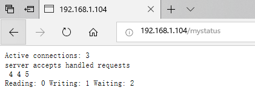

# Nginx 模块

Nginx是基于模块化设计的，上一篇笔记中，我们使用命令`nginx -V`查看编译参数，已经看到了很多默认编译进Nginx的模块，除此之外，Nginx还有很多第三方模块可以使用。

这篇笔记以`http_stub_status_module`为例介绍如何在Nginx中配置模块。

## http_stub_status_module

这个模块用于展示当前Nginx服务器的连接状态信息，默认没有开启。

我们可以在配置文件中配置该模块，启用这个功能。这里我们在`sites-available/default`中，在`server`配置里加一个`location`配置：

```
location /mystatus {
                stub_status;
        }
```

保存后，我们可以用Nginx自带的配置检测功能，检查一下我们编写的配置有没有语法错误（需要管理员权限）：

```
nginx -tc /etc/nginx/nginx.conf
```

使得配置文件生效不需要重新启动Nginx，只需要用nginx命令重新载入配置文件（需要管理员权限）：

```
sudo nginx -s reload -c /etc/nginx/nginx.conf
```

然后使用浏览器访问`/mystatus`就能看到相应的页面了：



* `Active connections`：活动的连接数
* 中间的三个数字：连接数，握手数，请求数
* 最后三个数字：正在读的连接数，正在写的连接数，等待的连接数（HTTP长连接会产生等待状态）

可能是因为这个模块比较古老了，不得不吐槽一下这个页面做的太简陋了，不做页面返回个json也行啊。
