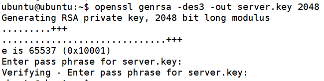
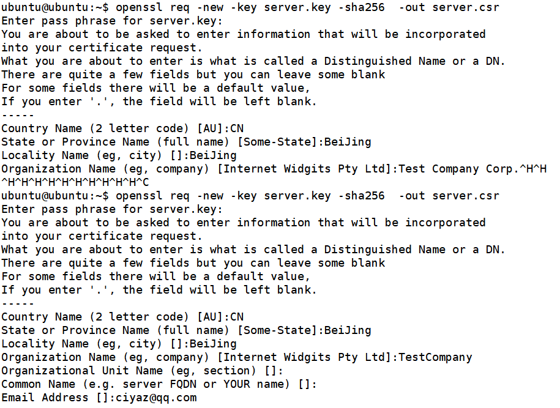
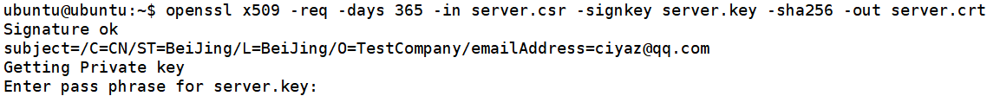
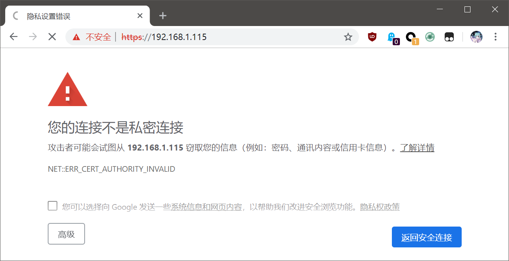

# 配置SSL证书

这篇笔记记录如何用`openssl`生成一个自签名证书，以及如何在Nginx中配置SSL证书。

## 生成自签名证书

这里我们使用Linux下的`openssl`命令生成一个自签名证书。生成证书的步骤其实很好理解，我们先生成一个私钥，然后根据私钥生成一个包含公钥的证书，发布到网络上即可。

步骤1：首先生成一个RSA私钥，秘钥我们使用RSA 2048，对称加密算法使用3DES，生成文件名为`server.key`，生成时，会要求我们输入密码。

```
openssl genrsa -des3 -out server.key 2048
```



步骤2：这里还需要生成一个CSR文件（Certificate Signing request，证书请求文件），这一步会要求输入一些内容，按要求输入即可。

```
openssl req -new -key server.key -sha256  -out server.csr
```



步骤3：生成自签名证书

```
openssl x509 -req -days 365 -in server.csr -signkey server.key -sha256 -out server.crt
```



这里生成的`.crt`文件就是证书了。

注：许多政府机关、国企的HTTPS网站都是使用的自签名证书，用户必须手动下载安装证书，其实不是买不起，而是不愿给外国人交钱，让证书的「合法性」掌握在外国人手中。而个人网站为了避免让用户安装证书的麻烦，通常使用`Let's encrypt`等提供的免费证书。

## 配置Nginx

配置Nginx时，还需要指定额外的一个文件，作为`ssl_password_file`的配置项，里面的内容是生成证书时输入的密码。

实际上，如果配置了SSL证书，Nginx启动时会要求输入密码。但是，Linux下我们的Nginx是通过`systemd`来管理启动的，因此没有手动输入密码的步骤就会报错，所以这里必须加上密码配置。

```
server {
        listen 443 ssl;
        listen [::]:443 ssl;

        server_name www.aaa.com;

        ssl_certificate /home/ubuntu/server.crt;
        ssl_certificate_key /home/ubuntu/server.key;
        ssl_password_file /home/ubuntu/passphrase;

        root /var/www/html;
        index index.html index.htm index.nginx-debian.html;

        location / {
                try_files $uri $uri/ =404;
        }
}
```

由于SSL证书是我们自签名的，所以访问时Chrome浏览器会给我们一个大大的警告，我们不用理它。



## 针对80端口的兼容配置

假如我们的网站之前使用的是HTTP，位于80端口，很多用户喜欢我们的网站，加入了收藏夹，加为了友情链接，或者把链接收藏在笔记本中。如果我们突然把80端口关闭改为443，这部分用户就会无法访问我们的网站。较好的解决方案是针对80端口的请求，直接301重定向到443端口，这可以用重写URL实现。

```
server {
        listen 80;
        server_name www.aaa.com;
        rewrite ^(.*)$ https://$host$1 permanent;
}
```

## 开启HTTP2

前面的配置虽然加上了SSL，但是还是HTTP1.1，我们可以开启HTTP2，提升传输的性能。

```
listen 443 ssl http2;
listen [::]:443 ssl http2;
```

响应头：

```
HTTP/2.0 200 OK
server: nginx/1.10.3 (Ubuntu)
date: Tue, 07 May 2019 11:02:21 GMT
content-type: text/html
last-modified: Tue, 19 Mar 2019 12:13:51 GMT
etag: W/"5c90dcff-264"
content-encoding: gzip
X-Firefox-Spdy: h2
```

注：Chrome74读取HTTP2的响应头，`view source`按钮似乎是消失了，不知是不是bug，这里使用的是Firefox开发者版。
