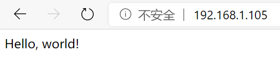
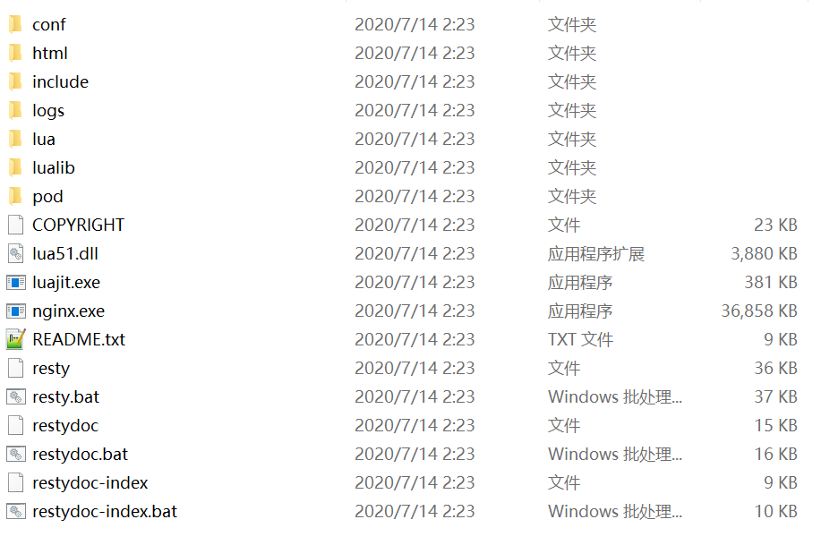

# OpenResty简介


OpenResty是一个基于Nginx和Lua的开源框架，OpenResty整合了ngx_lua等Nginx扩展，以及开发了一系列内置库，使其具有集成Redis、MySQL等组件的能力，形成了一个相对完整的Web应用开发框架。

当然，实际上目前OpenResty还是主要用作高性能的策略网关、防火墙等用途，而不是直接开发应用程序。

项目官网：[http://openresty.org/en/](http://openresty.org/en/)

项目代码仓库地址：[https://github.com/openresty/openresty](https://github.com/openresty/openresty)

## 什么是OpenResty

我们知道Nginx是一个使用十分广泛的Web服务器程序，通过大量的扩展模块和功能强大的配置文件，Nginx能够实现静态文件服务、反向代理、负载均衡等诸多功能。

然而，仅仅是通过配置文件来指挥Nginx，有时还是不够灵活，能不能插入一段脚本逻辑，来控制Nginx呢？`ngx_lua`扩展就能实现这样的功能，而OpenResty则是基于此的一个整合框架。可以说，Nginx本体只是没有感情的工具人，而OpenResty则是能让我们给Nginx注入灵魂的框架。

## 前置知识

学习OpenResty前，需要学习HTTP协议、Nginx相关知识，可以参考本笔记仓库中的相关章节，不了解这些内容是无法学习OpenResty的。

其次需要了解Lua语言，不过这门语言和C语言一样语法十分简单，花十分钟粗略浏览下文档即可学会基本的使用。

## 环境搭建

### Linux环境搭建

Linux环境下，建议通过源码方式安装OpenResty。

注：源码包编译后，会形成一个自带Nginx和OpenResty框架的目录，注意测试时别和系统的Nginx发生冲突（生产环境现在一般都是容器化部署，应该不会发生这种问题）。

首先安装必要的依赖：

```
apt-get install libreadline-dev libncurses5-dev libpcre3-dev libssl-dev perl make build-essential
```

然后下载OpenResty的源码包，注意我这里使用的是当前最新版本，具体使用时，还需要根据实际情况来选择，源码包可在官网找到。

```
wget https://openresty.org/download/openresty-1.17.8.2.tar.gz
```

解压源码包：

```
tar xvf openresty-1.17.8.2.tar.gz
```

配置编译的模块，这里`--prefix`指定的是安装目录，如果有需要，还可以使用`--with-`和`--without-`选项来指定开启或关闭编译的模块，这里我将模块留作默认。

```
./configure --prefix=/opt/openresty
```

编译安装：

```
make
```

```
make install
```

### Hello world

接下来，我们可以创建一个工程目录，来验证一下。OpenResty的工程目录，其实就是Nginx的配置文件，加一大堆Lua脚本。这里我们创建的工程目录如下：

```
openresty-demo/
├── conf
│   └── nginx.conf
└── logs
```

注：这里为了简单起见，我们的Lua脚本内联写到了`nginx.conf`里，实际开发中不推荐这么做。

nginx.conf
```lua
worker_processes  1;
error_log logs/error.log;
events {
    worker_connections 1024;
}

http {
    server {
        listen 80;
        location / {
            default_type text/html;

            content_by_lua_block {
                ngx.print("Hello, world!")
            }
        }
    }
}
```

启动OpenResty的Nginx：

```
/opt/openresty/nginx/sbin/nginx -p openresty-demo/
```

* `-p`：指定Nginx的工作目录，使用重载配置、关闭服务等相关操作时，都需要指定这个参数

使用浏览器访问：



### 关闭Lua代码缓存

```
lua_code_cache off;
```

开发过程中，我们可以关闭Lua代码缓存，这样Nginx每次处理请求时，都会重新读取Lua脚本，我们修改代码后，就不用再使用`nginx -s reload`了。

注：仅限于开发环境，生产环境不要这么做！

### Windows环境搭建

OpenResty有Windows系统下的预编译包，我们直接将其下载下来使用即可。Nginx的启动等操作，和Linux相同，这里就不多介绍了。


