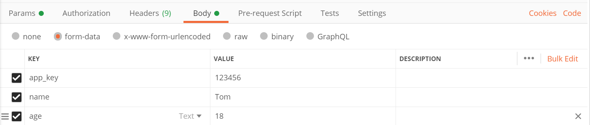

# 处理HTTP请求

OpenResty是基于Nginx封装的，因此处理HTTP请求也不像成熟的应用框架那样高度封装，而是更加偏向HTTP协议底层，当然这也留给我们了更多发挥的空间。

## 处理URL请求参数

下面例子代码中，我们可以读取形如`/demo?name=tom&age=18`这种请求的路径参数。

demo.lua
```lua
local args = ngx.req.get_uri_args()
for k, v in pairs(args) do
	ngx.say('[Param] '..k..' '..v)
end
```

这里注意一点，`get_uri_args()`读取的是路径参数，而不区分GET、POST、PUT、DELETE，只要是路径中的参数，都能读取。

## 处理请求体

HTTP协议中，请求体其实可以归为四类：

* `raw`：原始数据，Ajax中经常用其传递Json、XML或其它非表单类型的数据
* `x-www-form-urlencoded`：键值对型的表单数据
* `form-data`：标签和分隔符形式的表单数据，能够传输多个二进制文件
* `binary`：纯二进制数据

### 读取原始请求体

解析请求体前，我们需要先了解一个知识：

* `client_body_buffer_size`：Nginx的请求体缓冲区大小，64位系统下默认为16KB。如果请求体超过这个大小，将以临时文件的形式存储在磁盘中。对于仅用于上传功能的服务器，可以适当调大该值，以提高性能。

OpenResty中，提供了两个函数读取HTTP请求体：

* `ngx.req.get_body_data()`：读取内存中的请求体，如果请求体存储为了临时文件，则返回`nil`
* `ngx.req.get_body_file()`：获取请求体临时文件

因此，使用OpenResty时，这两种情况都需要考虑。如下代码即为读取HTTP请求体的例子：

demo.lua
```lua
function readTmpFile(filename)
	local fp = assert(io.open(filename, 'r'), '读取文件失败')
	local data = fp:read('*a')
	fp:close()
	return data
end

ngx.req.read_body()

local data = ngx.req.get_body_data()
if data == nil then
	local filename = ngx.req.get_body_file()
	if filename then
		data = readTmpFile(filename)
	end
end

ngx.say(data)
```

既然能读取原始请求体，那么解析`x-www-form-urlencoded`、Json、XML等也就都可以实现了，这里就不多介绍了。

### 使用lua-resty-upload

那么如何处理`form-data`类型表单呢？我们知道，其实`form-data`是HTTP协议上传文件所必须使用到的请求体格式，`lua-resty-upload`这个扩展库（默认编译时已经自带）就可以解析这种类型的请求体。

```lua
local upload = require 'resty.upload'
local cjson = require 'cjson'

local chunk_size = 4096
local form, err = upload:new(chunk_size)
if not form then
	ngx.exit(500)
end

while true do
	local typ, res, err = form:read()
	if not typ then
		ngx.exit(500)
	end
	
	ngx.say(cjson.encode({typ, res}))
	
	if typ == 'eof' then
		break
	end
end
```

这里我们为了便于输出，使用了`cjson`来将结果序列化为Json。`resty.upload`的使用非常简单，其实就是循环读取，根据返回的`typ`，来判断当前读取到`form-data`格式的哪一部分。

我们这里使用Postman来进行测试：



响应结果：

```
["header",["Content-Disposition","form-data; name=\"app_key\"","Content-Disposition: form-data; name=\"app_key\""]]
["body","123456"]
["part_end"]
["header",["Content-Disposition","form-data; name=\"name\"","Content-Disposition: form-data; name=\"name\""]]
["body","Tom"]
["part_end"]
["header",["Content-Disposition","form-data; name=\"age\"","Content-Disposition: form-data; name=\"age\""]]
["body","18"]
["part_end"]
["eof"]
```

注：最好不要使用Base64来通过文本接口上传文件，Base64编码后，体积会增大许多，服务端和客户端还都要进行编解码运算，这完全是没有必要的性能开销。
