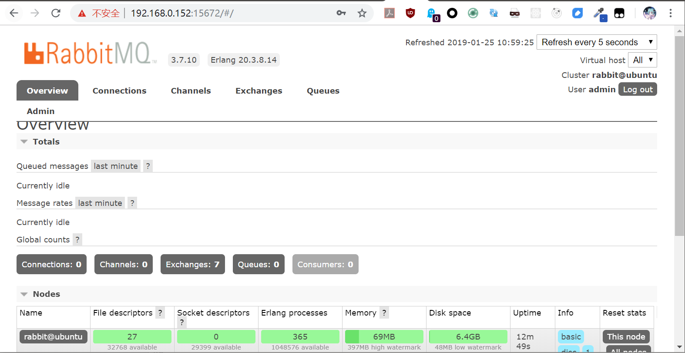

# RabbitMQ安装运行

RabbitMQ是一个使用erlang开发的开源高性能消息队列，使用广泛，文档详细，社区相对活跃。本系列笔记参考《RabbitMQ实战指南》这本书，学习RabbitMQ的部署、使用和运维。

## 在Ubuntu16.04下安装RabbitMQ

这里有安装的相关参考文档：[http://www.rabbitmq.com/install-debian.html#apt](http://www.rabbitmq.com/install-debian.html)

RabbitMQ安装前，首先要安装erlang，但是我们必须安装RabbitMQ对应的erlang版本，apt源中默认的版本可能不行，我们可以用erlang提供的`erlang-solutions`安装erlang环境。

```
wget https://packages.erlang-solutions.com/erlang-solutions_1.0_all.deb
sudo dpkg -i erlang-solutions_1.0_all.deb
sudo apt-get update
```

`erlang-solutions`安装好后，各个版本的erlang我们都可以通过其新加的软件仓库进行安装，因此我们首先要查看我们要安装的RabbitMQ对应的erlang版本，我目前安装的RabbitMQ是`3.7.10`版本，它需要`1:20.3`这个erlang版本，因此去github看一下详细的版本号。


找到版本号后，安装对应版本的erlang：
```
sudo apt-get install esl-erlang=1:20.3.8.14
```

然后安装RabbitMQ，我们需要添加apt源和仓库公钥，然后执行安装：
```
echo "deb https://dl.bintray.com/rabbitmq/debian xenial main" | sudo tee /etc/apt/sources.list.d/bintray.rabbitmq.list
wget -O - "https://github.com/rabbitmq/signing-keys/releases/download/2.0/rabbitmq-release-signing-key.asc" | sudo apt-key add -
sudo apt-get update
sudo apt-get install rabbitmq-server
```
安装好后，`rabbitmq-server`服务会自动注册和启动，我们可以使用`systemctl`进行管理。

开启web管理插件，我们就可以用浏览器访问RabbitMQ的控制台，默认服务端口号为`15672`：
```
sudo rabbitmq-plugins enable rabbitmq_management
```

RabbitMQ的web管理控制台默认有一个账号和密码都是`guest`的账号，但是该账号只能在`localhost`使用，学习RabbitMQ时，我们也可以手动添加一个账号，然后为其分配所有权限（不要在生产环境中这么干）。

给RabbitMQ配置一个新的管理员账号，账号`admin`，密码`123456`：
```
sudo rabbitmqctl add_user admin 123456
sudo rabbitmqctl set_user_tags admin administrator
sudo rabbitmqctl set_permissions -p / admin ".*" ".*" ".*"
```

登入RabbitMQ的web管理控制台如下图：


