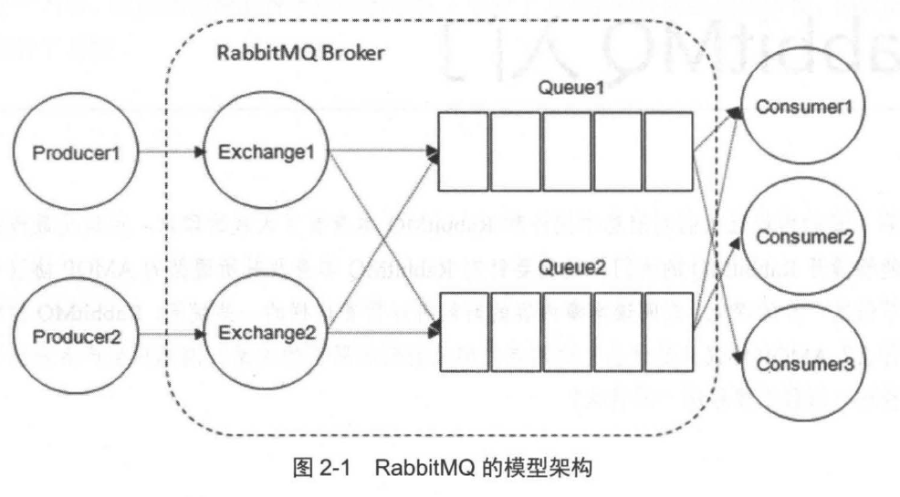

# RabbitMQ基本概念

本节介绍下RabbitMQ中的一些基本概念，我们使用RabbitMQ实际上就是基于这些抽象概念来进行的。

## RabbitMQ的架构

## 生产者 Producer

「生产者」指投递消息的一方，消息一般包含标签（Label）和载荷（Payload）两部分：

* 标签描述这条消息，包括交换器（Exchange）的名称和路由键（Route Key），用于标识这个消息会被送到哪些消费者手中
* 载荷是消息携带的数据，通常是一个具有业务逻辑的数据结构，比如一个JSON字符串

## 消费者 Consumer

消费者用于接收并处理消息，在RabbitMQ中间件处理的过程中，消息会通过标签被送到正确的消费者手中，消费者处理的是消息的载荷。

## 中间人 Broker

Broker中文可以翻译为「中间人」，在各种消息中间件中，通常用英文单词Broker表示一个启动的中间件实例，也可以理解为一台跑着RabbitMQ服务的服务器。

## 队列 Queue

队列是一个存储消息的数据结构，多个消费者可以定义同一个队列，队列中的消息会被订阅的消费者分摊，大多数消息中间件都是这么设计的。我们可以在RabbitMQ客户端代码中声明队列，也可以手动在管理控制台创建队列。

## 交换器 Exchange

生产者生成消息后，会将消息发送到交换器，由交换器发送到一个或多个队列。RabbitMQ中，Exchange常用的有三种类型：

* fanout：把所有发送到该Exchange的消息路由到所有与其绑定的Queue中
* direct：把发送到该Exchange的消息，通过Routing Key和Binding Key精确匹配，路由到所有与其绑定的Queue中
* topic：和direct的区别就是topic用通配符模糊匹配，具体见下文有关Routing Key和Binding Key的介绍

我们可以在RabbitMQ客户端代码中声明交换机，也可以手动在管理控制台创建交换机。

## 路由键 Routing Key 绑定键 Binding Key

Binding Key用于指定消息从Exchange流向哪些Queue，它对应的值是从Exchange到Queue的一对多映射关系，可以包含通配符。而Routing Key更像是一个标识，用于Binding Key去匹配，很多时候我们要求Binding Key精确匹配Routing Key，那么此时这两个键名就是相同的（Exchange的direct模式），有时Binding Key则是带有通配符的，例如`*.rabbitmq.*`，它可以匹配`com.rabbitmq.client`这个Routing Key（Exchange的topic模式）。

## 连接 Connection 信道 AMQP Channel

Connection就是从AMQP客户端到RabbitMQ的TCP连接，而Channel是TCP连接之上的一个抽象概念，这就像多层网络协议栈一样，Channel的实现是基于TCP连接的，我们使用AMQP客户端时，操作的是Channel。

## 高级概念

### 超时时间（Time To Live，TTL）

RabbitMQ中，消息和队列都可以指定超时时间，超时的消息将被删除（或进入死信队列），超时的队列将被删除。

注：数字电路中也有个TTL，不要搞混了

### 死信队列

死信队列表示当一个消息在消息队列中变成死信后，它会被路由到死信交换机中（Dead Letter Exchange，DLX），绑定DLX的队列就是死信队列。这个队列一般用于进行一些错误处理、写入错误日志之类的功能。

消息变成死信的条件：

1. 消息被拒绝，且设置`requeue`为`false`
2. 消息超过超时时间
3. 队列达到最大长度

### 延迟队列

延迟队列的消息会延迟一定时间后再交给消费者。

### 优先队列

在优先队列中，我们可以为消息指定优先级，如果一定时间内，生产者生产的消息远远快于消费者消费的速度，优先级高的消息就会被优先处理。
