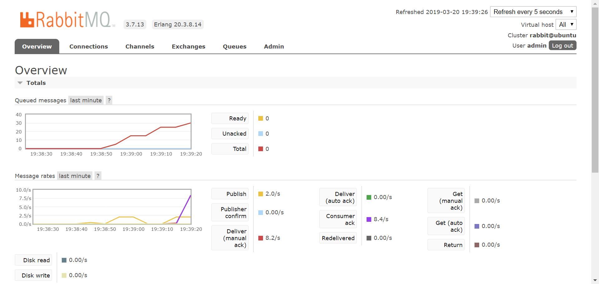
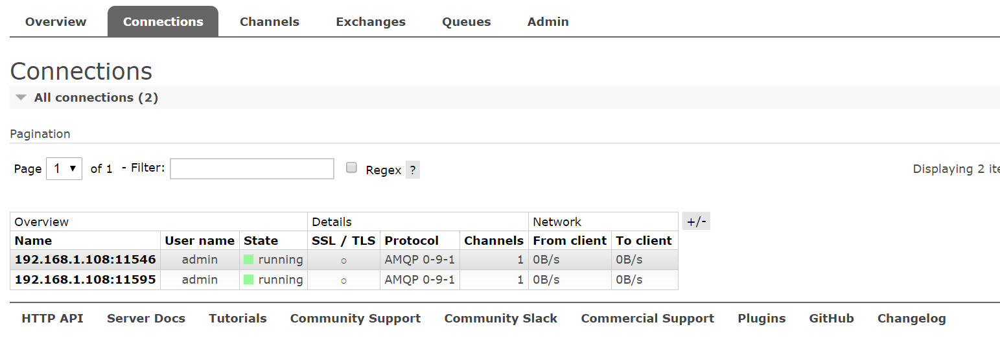
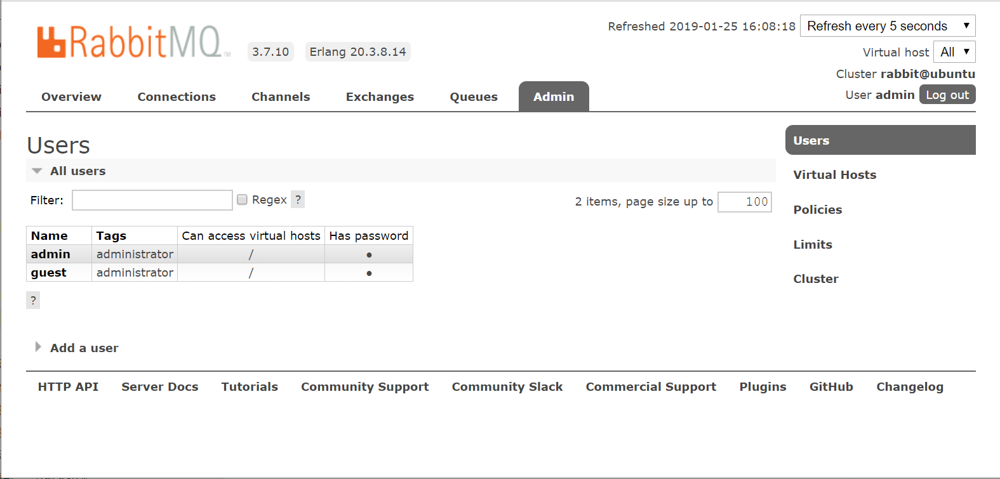
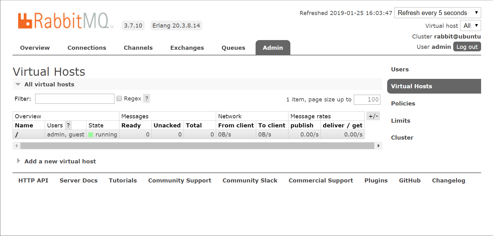

# RabbitMQ管理

本篇笔记记录RabbitMQ中的一些基本的管理配置。

在安装运行相关章节，实际上我们已经使用了`rabbitmqctl`进行了简单的用户管理，创建了一个可以远程登录的账户，此外还开启了`rabbitmq_management`插件。RabbitMQ提供的命令非常简单，但是使用web管理界面操作更加简单，通常我们使用后一种方式。

## 总体监控视图

在OverView视图中，我们能够看到队列中消息的状况。

## 连接视图

在Connection视图中，我们能看到当前所有连接到RabbitMQ的客户端，包括生产者和消费者。

后面的信道、队列、交换机视图都差不多，这里就不多作介绍了。

## 用户管理视图

用户管理界面如下图：

我们可以看到默认的`guest`用户，和我们之后为了方便实验创建的具有所有权限还能远程登入的`admin`用户。

我们也可以点击`Add a User`创建一个新用户。

## 虚拟主机管理

RabbitMQ具有「虚拟主机」的概念，就像web服务器通过域名在一个IP地址上运行多个应用，类似的RabbitMQ中也能通过虚拟主机建立多个隔离的消息系统环境，其中的Exchange、Queue等都不能互通。我们可以在web管理界面查看到相关信息：

默认情况下，我们只有一个虚拟主机，它用`/`表示，如果我们建立了一个虚拟主机`/myvhost`，使用代码创建`Connection`时也要正确指定要连接的虚拟主机。
