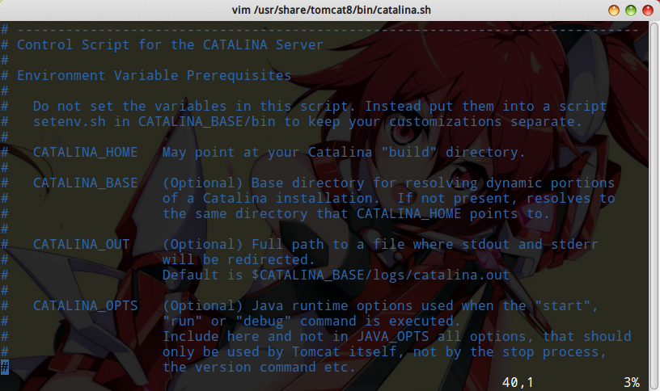

# Tomcat环境搭建和基本使用

本系列笔记参考《Tomcat权威指南 第二版》，《深入剖析Tomcat》，记录的是Tomcat服务器的配置，维护，实现等细节问题。有关JavaWeb开发的内容，请参考`Java企业级应用开发/JavaWeb`章节。

## 安装Tomcat

我们使用Tomcat开发软件时，最好的办法是从apache官网下载一个包含二进制文件的压缩包，例如`apache-tomcat-8.5.14.tar.gz`，然后在Intellij IDEA中配好这个服务器，我们就开工了。但是这里介绍的是在部署环境中，真实的服务器下，如何安装Tomcat，如何部署应用程序。由于服务器大多是Linux操作系统，这里我们以Ubuntu Server16.04为例，进行讲解，在一个虚拟机中进行实验。

### 使用apt安装Tomcat

为什么这里我们不是直接解压一个压缩包，而是要用apt安装呢？因为服务器中，Tomcat作为一个服务程序，和Nginx，MySQL等一样，应由系统管理员进行统一管理，比如配置runlevel等。手动解压的Tomcat的文件结构，和管理方式都不符合这种要求。Ubuntu下，建议使用包管理器apt进行安装。

配置Java环境
```
sudo apt-get install openjdk-8-jdk
```

安装Tomcat8
```
sudo apt-get install tomcat8
```

至此，我们已经搭建好了Tomcat环境。我们可以通过浏览器进行访问主机的8080端口（Tomcat默认使用8080端口）。


除了那个大大的`It works!`，不要忽略下面的小字，它告诉我们了这些有用的信息：

* Tomcat的应用目录为`/var/lib/tomcat8/webapps`。
* CATALINA_HOME（bin，包括一些二进制文件和脚本）为/usr/share/tomcat8，CATALINA_BASE（conf,logs,temp,webapps,work,shared目录）为/var/lib/tomcat8。
* 如果有需要，我们可以选装这三个软件包：
  * tomcat8-docs 安装一个包含有Tomcat文档的WebApplication
  * tomcat8-examples 安装一些WebApplication的例子程序，我们在开发相关的章节中多次提到这些例子程序，当然，在服务器中强烈不建议安装，以免引起不必要的麻烦（如安全漏洞等）。
  * tomcat8-admin 一个便于配置Tomcat的WebApplication，包括`manager webapp`和`host-manager webapp`。

### 直接解压Tomcat压缩包

在开发环境中，我们最好用这种方式安装Tomcat，因为所有Tomcat目录文件都在一个文件夹内。我们启动，停止Tomcat，就像操作一个普通应用程序一样简单，而不用了解复杂的Linux或Windows操作系统维护的知识。这个我想我们已经用的很熟了，就不多介绍了。

## 启动和停止Tomcat

如果我们使用apt进行安装，那么就可以和其他服务一样，统一使用service命令进行管理：

启动服务
```
sudo service tomcat8 start
```

停止服务
```
sudo service tomcat8 stop
```

重启服务
```
sudo service tomcat8 restart
```

## 环境变量

Tomcat正确运行需要一些环境变量，下面我们简单介绍一下。

### setenv.sh

我们打开`/usr/share/tomcat8/bin/catalina.sh`，在文件开头会看到一些关于环境变量的说明。



文中指出，我们如果要修改这些环境变量，建议在`bin`目录中，建立一个`setenv.sh`。通常这个文件没有被默认创建，我们手动创建一个就行了。里面编写`export`语句，修改环境变量即可。Tomcat的启动脚本运行时，会自动在脚本的shell中，设置里面的环境变量。

### 常用环境变量

* CATALINA_HOME Ubuntu下默认指向`/usr/share/tomcat8`，里面主要是`bin`目录，包括启动脚本等。
* CATALINA_BASE Ubuntu下默认指向`/var/lib/tomcat8`，我们可以理解为这个是Tomcat的工作目录，配置多个Tomcat实例时我们可以为每一个Tomcat都配置一个CATALINA_BASE，只有一个实例实际上这个环境变量就等于CATALINA_HOME。
* CATALINA_OPTS 我们可以通过这个环境变量指定Tomcat工作的JVM参数等。里面的参数会传递给启动Tomcat的`java`命令。如`-Xms`，`-Xmx`，这对Tomcat性能调优很有用。
