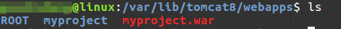
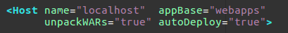

# Tomcat 应用程序部署

我们在使用IDE开发Java Web应用程序时，一点运行，就会自动弹出浏览器，显示程序的运行结果。实际上，IDE帮我们省略了很多步骤，这篇笔记记录如何在服务器的部署环境上，部署Java Web应用程序。

## war和war exploded

Java Web应用程序有固定的文件目录结构，开发完成后，可以把项目打包为一个`.war`文件部署，也可以直接把整个项目文件夹部署（war exploded方式）。

打包为单个`.war`文件，优点是只有一个文件，管理起来十分方便。而不打包，优点则是系统管理员可以很方便的对内部的配置文件进行修改。这两种方式的选择，应该视部署环境而定。

无论`.war`文件还是war exploded，在tomcat8中，最简单的部署方式就是把项目扔到`CATALINA_BASE/webapps`下。不需要任何配置，甚至不需要重启tomcat，项目已经热部署完成了。

下图中，我将`myproject.war`直接放入`webapps`，tomcat会自动将其解压到一个同名的文件夹，部署机器的IP是`192.168.1.104`，在浏览器中访问`http://192.168.1.104:8080/myproject/`就能正常访问到新部署的项目了。



## 自动部署

打开`CATALINA_BASE/conf/server.xml`，我们可以看到下图的默认配置。这也解释了tomcat解压缩`war`包，和自动热部署的行为。



## context

上面访问项目时，我们输入的地址是`http://IP:端口/myproject/`，其中`myproject`和我们放入`webapps`的`war`文件同名。实际上，对于tomcat，我们部署进去的一个“项目”被称为“context”，开发Java Web应用程序时，我们称`/myproject`为context path。如果tomcat里部署了多个项目，我们就能使用不同的context path进行访问。

## 手动进行部署配置

现在我们有`/home/ciyaz/myproject.war`，并且不打算把它放到`webapps`里，我们需要命名这个项目的名字（context）为`abc`，即我们希望使用`http://IP:端口/abc/`进行访问。此时，就必须手动配置了。

我们在`CATALINA_BASE/conf/Catalina/[hostname]`目录下，创建一个`abc.xml`，并写入以下内容：

```xml
<Context docBase="/home/ciyaz/myproject.war">
</Context>
```

这样配置就能达到我们的要求了。注意文件名，`abc.xml`的`abc`就是context名字，而配置文件里的`docBase`则是`war`包的路径。通过此种方式，我们也可以配置多个在不同位置的项目。

注：网上查到的资料都比较老了，网上大多数的手动配置是在`server.xml`的`host`里配置`context`，这样做的缺点是`server.xml`只会在服务器启动时读取一次，而上述的方法tomcat会一直监视配置文件的变化，修改不需要重启tomcat，比如把`abc.xml`改名为`cba.xml`，新的context path会立刻生效，而且这种方式配置文件结构比较清晰。

## host

`host`叫做虚拟主机。打开`CATALINA_BASE/conf/server.xml`，我们看到tomcat默认配置了一个host，其`name`属性为`localhost`。前文说过，tomcat可以配置多个`context`，也就是多个web应用程序，但是这些web应用程序在同一个服务器上，其ip相同。如果这些web应用程序域名不同，用户从DNS服务器得到web应用程序服务器IP，那服务器如何知道用户想要访问哪个网站呢？

实际上，用户的HTTP请求里有一个`host`字段，值就是用户请求的域名，tomcat配置的web应用程序如果需要使用域名，可以使用配置虚拟主机配置进行绑定。
