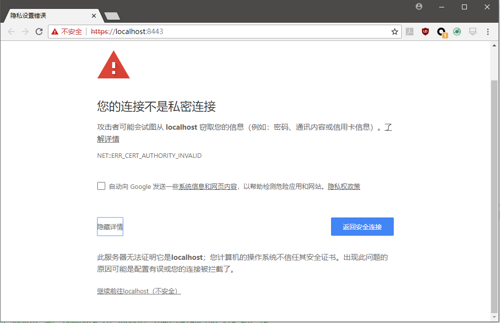

# 服务器配置概述

这片笔记主要讲解的其实就是server.xml中的一些配置项，涉及Tomcat服务器的功能配置、性能优化等内容。本片笔记是基于Tomcat8.0进行讲解的。

可以参考官方文档：[https://tomcat.apache.org/tomcat-8.0-doc/config/http.html#Connector_Comparison](https://tomcat.apache.org/tomcat-8.0-doc/config/http.html#Connector_Comparison)

## HTTP/HTTPS Connector配置

Tomcat中，Connector是处理网络请求的终端，使用浏览器上网时，我们最常用的两种协议是HTTP和HTTPS。

在`server.xml`中，默认有这样的配置：

```xml
<Connector port="8080" protocol="HTTP/1.1"
           connectionTimeout="20000"
           redirectPort="8443" />
```

* port：使用的TCP端口
* protocol：使用的协议
* connectionTimeout：请求超时时间
* redirectPort：这个配置其实比较让人费解，在Tomcat8中可能是历史遗留问题，没发现有任何用处，删掉也完全没问题。

这个配置能让我们使用`HTTP`协议与`TCP 8080`端口访问Tomcat服务器上的资源。

### 开启NIO2模式

JDK中新的NIO、NIO2相比旧的BIO，有更好的IO性能。将protocol属性替换成如下内容即可开启NIO2模式：

```xml
<Connector port="8080" protocol="org.apache.coyote.http11.Http11Nio2Protocol"
           connectionTimeout="20000"
           redirectPort="8443" />
```

### 开启APR（Apache Portable Runtime）模式

APR模式使用本地库，性能上得到了进一步提高，但是依赖于具体的操作系统平台，这里就不具体介绍了。

### 使用HTTPS

server.xml中有如下配置，取消注释就可以开启HTTPS了，但是直接启动会报错，因为我们必须配置HTTPS证书。

```xml
<Connector port="8443" protocol="org.apache.coyote.http11.Http11NioProtocol"
           maxThreads="150" SSLEnabled="true" scheme="https" secure="true"
           clientAuth="false" sslProtocol="TLS" />
```

这里我们使用JDK自带的工具`keytool`生成一个自签名证书（仅用于测试）。

输入命令：
```
keytool -genkeypair -keyalg "RSA" -keystore "e:/tomcat.keystore"
```

这里我们就生成了一个对localhost的证书了。

将HTTPS的Connector修改为如下，指定证书路径和密码：

```xml
<Connector port="8443" protocol="org.apache.coyote.http11.Http11Nio2Protocol"
           maxThreads="150" SSLEnabled="true" scheme="https" secure="true"
           clientAuth="false" sslProtocol="TLS" keystoreFile="E:\workspace_ciyaz\common-files\tomcat.keystore" keystorePass="root" />
```

使用chrome浏览器访问`https://localhost:8443`，由于是测试证书，因此显示如下：



继续访问即可。

## AJP Connector配置

AJP是一个二进制的TCP协议，主要应用于Web服务器（比如Apache）和Servlet容器之间传输数据，它通过保持TCP长连接来提高反向代理的数据传输性能。网上一些一知半解的博客说AJP用于动静分离什么的，其实这个协议和动静分离没有任何关系，它仅仅是用于将数据传输给Web服务器，然后由Web服务器转换为HTTP的方式再发送给客户端。

支持AJP的Web服务器主要是Apache的`mod_jk`，现在很火的Nginx只有第三方模块`nginx_ajp_module`，国人开发的，项目Github地址：[https://github.com/yaoweibin/nginx_ajp_module](https://github.com/yaoweibin/nginx_ajp_module)，但是用的人似乎不多，好多年未更新了，也不知道是否靠谱。还有一种说法是Nginx使用AJP相比HTTP没有什么优势，总之使用Nginx时，几乎没人用AJP了。不仅如此，大部分人都建议关闭AJP Connector以提高Tomcat性能和安全性。

总之这个功能默认就是开着的（最新的Tomcat9.0也是），如果实际上线的系统中不使用AJP，尤其是非对外开放的系统中，一定要注意这个AJP的Connector，不需要就应该及时关闭，以免引发安全问题。
