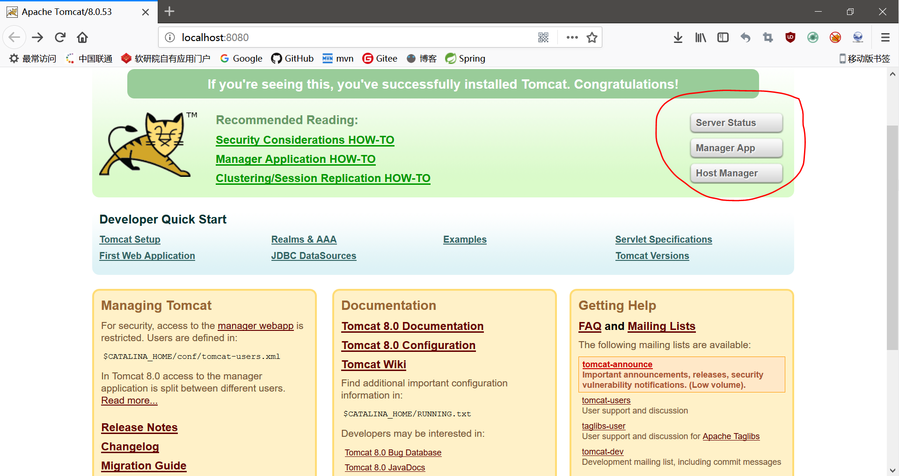

# 配置使用 Manager

在Tomcat的应用目录中，包含了`manager`和`host-manager`这两个项目，这些是Tomcat自带的GUI服务器管理工具，`manager`用于查看服务器状态，以及部署应用，`host-manager`用于管理虚拟主机配置。

启动Tomcat，访问`localhost:8080`，我们就能在默认首页右侧找相关按钮：



但是默认情况下，处于安全考虑，Tomcat没有为这两个功能配置任何用户和角色，要想使用我们需要自行配置。

找到`$CATALINA_BASE/conf/tomcat-users.xml`，在`<tomcat-users>`节点中，添加配置如下：

```xml
<!--
available roles:
  manager-gui — Access to the HTML interface.
  manager-status — Access to the "Server Status" page only.
  manager-script — Access to the tools-friendly plain text interface that is described in this document, and to the "Server Status" page.
  manager-jmx — Access to JMX proxy interface and to the "Server Status" page.
  admin-gui - allows access to the HTML GUI
  admin-script - allows access to the text interface
-->
<role rolename="manager-gui" />
<role rolename="manager-status" />
<role rolename="manager-script" />
<role rolename="manager-jmx" />
<role rolename="admin-gui" />
<role rolename="admin-script" />
<user username="admin" password="123456" roles="manager-gui,manager-status,manager-script,manager-jmx,admin-gui,admin-script"/>
```

这里配置了一个名为`admin`，密码为`123456`的用户，他拥有全部的权限（仅用于演示，千万不要在上线的服务器中这么做！！！）。

注：上面的角色定义注释是我照Tomcat文档抄的。

## Manager的安全性问题

如果觉得这个Manager开着不安全，也完全用不上，而且还拖慢Tomcat的启动速度，就不要配置`tomcat-users`了，把`webapps`下的应用删掉就行了，但是实际上`manager`工程的代码并不全在`webapps`中，大部分在tomcat的`lib`中的`catalina.jar`里。如果对Tomcat熟悉，定制精简也是能做到的。
