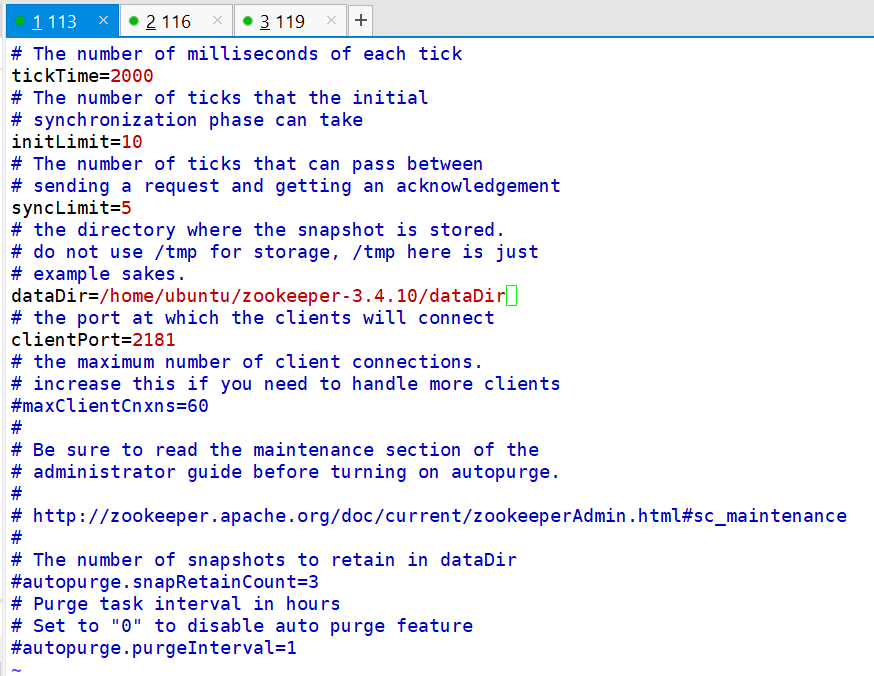

# ZooKeeper简介和集群环境搭建

ZooKeeper（以下简称ZK）是一个Java实现的分布式调度服务，能够实现例如：

1. 统一命名服务：对应用服务节点统一命名，实现服务注册发现
2. 服务节点配置管理：配置文件统一存储、同步，基于观察者模式通知应用服务节点更新配置
3. 集群状态管理：实时掌握应用服务节点的状态，维护节点上下线、故障等状态信息
4. 软负载均衡：可以实现根据访问量均衡应用服务节点负载（理论能实现，但真没听说过有这么干的）

说白了，ZK的功能其实非常简单，就是维护了一组目录，像文件夹那样，这些目录节点可以存储数据，这有点像LDAP或是JNDI。当数据更新时，ZK服务可以基于观察者模式通知客户端，该数据已更新。另外，ZK一般是以集群模式出现。功能就是这么个功能，比较好理解，基于ZK能玩出什么花样，我们就可以发挥自己的想象力了。

注：不要觉得ZK太过简单，没有任何技术含量。实际上，一个技术一旦放到分布式环境就会变得复杂，ZK的实现其实要考虑很多细节，比如分布式系统的CAP属性。

## ZK环境搭建

在搭建之前，先介绍两个基本概念。

选举机制：前面说过ZK是存储数据的，ZK集群可以类比为数据库主从集群，ZK集群节点也具有主节点和从节点的属性，然而稍有不同的是ZK的主节点是根据选举算法自动选出的，有兴趣可以了解一下，选举非常简单，这里不多介绍。

半数机制：当ZK节点有超过半数正常时，ZK集群能够正常提供服务。比如5个ZK节点有3个正常，ZK集群能够提供服务，有2个正常就不行了。这也导致，我们部署ZK集群时，最好部署奇数个节点。

### 下载安装包

下载：[https://zookeeper.apache.org/](https://zookeeper.apache.org/)

我们这里下载的版本是`zookeeper-3.4.10.tar.gz`，使用的服务器是UbuntuServer16.04，将ZK的压缩包分别在三台服务器上解压缩，运行ZK前要保证服务器装有JRE。

### 设置ZK节点

我们这里搭建有三个节点的ZK集群，ZK的配置非常简单，主配置文件在`conf`目录中，我们使用时，将`zoo_sample.cfg`复制一份为`zoo.cfg`即可。一些配置解释：

* tickTime：维持集群的心跳间隔毫秒数
* initLimit：集群启动超时时间，单位是心跳包的次数
* syncLimit：集群启动后维持心跳的超时时间，单位是心跳包的次数
* dataDir：ZK存储数据的目录，默认为`/tmp/zookeeper`，建议改为别的
* clientPort：ZK客户端连接的端口号



此外，我们还需要设置节点名称，节点名称不在配置文件里设置，而是需要在`dataDir`中创建一个叫做`myid`的文本文件，其中的名字就是节点名。


注：`myid`中的内容必须是数字！

之后，在`conf/zoo.cfg`中加上所有集群节点的配置即可。

```
server.1=192.168.1.113:2888:3888
server.2=192.168.1.116:2888:3888
server.3=192.168.1.119:2888:3888
```

ZK有三个端口需要我们了解：

* 2181：客户端连接时的端口
* 2888：集群内同步数据的端口
* 3888：集群内选举主节点的端口

如上设置其实就是对应这数据同步和选举端口。客户端连接端口在之前的`clientPort`已经设置过了。

### 启动ZK节点

切换到`bin`目录，执行：
```
./zkServer.sh start
```

`zkServer.sh`能够启停ZK节点，查看节点状态。启动后，我们可以继续用该命令查看节点是否成功启动：


默认情况下，日志位于当前目录`zookeeper.out`，搭建测试时我们可以根据这些日志找出ZK服务报错的原因，当然，正式使用时肯定不会让它直接在根目录输出一个文件，这些配置都可以修改，就不多作介绍了。

## 使用客户端连接

在`bin`目录执行`./zkCli.sh`即可启动客户端，默认连接端口`2181`。


在这个客户端里，我们就可以像操作文件系统一样操作ZK集群中存储的文件。
