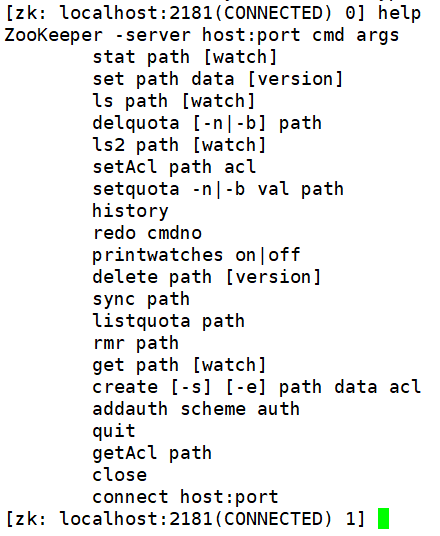

# ZK客户端操作

之前说过ZK说白了其实就是存储数据的，而且存储形式和文件系统很像，例子：
```
/
|__zknode1
  |__zknode11
  |__...
|__zknode2
|__...
```

其中，我们创建的节点可以存储数据，因此一份数据就对应的一个唯一路径，例如`/zknode1/zknode11`。

那么，我们使用`zkCli.sh`操作ZK上的数据，其实和在Linux的bash shell上操作文件一样。

## 使用ZK客户端连接ZK集群

我们使用任意一个ZK节点的`zkCli.sh`都可以连接到ZK集群上，默认连接本机2181端口，客户端发出操作后，这些集群节点的数据是会自动以主从形式同步的。

```
./zkCli.sh
```

## 查看命令帮助

直接在客户端中键入`help`，即可列出所有可用命令：



这里介绍写常见用法：

* ls：查看当前路径节点
* ls2：查看当前路径节点详细信息
* get <path> [watch]：获取节点数据，指定`watch`表示监听数据变化，**监听只生效一次**
* set <path> <data>：设置节点数据
* rmr <path>：递归删除一个节点
* create [-s] [-e] <path> <data>：创建一个节点，必须在创建时指定节点数据
  * `-s`：使用节点名序号，指定该参数创建的节点名会自动带上递增的序号，用于记录创建顺序
  * `-e`：临时节点，客户端下线时，该节点会删除，通常用于记录服务是否在线
* stat <path>：属于一个路径节点的信息
* quit：退出客户端

其实，这个客户端一般只用于查看信息，因为设置信息一般是通过程序代码实现的。网上甚至有些开源的图形界面客户端，不过用的人不多。

## 增删改查节点路径和数据演示

这个就非常简单了，我只举几个例子。

创建一个节点：
```
create /node1 "hello,world"
```

创建一个该节点的节点：
```
create /node1/node11 "hello"
```

列出根路径：
```
ls /
```

在其它客户端监听一个节点：
```
get /node1 watch
```

修改该节点数据（观察监听客户端的变化）：
```
set /node1 "hello"
```

删除该节点：
```
delete /node1
```

递归删除节点：
```
rmr /node1
```
