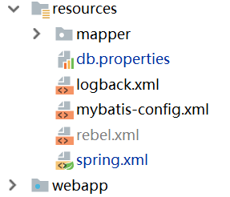
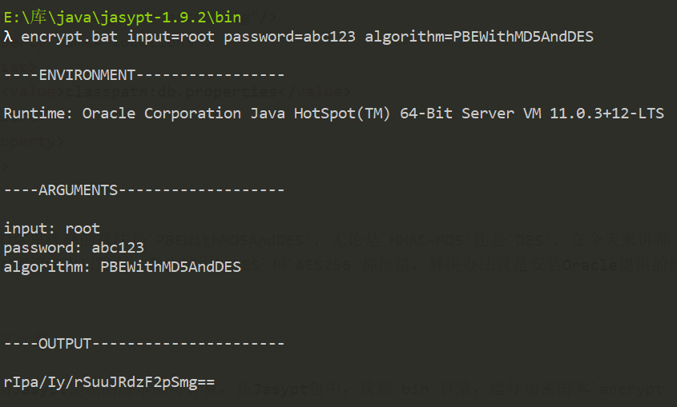

# 应用程序配置文件加密

近几个月来，一些公司信息系统后台源代码泄漏的情况频频出现，我印象最深刻的一次就是Bilibili后台的部分Go语言代码被上传至Github并被大家疯狂转发，B站待遇，以及代码中的某些逻辑是否道德姑且不提，我们一定要知道，无论是为了贩卖源码牟利，还是出于不公平待遇泄愤而「开源」代码，这种行为都是违法的。

后台程序「被开源」最大的危害是密码泄漏，我们知道数据库，Redis，Linux服务器，FTP等等都是需要账户密码的，很多程序都把这些密码明文写在了配置文件或是代码中。出于信息安全考虑，我们应该为源码工程中的明文密码加密。

## 原理

将明文密码加密为密文，使用最简单的对称加密就可以实现了，而难点在于将加密功能和我们整个开发部署流程整合。

现在一种比较通用的方式，是在应用程序中部署密文密码和解密算法程序，生产环境秘钥由实施人员掌握和部署。项目上线时，实施人员在应用程序启动时加载秘钥，密码密文被解密为明文到内存中，秘钥则是通过临时文件、环境变量、或是启动参数指定的，它们都是用后即焚而不是持久的。

当然很明显，密码明文在内存中，这也不安全，但要注意我们解决的问题是源码泄露，攻击者拿到源码没有秘钥，是不能解密密文或者运行程序的。如果攻击者攻破线上应用服务器，那也是可以拿到密码明文的，如果想要解决这个问题那就困难了，我们无法仅从应用程序这里解决，而必须从数据库服务器和应用服务器两者会话保持上入手了，这里不多做介绍。

## 使用Jasypt

我们这里以基于Spring的Java工程为例，介绍如何实现配置文件加密，实际上我们根本不用自己写代码，直接使用现成的Jasypt就可以实现这个功能了。

Jasypt基于PBE系列算法实现对称加密，能够和Spring集成，使用起来非常方便（当然，自己基于现有的加密算法实现也没有任何难度）。

官网：[http://www.jasypt.org/](http://www.jasypt.org/)

我们可以下载Jasypt的压缩包，里面包含依赖库和一些会用到的工具脚本。

### 工程配置文件结构

这里我们主要关注的就是`spring.xml`和`db.properties`，前者是Spring配置文件，后者是数据库配置键值对。注意必须将这两个配置分开，我们的解密组件会在Spring的配置覆盖时起效。



### 引入依赖

我们这里使用的Spring版本是5.x，下面引入Jasypt的依赖：

```xml
<dependency>
  <groupId>org.jasypt</groupId>
  <artifactId>jasypt</artifactId>
  <version>1.9.2</version>
</dependency>
<dependency>
  <groupId>org.jasypt</groupId>
  <artifactId>jasypt-spring31</artifactId>
  <version>1.9.2</version>
</dependency>
```

注意：官网上说`jasypt-spring31`支持Spring3.1以后的版本，实测Spring4.x后配置文件中有XSD冲突，官网给出的Spring配置无法使用，但我们可以手动装配Bean，按照我们后文介绍的配置是可以正常使用的。

### Spring配置文件

这里我们对解密器和秘钥进行配置，这里将秘钥配置为从环境变量`APP_PASSWORD`中读取。

```xml
<bean id="pbeConfig" class="org.jasypt.encryption.pbe.config.EnvironmentStringPBEConfig">
  <property name="algorithm" value="PBEWithMD5AndDES"/>
  <property name="passwordEnvName" value="APP_PASSWORD"/>
</bean>

<bean id="encConfig" class="org.jasypt.encryption.pbe.StandardPBEStringEncryptor">
  <property name="config" ref="pbeConfig"/>
</bean>

<bean id="placeHolderConfig" class="org.jasypt.spring31.properties.EncryptablePropertyPlaceholderConfigurer">
  <constructor-arg ref="encConfig"/>
  <property name="locations">
    <list>
      <value>classpath:db.properties</value>
    </list>
  </property>
</bean>
```

注：我们这里选择的算法是`PBEWithMD5AndDES`，无论是`HMAC-MD5`还是`DES`，在今天来讲都不能称之为「安全」了，但是由于美国的加密算法出口限制，我尝试用`PBEWITHMD5ANDTRIPLEDES`报错，解决办法就是安装Oracle提供的授权补丁，这里简单起见就不过多演示了。

Oracle官网关于加密算法出口限制的说明：[https://www.oracle.com/technetwork/java/javase/downloads/jce-all-download-5170447.html](https://www.oracle.com/technetwork/java/javase/downloads/jce-all-download-5170447.html)

实际上，针对JDK9+，JDK8u161之后版本`PBEWITHMD5ANDTRIPLEDES`直接就好使。

### 连接池配置

这个配置和之前明文方式没有区别。

```xml
<bean id="hikariConfig" class="com.zaxxer.hikari.HikariConfig">
  <property name="poolName" value="mercatus_connection_pool"/>
  <property name="dataSourceClassName"
            value="com.mysql.cj.jdbc.MysqlDataSource"/>
  <property name="maximumPoolSize" value="50"/>
  <property name="maxLifetime" value="60000"/>
  <property name="idleTimeout" value="30000"/>
  <property name="dataSourceProperties">
    <props>
      <prop key="url">${jdbc.url}</prop>
      <prop key="user">${jdbc.username}</prop>
      <prop key="password">${jdbc.password}</prop>
      <prop key="prepStmtCacheSize">250</prop>
      <prop key="prepStmtCacheSqlLimit">2048</prop>
      <prop key="cachePrepStmts">true</prop>
      <prop key="useServerPrepStmts">true</prop>
    </props>
  </property>
</bean>
```

注意Spring中配置文件覆盖是通过`context:property-placeholder`实现的，有关Spring的内容这里不多做介绍。

```xml
<context:property-placeholder location="classpath:db.properties"/>
```

### 密文计算

我们使用Jasypt提供的脚本即可计算，在Jasypt包中，找到`bin`目录，运行加密脚本`encrypt`。

```
encrypt.bat input=<明文> password=<秘钥> algorithm=PBEWithMD5AndDES
```



我们这里数据库密码是`root`，我们使用的秘钥为`abc123`。

计算出密文后，在数据库配置文件中配置即可，下面是一个例子：

db.properties
```
jdbc.url=jdbc:mysql://127.0.0.1:3306/shiro_demo?useSSL=false&serverTimezone=GMT%2B8
jdbc.username=root
jdbc.password=ENC(rIpa/Iy/rSuuJRdzF2pSmg==)
```

如果你觉得不过瘾，其他配置也都是可以加密的！

### 配置环境变量

这个就不多说了，在Windows和Linux上是不同的，我们需要配置一个环境变量`APP_PASSWORD=abc123`，这样解密器才能正确解密我们的密文。

## SpringBoot

SpringBoot中可以配置Jasypt的起步依赖，非常简单，这里就不多做介绍了。
