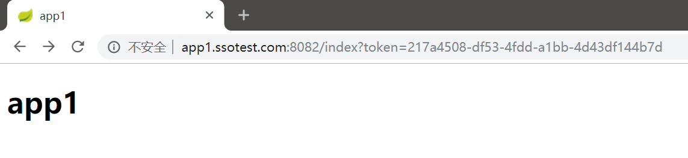

# CAS单点登录

在一个企业内部，当运行的信息化系统越来越多时，我们不可能要求所有员工记住N多系统的账号密码，自然就产生了实现统一登录方案的需求。除此之外，在一些超大型管理系统中，系统内的每个子应用甚至都是不同团队研发，不同架构部署的，它们通过`iframe`等形式集成到系统中。这些应用必须接受统一的访问权限控制，因此必须使用单点登录。

除了CAS，单点登录还有许多解决方案，其中不乏各种投机取巧的姿势，比如父子域名加共享Session等实现，但都会随着架构越来越复杂暴露出问题，这里就不多做介绍了。

## 什么是CAS

CAS（Central Authentication Service）是一种实现单点登录的架构，用于针对性的解决上述问题。下面是CAS单点登录流程的时序图。


## CAS实现

### 实验环境准备

要实现一个CAS单点登录的Demo，至少需要部署三个系统：

* 应用系统1
* 应用系统2
* 单点登录系统

应用系统需要和单点登录系统通信，一般我们都是通过ESB或微服务调用实现的。这里简单起见，我们就选用比较简单易用的SpringCloud搭建，此外我们还需要一个Redis用于存储单点登录的token信息。


#### 注意Cookie冲突

由于Cookie只区分域名不区分端口，我们的实验系统都搭建在本地，就会产生冲突，这里需要修改`hosts`文件实现Cookie的隔离。下面是我们设定的单点登录系统、应用系统1、应用系统2的域名：
```
127.0.0.1		casserver.ssotest.com
127.0.0.1		app1.ssotest.com
127.0.0.1		app2.ssotest.com
```

#### 注意Session的使用

我们这里出于简单考虑，使用的是Tomcat的Session实现单个应用的会话保持，因此无法支持集群，更一般的情况下，还是建议使用Redis或Redis集群实现Session功能。本例子中用到的Redis，仅仅是在单点登录服务器上缓存一个单点登录的token，也可以用HashMap代替。

### 系统搭建

#### 服务发现 Eureka

如果对SpringCloud熟悉，可以跳过这里。

创建SpringBoot项目时，加入Eureka依赖：
```xml
<dependency>
  <groupId>org.springframework.cloud</groupId>
  <artifactId>spring-cloud-starter-netflix-eureka-server</artifactId>
</dependency>
```

配置`application.properties`：
```
# EurekaServer的域名
eureka.instance.hostname=localhost
# EurekaServer的端口号
server.port=8080
# 是否注册该应用到EurekaServer，该应用自己就是EurekaServer，所以不注册
eureka.client.register-with-eureka=false
# 是否从EurekaServer同步数据，这里搭建单节点的EurekaServer，因此不需要
eureka.client.fetch-registry=false
# 注册和查询服务的地址
eureka.client.serviceUrl.defaultZone=http://${eureka.instance.hostname}:${server.port}/eureka/
# 是否启用自我保护机制，测试环境建议关闭
eureka.server.enable-self-preservation=false
```

使用`@EnableEurekaServer`注解，标注该SpringBoot应用是一个Eureka服务器：
```java
@SpringBootApplication
@EnableEurekaServer
public class CasEurekaApplication {
    public static void main(String[] args) {
        SpringApplication.run(CasEurekaApplication.class, args);
    }
}
```

#### 单点登录系统 casserver

单点登录系统需要有一个登录界面，这里使用Thymeleaf模板后端渲染实现。此外，token校验时，应用系统需要调用单点登录系统的服务，因此还需要加入Eureka客户端的依赖，暴露token校验服务。token缓存在Redis中，还需要加入连接Redis的依赖，我们这里使用最方便的`spring-data-redis`实现。


```xml
<dependency>
    <groupId>org.springframework.boot</groupId>
    <artifactId>spring-boot-starter-web</artifactId>
</dependency>
<dependency>
    <groupId>org.springframework.cloud</groupId>
    <artifactId>spring-cloud-starter-netflix-eureka-client</artifactId>
</dependency>
<dependency>
    <groupId>org.springframework.boot</groupId>
    <artifactId>spring-boot-starter-data-redis</artifactId>
</dependency>
<dependency>
    <groupId>org.springframework.boot</groupId>
    <artifactId>spring-boot-starter-thymeleaf</artifactId>
</dependency>
```

配置`application.properties`：
```
# 服务名称
spring.application.name=cas-server
# 服务端口号
server.port=8081
# 在注册中心中进行注册
eureka.client.serviceUrl.defaultZone=http://localhost:8080/eureka/
# Redis配置
spring.redis.host=localhost
spring.redis.port=6379
```

用注解开启Eureka客户端：
```java
@EnableEurekaClient
@SpringBootApplication
public class CasServerApplication {
    public static void main(String[] args) {
        SpringApplication.run(CasServerApplication.class, args);
    }
}
```

控制器我们这里编写了两个，分别是：

1. `ApiController`：暴露的微服务，主要就是token校验服务
2. `LoginController`：获取登录页面，跳转控制等

ApiController.java
```java
@RestController
public class ApiController {

    @Resource
    private RedisTemplate<String, User> redisTemplate;

    @RequestMapping(value = "/api/checkToken", method = RequestMethod.GET)
    public User checkToken(String token) {
        User user = redisTemplate.opsForValue().get(token);
        if (user != null) {
            return user;
        } else {
            return null;
        }
    }
}
```

上面代码非常简单，其实就是根据`token`值去Redis中检查，数据在单点登录后以`token -> 用户实体对象`的形式保存，如果存在则返回键对应的数据，不存在返回`null`。

LoginController.java
```java
@Controller
public class LoginController {

    @Resource
    private RedisTemplate<String, User> redisTemplate;

    @RequestMapping(value = "/ssologin", method = RequestMethod.GET)
    public String login(String redirectUrl, Model model, HttpServletRequest request) {

        if(request.getSession().getAttribute("user") != null && redirectUrl != null) {
            // 如果已在cas-server登陆过，且不是直接访问登录页，直接带token跳回去
            String token = (String) request.getSession().getAttribute("token");
            return "redirect:" + redirectUrl + "?token=" + token;
        } else {
            // 未在cas-server登陆过，或直接访问登录页，响应登录页面
            if (redirectUrl == null) {
                // 不是从别的系统跳转过来的情况，加一个默认页
                redirectUrl = "http://xxx.com/dashboard";
            }
            model.addAttribute("redirectUrl", redirectUrl);
            return "ssologin";
        }
    }

    @RequestMapping(value = "/ssologin", method = RequestMethod.POST)
    public String doLogin(String username,
                          String password,
                          String redirectUrl,
                          Model model,
                          HttpServletRequest request) {
        if ("admin".equals(username) && "123".equals(password)) {
            // 登陆成功，token存入redis
            String token = UUID.randomUUID().toString();
            User user = new User();
            user.setUsername("admin");
            user.setPassword("123");
            redisTemplate.opsForValue().set(token, user);

            // cas-server登录状态存入session
            request.getSession().setAttribute("user", user);
            request.getSession().setAttribute("token", token);

            // 通过跳转页间接跳回原地址，避免设置cookie失效的问题
            model.addAttribute("redirectUrl", redirectUrl);
            model.addAttribute("token", token);
            return "redirect";
        } else {
            // 登录失败
            model.addAttribute("msg", "login failed");
            model.addAttribute("redirectUrl", redirectUrl);
            return "ssologin";
        }
    }
}
```

注意登录成功后的操作：

1. 设置session，记录对于单点登录系统，该用户已登录
2. 设置token，记录对于全局应用系统，该用户已登录
3. 根据redirectUrl回跳，携带的数据是token

后期补充：其实你也可以直接将token放到cookie中，这样就能省去session的操作和判断了，我的实现方式稍微绕了一点。

ssologin.html
```html
<!doctype html>
<html lang="zh" xmlns:th="http://www.thymeleaf.org">
<head>
    <meta charset="UTF-8">
    <meta name="viewport"
          content="width=device-width, user-scalable=no, initial-scale=1.0, maximum-scale=1.0, minimum-scale=1.0">
    <meta http-equiv="X-UA-Compatible" content="ie=edge">
    <title>Login</title>
</head>
<body>
<fieldset>
    <form th:action="@{/ssologin}" method="post">
        <input type="hidden" name="redirectUrl" th:value="${redirectUrl}"/>
        <label for="username">用户名</label>
        <input id="username" type="text" name="username" />
        <label for="password">密码</label>
        <input id="password" type="password" name="password" />
        <input type="submit" value="登录" />
        <span style="color: red" th:text="${msg}"></span>
    </form>
</fieldset>
</body>
</html>
```

redirect.html
```html
<!doctype html>
<html lang="zh" xmlns:th="http://www.thymeleaf.org">
<head>
    <meta charset="UTF-8">
    <meta name="viewport"
          content="width=device-width, user-scalable=no, initial-scale=1.0, maximum-scale=1.0, minimum-scale=1.0">
    <meta http-equiv="X-UA-Compatible" content="ie=edge">
    <title>登录成功</title>
</head>
<body>
<p>登录成功，正在跳转</p>
<input type="hidden" id="redirectUrl" th:value="${redirectUrl}"/>
<input type="hidden" id="token" th:value="${token}"/>
<script>
    window.onload = function (ev) {
        var redirectUrl = document.getElementById('redirectUrl').value;
        var token = document.getElementById('token').value;
        window.location.href=redirectUrl + '?token=' + token;
    };
</script>
</body>
</html>
```

为什么要设置一个`redirect.html`呢？因为我们`session.setAttribute()`实际上也是写cookie，如果直接向浏览器发送302跨域重定向，可能造成cookie还没来得及写就跳到别的域了，经过尝试，Chrome在这种情况下session是写不了的，因此多加了一个页面，在页面上通过JavaScript进行延迟重定向。

#### 应用系统cas-app1和cas-app2

两个应用系统是一模一样的，复制两个是为了测试在app1中登录后，切换到app2中单点登录是否有效，我们这里就只详细介绍其中一个。


依赖包括SpringMVC组件，Eureka客户端，Ribbon客户端负载均衡，以及`cas-server`，我们会用到其中定义的实体类`User`，因此需要依赖单点登录项目。

```xml
<dependency>
    <groupId>org.springframework.boot</groupId>
    <artifactId>spring-boot-starter-web</artifactId>
</dependency>
<dependency>
    <groupId>org.springframework.cloud</groupId>
    <artifactId>spring-cloud-starter-netflix-eureka-client</artifactId>
</dependency>
<dependency>
    <groupId>org.springframework.cloud</groupId>
    <artifactId>spring-cloud-starter-netflix-ribbon</artifactId>
</dependency>
<dependency>
    <groupId>com.gaoshuhang.demo</groupId>
    <artifactId>cas-server</artifactId>
    <version>0.0.1-SNAPSHOT</version>
</dependency>
```

application.properties
```
server.port=8083
eureka.client.serviceUrl.defaultZone=http://localhost:8080/eureka/
spring.application.name=app2
```

```java
@EnableEurekaClient
@SpringBootApplication
public class CasApp2Application {
    @Bean
    @LoadBalanced
    RestTemplate restTemplate() {
        return new RestTemplate();
    }

    public static void main(String[] args) {
        SpringApplication.run(CasApp2Application.class, args);
    }
}
```

在入口类中，和之前一样，使用`@EnableEurekaClient`注解标注这个SpringBoot应用是Eureka客户端，另外配置了`RestTemplate`的依赖注入。

WebMvcConfig.java
```java
@Configuration
public class WebMvcConfig implements WebMvcConfigurer {

    private final RestTemplate restTemplate;

    @Autowired
    public WebMvcConfig(RestTemplate restTemplate) {
        this.restTemplate = restTemplate;
    }

    @Bean
    SsoLoginInterceptor ssoLoginInterceptor() {
        return new SsoLoginInterceptor(restTemplate);
    }

    @Override
    public void addInterceptors(InterceptorRegistry registry) {
        List<String> includePathConf = new ArrayList<>();
        includePathConf.add("/index");
        registry.addInterceptor(ssoLoginInterceptor()).addPathPatterns(includePathConf);
    }
}
```

这里我们主要就是配置了一个拦截器，该拦截器实现登录状态拦截和校验。由于我们只有一个测试页面，位于地址`/index`，所有这里只拦截了一个地址，具体开发时还要根据实际情况编写拦截规则。

MainController.java
```java
@Controller
public class MainController {

    @RequestMapping(value = "/index", method = RequestMethod.GET)
    public String index() {
        return "index";
    }
}
```

这个控制器没有任何作用，就是返回一个页面。我们主要通过访问这个地址，去触发拦截器。

SsoLoginInterceptor.java
```java
public class SsoLoginInterceptor implements HandlerInterceptor {

    private RestTemplate restTemplate;

    public SsoLoginInterceptor(RestTemplate restTemplate) {
        this.restTemplate = restTemplate;
    }

    @Override
    public boolean preHandle(HttpServletRequest request, HttpServletResponse response, Object handler) throws Exception {
        User user = (User) request.getSession().getAttribute("user");
        if (user != null) {
            // 已在app1子系统登录
            return true;
        } else {
            // 未在app1子系统登录，检查token，有token说明是单点登录跳过来的
            String token = request.getParameter("token");
            if (token != null && !"".equals(token)) {
                // 单点登录跳过来的，调用服务进行验证
                user = restTemplate.getForObject("http://cas-server/api/checkToken?token=" + token, User.class);
                if (user != null) {
                    // 验证成功，加入session确认登录子系统
                    request.getSession().setAttribute("user", user);
                    return true;
                } else {
                    // token错误，验证失败
                    response.sendRedirect("http://casserver.ssotest.com:8081/ssologin?redirectUrl=" + request.getRequestURL().toString());
                    return false;
                }
            } else {
                response.sendRedirect("http://casserver.ssotest.com:8081/ssologin?redirectUrl=" + request.getRequestURL().toString());
                return false;
            }
        }
    }
}
```

注意拦截器中的逻辑：
```
if(app1中session存在) {
  已登录
} else {
  if(请求中携带token) {
    调用服务校验token，登录成功则设置session记录子系统的登录状态
  } else {
    跳转到单点登录页，请求中包含redirectUrl，说明跳转来源用来回跳
  }
}
```

### 测试

经过这么一番折腾，一个很不完善的单点登录系统就搭建好了，我们可以用浏览器访问并测试。

访问app1，会自动跳转到登录页面，注意浏览器的地址栏。


登录成功，会携带token跳回app1。



再次访问app1，可以不带token，因为app1已经设置了session，记录了你在app1子系统的登录状态。


访问app2，无需再次登录，浏览器会自动跳到单点登录系统，单点登录系统检测到已登录，又自动携带token跳回app2，app2检测到token在后台向单点登录发起服务调用，调用成功说明登录成功，就会向用户设置app2登录状态保持的session（说起来略复杂）。


