# 向量

本系列笔记是《DirectX9.0 3D游戏开发编程基础》相关笔记的辅助章节，这里我们根据书中内容简单复习下《线性代数》，所涉及的知识只包括那些3D编程中最常用到的数学知识，例子代码使用D3DX库进行编写，具体环境搭建请参考DirectX的内容。

注意：在测试下面的这些函数时，由于我们创建的是「Windows桌面应用程序工程」，因此没有控制台，可以使用`swprintf`打印到`wchar_t`字符串中，再用MessageBox进行输出。例子：

```cpp
wchar_t s[20];
swprintf(s, 20, L"%f", f);
::MessageBox(0, s, TEXT("debug"), 0);
```

补充：后来发现其实可以用`OutputDebugStringA(str)`和`OutputDebugStringW(str)`这些预定义宏输出调试信息。

## 什么是向量

```
既有长度有有方向的量叫向量（Vector），向量可以放在三维坐标系中，用u(x,y,z)表示，三个值被称为向量的分量。
```

定义一个三维向量：
```cpp
D3DXVECTOR3 v1(1.0f, 0.0f, 0.0f);
```

访问该向量的分量：
```
v1.x
v1.y
v1.z
```

## 向量相等

两个向量的长度和方向均相同，即在同一坐标系中，两个向量的每个分量均相同。

判断向量相同：
```cpp
D3DXVECTOR3 v1(1.0f, 0.0f, 0.0f);
D3DXVECTOR3 v2(1.0f, 0.0f, 0.0f);
if (v1 == v2)
{
  ...
}
```

注意：由于浮点数的不精确性，`==`这个重载并不是简单的比较向量的三个分量，而是进行了一些近似处理。

## 向量的长度

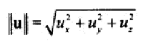

计算向量长度：
```cpp
D3DXVECTOR3 v(1.0f, 2.0f, 3.0f);
float f = D3DXVec3Length(&v);
```

## 向量的规范化

规范化（normalizing）就是保留向量的方向，把向量的长度重置为`1`。计算向量的规范化非常简单，将向量的每一个分量都除以该向量的长度即可。这个方法经常用来提取一个向量的方向。

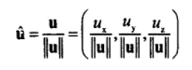

计算向量规范化：
```cpp
D3DXVECTOR3 v(1.0f, 2.0f, 3.0f);
D3DXVECTOR3 result(0.0f, 0.0f, 0.0f);
D3DXVec3Normalize(&result, &v);
```

计算结果存储在向量`result`中。

## 向量相加

向量相加就是将向量的各个分量依次相加：

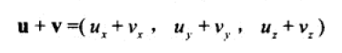

向量相加的几何意义：

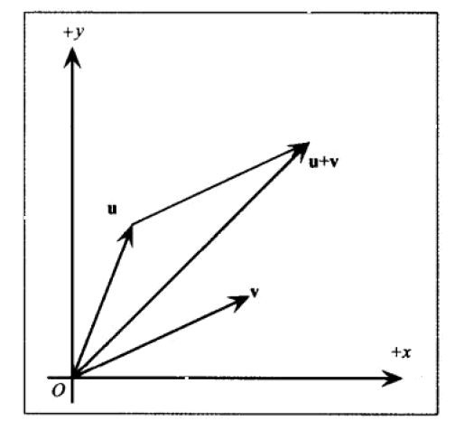

代码实现：
```cpp
D3DXVECTOR3 v1(1.0f, 2.0f, 3.0f);
D3DXVECTOR3 v2(2.0f, 3.0f, 4.0f);
D3DXVECTOR3 v3 = v1 + v2;
```

## 向量相减

起始端在原点的向量`u - v`，会生成一个由v末端指向u末端的向量。

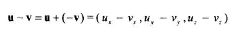

向量相减的几何意义：

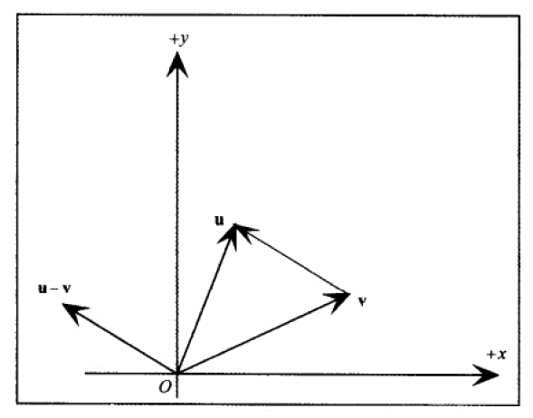

```cpp
D3DXVECTOR3 v1(1.0f, 2.0f, 3.0f);
D3DXVECTOR3 v2(2.0f, 3.0f, 4.0f);
D3DXVECTOR3 v3 = v2 - v1;
```

## 向量数乘

该操作其实就是对向量缩放而不改变其方向（如果k为正数），结果是一个向量，如果数乘的值为负数，则结果向量的方向与原方向相反。

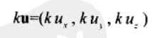

```cpp
D3DXVECTOR3 v1(1.0f, 2.0f, 3.0f);
D3DXVECTOR3 v2 = v1 * 5;
```

## 向量点积

点积用于判断两个向量的夹角，点积的值是一个浮点数。

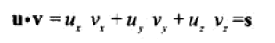

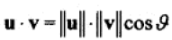

```cpp
D3DXVECTOR3 v1(1.0f, 0.0f, 0.0f);
D3DXVECTOR3 v2(1.0f, 1.0f, 0.0f);
float dot = D3DXVec3Dot(&v1, &v2);// 点积
float cosv1v2 = dot / (D3DXVec3Length(&v1) * D3DXVec3Length(&v2)); // 计算v1和v2夹角的cos值
float f = acos(cosv1v2);// 计算v1和v2夹角
f = D3DXToDegree(f);// 弧度转角度
```

实际上，点积经常用于判断两个向量的夹角是钝角还是锐角：

1. 点积>0，夹角为锐角
2. 点积=0，夹角为直角
3. 点积<0，夹角为钝角

## 向量叉积

叉积用于计算和两个向量都正交的一个向量，结果是一个向量，叉积用于求一个面的法向量。

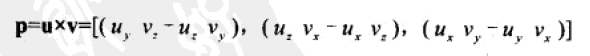

叉积的几何意义：

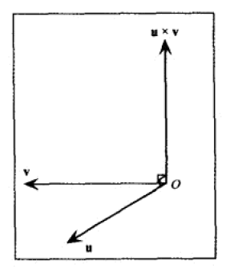

```cpp
D3DXVECTOR3 v1(1.0f, 0.0f, 0.0f);
D3DXVECTOR3 v2(0.0f, 1.0f, 0.0f);
D3DXVECTOR3 v3(0.0f, 0.0f, 0.0f);
D3DXVec3Cross(&v3, &v1, &v2);
```
