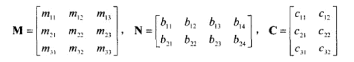
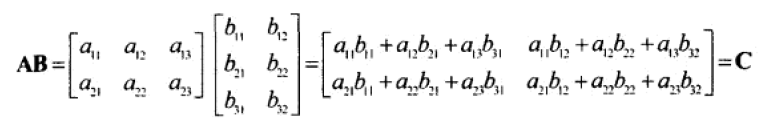
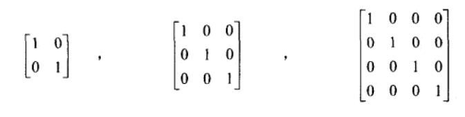
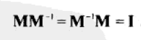
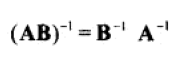
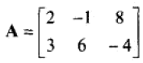
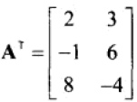

# 矩阵运算

本节主要讨论矩阵的一些相关知识。

注：代码中，针对三维空间向量进行变换的D3DXMATRIX是一个4x4的变换矩阵，具体有关矩阵变换的内容我们将在下一节介绍。

## 什么是矩阵

一个m×n矩阵就是一个m行n列的二维数组。



在D3DX中，使用D3DXMATRIX定义4x4矩阵。

```cpp
D3DXMATRIX matrix(
  1.0f, 0.0f, 0.0f, 0.0f,
  0.0f, 1.0f, 0.0f, 0.0f,
  0.0f, 0.0f, 1.0f, 0.0f,
  0.0f, 0.0f, 0.0f, 1.0f
  );
```

上面例子代码中，定义了一个单位矩阵。

## 矩阵相等、数乘、加法

1. 两个矩阵行列数相同，且对应元素都相等，那么两个矩阵相等。
2. 矩阵和标量进行数乘运算，就是矩阵的每个元素都乘该标量。
3. 两个矩阵行列数相同，加法就是矩阵对应处的元素相加。

矩阵的相等、数乘、加法、乘法，D3DXMATRIX中定义了这些运算符的重载，这里我们就不多做介绍了。

## 矩阵乘法



上图是矩阵的乘法公式。

一个`m×n`的矩阵和`n×p`的矩阵相乘，得到一个`m×p`的矩阵，否则不能相乘。

除此之外，再不改变矩阵顺序的条件下，矩阵乘法满足结合律，我们只需要用字母写出矩阵乘积形式，就可以证明。

## 单位矩阵

形如下图的矩阵是单位矩阵，单位矩阵一定是方阵。



任何矩阵乘单位矩阵得到的都是这个矩阵本身，单位矩阵就像数字`1`一样，可以作为一个乘法的单位量。

D3DX中封装了初始化单位矩阵的方法，我们可以直接使用：
```cpp
D3DXMATRIX matrix;
D3DXMatrixIdentity(&matrix);
```

## 逆矩阵

有部分方阵具有逆矩阵，一个矩阵与其逆矩阵乘积为单位矩阵。



大学课程中，我们学过对于二、三阶的逆矩阵可通过伴随矩阵求得，有好几种方法，但是都比较复杂，对于更高阶矩阵则是更加的复杂，具体这里就不讨论了。

逆矩阵的另外一个性质：



D3DX中求逆矩阵的函数：

```cpp
D3DXMatrixInverse(&matrixB, NULL, &matrixA);
```

其中第二个参数貌似是行列式的值，我没搞懂这个有什么用，书中也没有给出具体解释。书中描述为：
```
determinant,if required, else pass 0
```

MSDN描述为：
```
Pointer to a FLOAT value containing the determinant of the matrix. If the determinant is not needed, set this parameter to NULL.
```

我们一般传NULL就行。

## 转置矩阵

把一个矩阵沿左上到右下的对角线翻过来，就是转置矩阵。一个`m×n`矩阵的转置矩阵是`n×m`的。





求一个矩阵的转置矩阵代码：

```cpp
D3DXMATRIX matrixA(
  1.0f, 0.0f, 0.0f, 0.0f,
  1.0f, 1.0f, 0.0f, 0.0f,
  1.0f, 0.0f, 1.0f, 0.0f,
  1.0f, 0.0f, 0.0f, 1.0f
  );
D3DXMATRIX matrixB;
D3DXMatrixTranspose(&matrixB, &matrixA);
```
