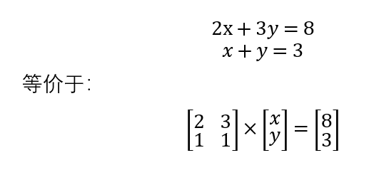

# 变换矩阵

## 矩阵的本质

### 矩阵和线性方程组

矩阵可以用于表示一个线性方程组：


这里用一个2x2矩阵和一个列向量（2x1矩阵）相乘，得到一个列向量（2x1矩阵）。根据矩阵乘法公式，我们很容易发现这两者是等价的。

注：数学中，更一般的线性方程组类似下面这种形式：



那么如何用矩阵的算法求出x和y呢？我们可以算出2x2矩阵的`逆矩阵`，然后和右侧相乘，接下来就和上面的形式一样了。

### 矩阵和变换

很显然，之前我们对`[1, 2]`这个列向量进行了某种线性变换得到了`[a,b]`，我们可以将这种一个矩阵乘一个列向量的形式，理解为一个向量从一个坐标系到另一个坐标系的映射，矩阵就是这种映射的一个关系参数，而逆矩阵就是一个反向的映射。

变换空间中的向量就是矩阵的用途，在3D中就是平移、旋转、缩放等变换。

### 变换矩阵相乘

由于矩阵乘法满足结合律，多个变换矩阵应用到一个列向量时，可以先计算出这些变换矩阵的乘积，再用乘积乘列向量。

## D3DXMATRIX

D3DX中，操作的是三维空间，使用`D3DXMATRIX`，表示一个`4×4`矩阵。

为什么是`4×4`而不是`3×3`呢？这涉及到一个`(x,y,z)`这样的数据结构表示的究竟是一个点还是一个向量。点代表一个空间中的位置，而向量代表一个有方向和长度的量。

因为三维向量只包含了长度和方向的信息，而没有位置信息，因此`3×3`矩阵无法做到在不添加额外参数的情况下，只用一个变换矩阵乘向量实现一个点平移、镜像等需要位置信息的变换，因此添加了一个维度。具体原理其实很容易证明。

那么假如现在有一个复杂的变换矩阵实现了某个功能，我们如何填充`(x,y,z)`到一个四维结构中呢？如果它代表一个点，就用`(x,y,z,1)`，如果代表一个向量，就用`(x,y,z,0)`以屏蔽对向量没有意义的位置操作。最后一个维度仅仅是便于操作之用。点变换后，新添加的分量如果不是1，我们就将其映射为1，这样我们就重新回到了三维空间（可以类比为三维空间中把z分量映射为1，效果就像把立体对象拍扁了一样，这里不过这里是从四维到三维）。

具体看下面三个变换的例子就清楚了。我们把这个添加的维度记为`w`。

当然，我们并不需要手动进行这些操作，我们代码中操作的就是`D3DXVECTOR3`不用变，只不过心里知道调用变换矩阵的时候，会填充一位并和矩阵相乘。

针对一个3维向量应用一个变换代码：

```cpp
D3DXVec3TransformCoord(&v, &u, &matrix);
```

* D3DXVec3TransformCoord：变换后自动将结果映射到w分量为1的情况，用于点的变换
* D3DXVec3TransformNormal：将w分量设为0，w维度不参与变换，用于向量变换
* D3DXVec3TransformCoordArray/D3DXVec3TransformNormalArray：用于点和向量数组的批量变换
* D3DXVec3Transform：变换后不会自动将向量映射到w分量为1的情况，一般不用这个

## 常用的变换矩阵例子

平移、旋转、缩放是最常用的三个变换，这里我们以此为例加深对变换矩阵的理解。

实际上，我们编程中不用写这些基础的变换矩阵的代码，D3DX都为我们封装好了，我们调用一下就可以了。

### 平移变换

平移变换矩阵`T`，其中X轴平移分量为`Px`，Y轴平移分量为`Py`，Z轴平移分量为`Pz`。

现在要将点`(x,y,z)`进行平移，我们只需要将其填入`u=(x,y,z,1)`，乘下面这个变换矩阵，算出`T×u`即可：


显然，`T×u`得到的结果就是`(x+Px,y+Py,z+Pz,1)`。

注：《DirectX9.0 3D游戏开发编程基础》这本书中约定变换向量是行向量乘以变换矩阵，而且图还都是左手系，这些设定和我们国内大学教的恰好相反，让人很不适应。我这里还是按照中国的习惯，使用矩阵乘以列向量。

沿X轴平移`1.0f`的例子代码：

```cpp
D3DXMATRIX matrix;
D3DXVECTOR3 u(1.0f, 0.0f, 0.0f);
D3DXVECTOR3 v;

D3DXMATRIX matrix;
D3DXMatrixTranslation(&matrix, 1.0f, 0.0f, 0.0f);
D3DXVec3TransformCoord(&v, &u, &matrix);
```

### 旋转变换

旋转变换其实高中阶段我们就可以得出了，我们可以这样来做：先计算出绕X轴、Y轴、Z轴旋转的变换矩阵，有需要时再合成到一起。绕某一坐标轴旋转，其实是个二维问题。

另外一点，旋转角度这里我们遵循右手系和右手定则，你可以理解为：X轴超右，Y轴朝上，那么Z轴朝向你，在XOY平面旋转逆时针为旋转正方向。

我们根据旋转的两个特点进行推导：

1. 圆半径不变
2. 三角函数公式：`sin(a+b)=sin(a)sin(b)+cos(a)cos(b)`等

由于我的笔记工具不适合写太多公式，这里就略过推导过程，直接给出书上的答案。

绕X轴旋转：


绕Y轴旋转：


绕Z轴旋转：


 注：和《DirectX9.0 3D游戏开发编程基础》这本书中是反的。

将`(1,0,0)`沿Z轴旋转90度例子：

```cpp
D3DXVECTOR3 u(1.0f, 0.0f, 0.0f);
D3DXVECTOR3 v;

D3DXMATRIX matrix;
D3DXMatrixRotationZ(&matrix, D3DXToRadian(90));
D3DXVec3TransformCoord(&v, &u, &matrix);
```

### 缩放变换

缩放变换比较简单，变换矩阵形式如下：


缩放就是将一个点的X、Y、Z三个分量分别缩小或扩大若干倍，就能实现了。

将X轴缩放为原来一般的例子代码：

```cpp
D3DXVECTOR3 u(1.0f, 0.0f, 0.0f);
D3DXVECTOR3 v;

D3DXMATRIX matrix;
D3DXMatrixScaling(&matrix, 0.5f, 0.0f, 0.0f);
D3DXVec3TransformCoord(&v, &u, &matrix);
```
