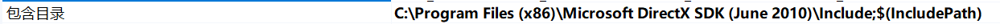
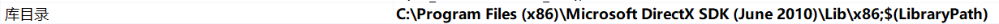
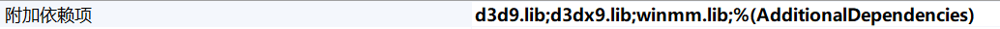

# DX9开发环境搭建

本系列文章是参考《DirectX9.0 3D游戏开发编程基础》的学习笔记，主要目的是对DirectX的API、着色器和游戏引擎底层的编程模型进行一些了解，以更好的利用游戏引擎进行开发。

这里我们使用的开发环境是Windows10操作系统和Visual Studio2017，开发语言为C++，你需要熟练使用这些工具和编程语言，此外还需要线性代数以及Win32API的基础知识。

## 安装DX9 SDK

DX9是DirectX中比较老的版本了（但依然很经典），新版本的DX12内置在Windows10 SDK中，会随Visual Studio一起安装，但是老版本的DX则需要单独安装。

[微软 DirectX Software Development Kit](https://www.microsoft.com/en-us/download/confirmation.aspx?id=6812)

下载之后双击安装即可，安装到最后会报个错，这是由于Windows10中一个VC++运行库版本过新导致的，但是实际安装已经完成，可以正常使用了，我们不用在意那个错误。

## 配置Visual Studio 2017

我们需要创建一个VC++的Windows桌面应用程序，因为我们会用到Win32 API初始化DX窗口以及响应用户输入。

这里我们假设DX SDK的安装位置是`C:\Program Files (x86)\Microsoft DirectX SDK (June 2010)`。

首先配置DX SDK的头文件目录，在项目`属性->VC++目录->包含目录`中添加一个字段：

然后同理添加库目录：

然后在`链接器->输入`中，添加`d3d9.lib`、`d3dx9.lib`、`winmm.lib`（这个不是DX库但我们会用到，它是Windows的音频库，win32 API章节有介绍过）

## 运行书上的例子

书上的例子使用的Visual C++版本太老了，很多微软的VC++语法标准都变了，直接粘进Visual Studio 2017基本都编译不过，好在都只是些小问题，语法错误的地方会有自动提示，我们按新标准改改就行。主要改如下几个问题：

1. 简单起见，demo工程中我们把新版Visual Studio的预编译头文件的设定去掉
2. 引用自己的头文件使用双引号，而不是尖括号，引用声明放在库头文件下面
3. 所有针对Win32API使用字符串的地方用`TEXT()`宏包装一下，这个宏能够让Win32API支持Unicode
4. 书上的一些类名似乎也有点错误，都很容易看出来，改改就行了
5. 代码直接复制进Visual Studio后，把原本注释都删掉，这些注释可能包含我们中文Windows系统不识别的文字编码，导致Visual Studio的语法检查莫名其妙报错（但不影响编译运行）
