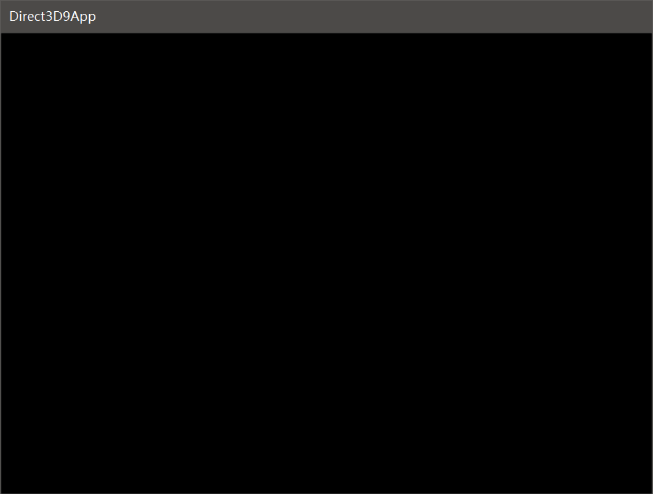
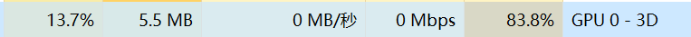

# 初始化DX9

初始化DX9是个比较复杂的过程，DX9的API不仅和win32API一样麻烦，它还必须和win32API一起使用才能初始化一个具有DX9环境的窗口，这也是为什么很少有人直接用DX9进行游戏开发的原因。

## 基础概念

### 硬件加速模式和软件渲染模式

Direct3D是一套底层图形API，我们编写的应用程序通过Direct3D定义的API接口去调用其实现，而其实现则是硬件提供商作为显卡驱动的一部分，分发给我们的。但是显卡硬件是各种各样的，一个品牌的显卡也有各种不同的规格，各种硬件对Direct3D定义的接口支持情况也可能各不相同。这可能涉及到几种不同的情况：

1. 显卡完全硬件实现了Direct3D定义的接口，并抽象出Direct3D实现供我们调用
2. 显卡没能完全硬件实现Direct3D定义的接口，但是显卡驱动用软件兼容实现了，Direct3D接口并不知情
3. 显卡根本不支持某一Direct3D特性，需要应用层的程序员去处理这个情况

实际上，情况1和2是经常出现的，3则出现在较老的显卡驱动无法运行新版本Direct3D的情况，例如：`Nvidia GT430`这款老式显卡能兼容实现最高的DirectX版本是DirectX11.2，但是并不支持DirectX12。那么DirectX12程序就完全不能在配备这款显卡的机器上运行了吗？也不是，DirectX为我们提供了一套软件渲染的模式，它使用CPU进行运算，就像Windows的VGA模式一样，你甚至不需要显卡驱动（但你还是需要显卡，否则没有显示器的插口）。

DX9中，HAL（Hardware Abstraction Layer，硬件抽象层）表示显卡驱动的DirectX实现，REF（reference rasterizer device）则是DX提供的纯软件模式渲染。这些枚举值在`D3DDEVTYPE`中，需要我们在创建设备时进行指定。

### 操作屏幕对应的绘制表面（Surface）

DX中，使用Surface这个词表达用于显示图形的像素集合，Surface包含三个重要的内容：

* width：宽（像素）
* height：高（像素）
* pitch：跨度（字节）

要显示的像素其实是以一维数组的形式进行存储的，按照一行行顺序读取。屏幕上显示的是像素，但是我们在存储器中，像素是以对应的二进制格式保存的，而且一个像素的保存格式有许多种，它们占用的空间都不同，因此实际体现在这个数组时，还具有一个跨度参数。

宽和高很好理解，跨度这里解释下：跨度其实就是保存像素的结构中，对应屏幕上一行像素的字节数。假如使用`A8R8G8B8`存储一个像素，一个像素点就对应4字节，但是我们依然不能认为`pitch=width*4`，因为一个跨度的末尾，还可能包含一些用于缓存的字节！

[MSDN中对跨度的描述](https://docs.microsoft.com/en-us/windows/desktop/direct3d9/width-vs--pitch)

### 抗锯齿

用像素矩阵直接表示图像时，可能会产生明显的锯齿，而DirectX中定义的多重采样是能够实现抗锯齿的底层方式之一。书中给出的例子没有开启多重采样，因为这会显著影响我们程序的性能。

注：毕竟这本书比较老了，2007年最强的显卡大概是Nvidia 7900GS，如今显卡性能已经翻了十余倍。DX9的多重采样抗锯齿可以在初始化时，在`D3DPRESENT_PARAMETERS`的`MultiSampleType`和`MultiSampleQuality`指定。

### 像素格式

前面提到Surface的宽度和跨度的区别，这里继续深入介绍下像素的二进制格式。DX9中，像素格式用`D3DFORMAT`枚举值进行定义，其中`D3DFMT_R8G8B8和D3DFMT_A8R8G8B8`是最常用的像素格式，每个彩色像素用24位二进制表示（不算Alpha通道），它能表示约一千六百万色。

在Photoshop中，我们默认创建的其实就是这种24位色，在现在普及的显示器水平下，对于一个不懂美术和计算机的普通人，你不告诉他这张图是24位色画的，他根本看不出来。

### 内存池和双缓冲

Surface像素等资源需要存储在计算机的存储器中，但是存储器不仅仅有内存，还有显存等区域。DirectX中用`D3DPOOL`指示资源应该放在何种内存池中，但我们其实不用干预它，使用默认的`D3DPOOL_DEFAULT`，DX9会自动为我们选择。

DX9使用双缓冲显示图像，DX中这被称为「交换链」，用`IDirect3DSwapChain9`表示，当然我们也不需要干预它，只是要知道有这么个东西。

### z-缓冲区

我们知道渲染一个三维坐标系中的物体时，不同的物体会相互遮挡，这就需要用到z-缓冲区，它用于实时计算屏幕上每个点的绘制顺序，并只绘制最前面的那个表面，以节省性能开销。我们初始化时需要设定z-缓冲区的位数（也就是精度），但一般都使用`D3DFMT_D24S8`，也就是24位z-缓冲区。

注：z-缓冲区的概念非常常用，例如2D的日式RPG，角色在TileMap上和地图上的元素互相遮挡，就需要用z-缓冲区计算。在网页上，有时也需要用CSS中的`z-index`属性指定`div`的遮挡顺序。

### 设备性能检查

`D3DCAPS`用于设备支持情况检查，其中包含大量的参数，我们在使用某些特性时，需要提前检查用户的显示设备是否支持。下面链接是MSDN中相关的文档。

[https://docs.microsoft.com/zh-cn/windows/desktop/api/d3d9caps/ns-d3d9caps-_d3dcaps9](https://docs.microsoft.com/zh-cn/windows/desktop/api/d3d9caps/ns-d3d9caps-_d3dcaps9)

虽然书中是这样说的，其实这个并没有什么用，因为一款显卡产品的驱动对Direct3D支持的七零八落，那么如何保证游戏兼容性呢？所以显卡发布时，会附带说明该显卡驱动支持到D3D多少版本，我们只要看清大版本号，放心用就行了。

## 初始化代码和流程讲解

首先我们给出书中的例子代码（已修改，能在Windows10和VS2017中运行，但是比较古老的代码风格就没法改了，如果装了ReSharp C++可能疯狂提示写的不规范，强迫症慎用）。

d3dUtility.h
```cpp
#ifndef __d3dUtilityH__
#define __d3dUtilityH__

#include <d3dx9.h>
#include <string>

namespace d3d
{
	bool InitD3D(
		HINSTANCE hInstance,       // [in] Application instance.
		int width, int height,     // [in] Backbuffer dimensions.
		bool windowed,             // [in] Windowed (true)or full screen (false).
		D3DDEVTYPE deviceType,     // [in] HAL or REF
		IDirect3DDevice9** device);// [out]The created device.

	int EnterMsgLoop(
		bool (*ptr_display)(float timeDelta));

	LRESULT CALLBACK WndProc(
		HWND hwnd,
		UINT msg,
		WPARAM wParam,
		LPARAM lParam);

	template<class T> void Release(T t)
	{
		if( t )
		{
			t->Release();
			t = 0;
		}
	}

	template<class T> void Delete(T t)
	{
		if( t )
		{
			delete t;
			t = 0;
		}
	}
}

#endif // __d3dUtilityH__
```

d3dUtility.cpp
```cpp
#include "d3dUtility.h"

bool d3d::InitD3D(
	HINSTANCE hInstance,
	int width, int height,
	bool windowed,
	D3DDEVTYPE deviceType,
	IDirect3DDevice9** device)
{
	//
	// Create the main application window.
	//

	WNDCLASS wc;

	wc.style = CS_HREDRAW | CS_VREDRAW;
	wc.lpfnWndProc = (WNDPROC)d3d::WndProc;
	wc.cbClsExtra = 0;
	wc.cbWndExtra = 0;
	wc.hInstance = hInstance;
	wc.hIcon = LoadIcon(0, IDI_APPLICATION);
	wc.hCursor = LoadCursor(0, IDC_ARROW);
	wc.hbrBackground = (HBRUSH)GetStockObject(WHITE_BRUSH);
	wc.lpszMenuName = 0;
	wc.lpszClassName = TEXT("Direct3D9App");

	if (!RegisterClass(&wc))
	{
		::MessageBox(0, TEXT("RegisterClass() - FAILED"), 0, 0);
		return false;
	}

	HWND hwnd = 0;
	hwnd = ::CreateWindow(TEXT("Direct3D9App"), TEXT("Direct3D9App"),
		WS_EX_TOPMOST,
		0, 0, width, height,
		0 /*parent hwnd*/, 0 /* menu */, hInstance, 0 /*extra*/);

	if (!hwnd)
	{
		::MessageBox(0, TEXT("CreateWindow() - FAILED"), 0, 0);
		return false;
	}

	::ShowWindow(hwnd, SW_SHOW);
	::UpdateWindow(hwnd);

	//
	// Init D3D:
	//

	HRESULT hr = 0;

	// Step 1: Create the IDirect3D9 object.

	IDirect3D9* d3d9 = 0;
	d3d9 = Direct3DCreate9(D3D_SDK_VERSION);

	if (!d3d9)
	{
		::MessageBox(0, TEXT("Direct3DCreate9() - FAILED"), 0, 0);
		return false;
	}

	// Step 2: Check for hardware vp.

	D3DCAPS9 caps;
	d3d9->GetDeviceCaps(D3DADAPTER_DEFAULT, deviceType, &caps);

	int vp = 0;
	if (caps.DevCaps & D3DDEVCAPS_HWTRANSFORMANDLIGHT)
		vp = D3DCREATE_HARDWARE_VERTEXPROCESSING;
	else
		vp = D3DCREATE_SOFTWARE_VERTEXPROCESSING;

	// Step 3: Fill out the D3DPRESENT_PARAMETERS structure.

	D3DPRESENT_PARAMETERS d3dpp;
	d3dpp.BackBufferWidth = width;
	d3dpp.BackBufferHeight = height;
	d3dpp.BackBufferFormat = D3DFMT_A8R8G8B8;
	d3dpp.BackBufferCount = 1;
	d3dpp.MultiSampleType = D3DMULTISAMPLE_NONE;
	d3dpp.MultiSampleQuality = 0;
	d3dpp.SwapEffect = D3DSWAPEFFECT_DISCARD;
	d3dpp.hDeviceWindow = hwnd;
	d3dpp.Windowed = windowed;
	d3dpp.EnableAutoDepthStencil = true;
	d3dpp.AutoDepthStencilFormat = D3DFMT_D24S8;
	d3dpp.Flags = 0;
	d3dpp.FullScreen_RefreshRateInHz = D3DPRESENT_RATE_DEFAULT;
	d3dpp.PresentationInterval = D3DPRESENT_INTERVAL_IMMEDIATE;

	// Step 4: Create the device.

	hr = d3d9->CreateDevice(
		D3DADAPTER_DEFAULT, // primary adapter
		deviceType,         // device type
		hwnd,               // window associated with device
		vp,                 // vertex processing
		&d3dpp,             // present parameters
		device);            // return created device

	if (FAILED(hr))
	{
		// try again using a 16-bit depth buffer
		d3dpp.AutoDepthStencilFormat = D3DFMT_D16;

		hr = d3d9->CreateDevice(
			D3DADAPTER_DEFAULT,
			deviceType,
			hwnd,
			vp,
			&d3dpp,
			device);

		if (FAILED(hr))
		{
			d3d9->Release(); // done with d3d9 object
			::MessageBox(0, TEXT("CreateDevice() - FAILED"), 0, 0);
			return false;
		}
	}

	d3d9->Release(); // done with d3d9 object

	return true;
}

int d3d::EnterMsgLoop(bool(*ptr_display)(float timeDelta))
{
	MSG msg;
	::ZeroMemory(&msg, sizeof(MSG));

	static float lastTime = (float)timeGetTime();

	while (msg.message != WM_QUIT)
	{

		if (::PeekMessage(&msg, 0, 0, 0, PM_REMOVE))
		{
			::TranslateMessage(&msg);
			::DispatchMessage(&msg);
		}
		else
		{
			float currTime = (float)timeGetTime();
			float timeDelta = (currTime - lastTime)*0.001f;

			ptr_display(timeDelta);

			lastTime = currTime;
		}
	}
	return msg.wParam;
}
```

d3dInit.cpp
```cpp
#include <windows.h>
#include "d3dUtility.h"

IDirect3DDevice9* Device = 0;

bool Setup()
{
	return true;
}

void Cleanup()
{

}

bool Display(float timeDelta)
{
	if( Device )
	{
		Device->Clear(0, 0, D3DCLEAR_TARGET | D3DCLEAR_ZBUFFER, 0x00000000, 1.0f, 0);
		Device->Present(0, 0, 0, 0);
	}
	return true;
}

LRESULT CALLBACK d3d::WndProc(HWND hwnd, UINT msg, WPARAM wParam, LPARAM lParam)
{
	switch( msg )
	{
	case WM_DESTROY:
		::PostQuitMessage(0);
		break;

	case WM_KEYDOWN:
		if( wParam == VK_ESCAPE )
			::DestroyWindow(hwnd);
		break;
	}
	return ::DefWindowProc(hwnd, msg, wParam, lParam);
}

int WINAPI WinMain(HINSTANCE hinstance,
				   HINSTANCE prevInstance,
				   PSTR cmdLine,
				   int showCmd)
{
	if(!d3d::InitD3D(hinstance,
		640, 480, true, D3DDEVTYPE_HAL, &Device))
	{
		::MessageBox(0, TEXT("InitD3D() - FAILED"), 0, 0);
		return 0;
	}

	if(!Setup())
	{
		::MessageBox(0, TEXT("Setup() - FAILED"), 0, 0);
		return 0;
	}

	d3d::EnterMsgLoop( Display );

	Cleanup();

	Device->Release();

	return 0;
}
```

DX初始化其实总的来看，分为如下几个步骤：

1. 获取IDirect3D9指针，该接口用于获取系统中物理硬件设备的信息并创建接口`IDirect3DDevice9`，该接口代表用来显示3D图形的硬件设备。
2. 检查设备性能`D3DCAPS9`，我们需要判断显卡支持我们所需的功能。
3. 初始化`D3DPRESENT_PARAMETERS`，通过它的成员变量指定`IDirect3DDevice9`的参数。
4. 初始化`D3DPRESENT_PARAMETERS`。

## 运行程序

我们需要按照第一节`DX9开发环境搭建`中的指导配置好DXSDK和VS2017，然后把代码粘进去就可以运行了，目前我们什么都还没有绘制，因此得到的是一片黑（我们用黑色初始化了显示区域）。



如果是笔记本采用Nvidia Optimus模式的双显卡，我们可以打开任务管理器看一下，我们的程序是否在使用Nvidia显卡进行运算（其实Intel核心显卡的性能都已经远远超出这本书的要求了）。



注：不要在意GPU的占用率，因为我们没有控制帧数，目前显卡还只是在空转。
