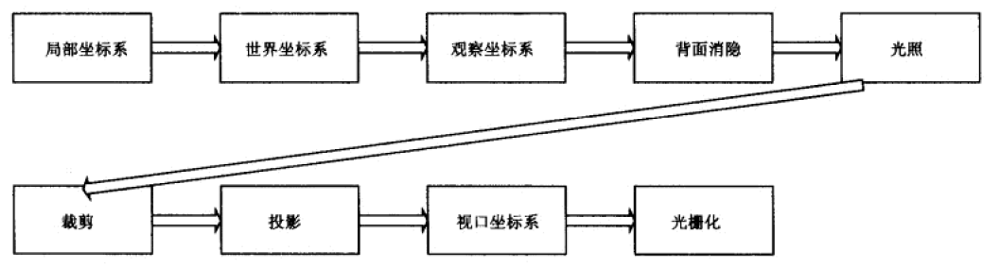
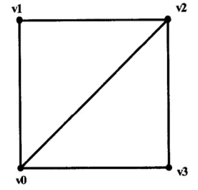
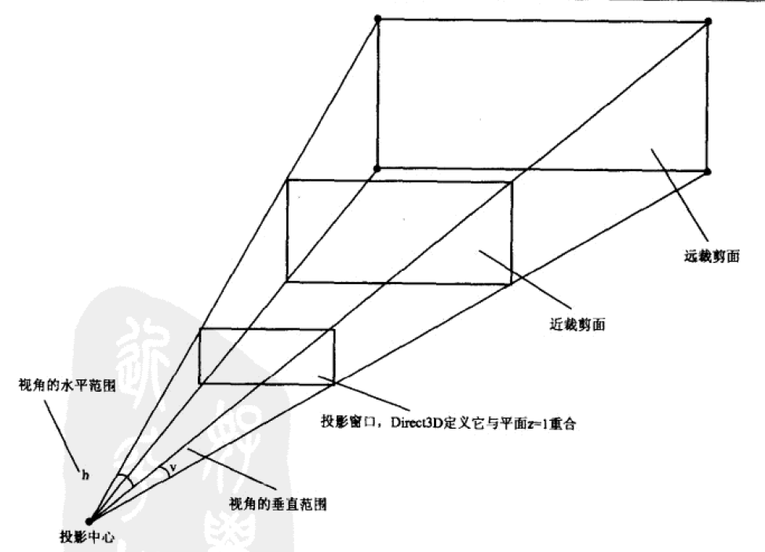

# 绘制流水线 Rendering Pipeline

这篇笔记我们简单介绍一下Direct3D9的绘制流水线。我们的三维模型加载到计算机内存中，到绘制到用户的屏幕上，这中间会经过一系列的处理过程，这些处理过程合到一起，我们称它为绘制流水线。

下图是对D3D绘制流水线的一个概括，后文我们会详细说明。



## 模型表示

在D3D中，任何物体都是用三角形面逼近表示的。在3dsMax等软件中，虽然我们能够在模型上建立多边形面，但实际上，在程序中它们都是用三角形面模拟的，所以任何三维物体实际上都可以表示为一组三角型图元。除了三角型图元，D3D还支持点和线图元，它们起一些辅助作用。

### 描述三角型图元的顶点

描述一个三角型，我们用三个顶点就可以了，但是D3D中顶点还包含颜色和法线属性，也可能包含一个该顶点对应的UV坐标。D3D为顶点定义了灵活顶点格式（Flexible Vertex Format）。

例子：
```cpp
// 包含顶点位置 漫射光颜色
#define FVF_COLOR ( D3DFVF_XYZ | D3DFVF_DIFFUSE );
// 包含顶点位置 顶点法线 UV纹理坐标
#define FVF_NORMAL_TEX1 ( D3DFVF_XYZ | D3DFVF_NORMAL | D3DFVF_TEX2 );
```

参考文档：[https://docs.microsoft.com/en-us/windows/desktop/direct3d9/d3dfvf](https://docs.microsoft.com/en-us/windows/desktop/direct3d9/d3dfvf)

### 描述三角形图元

有了顶点，我们就可以用顶点表示三角形图元，进而表达整个三维物体的表面网格。但是还有一个问题，我们要考虑背面剔除，我们不用把每个面都渲染，剔除掉背向摄像机的面能够减少很多运算量。

Direct3D中，通过三角形面顶点的指定顺序标记面的朝向，在观察坐标系中，D3D默认顺时针定义顶点的三角形面是朝向摄像机的，逆时针定义顶点的三角形面是背向摄像机的。

D3D中，一个模型的所有顶点使用绕序进行定义，例子：



表示为：
```
Vertex rect[6] = {
  v0, v1, v2,
  v0, v2, v3
};
```

然而，我们可以发现，许多三角形图元组成的表面有大量重合的顶点，如果带着这些重合的顶点去直接渲染，就太占内存了。我们去掉重合的顶点，再引入一层索引，用索引表示要渲染处理的顶点，就能解决这个问题了。上图中，我们可以表示为：

```
Vertex rect[4] = {v0, v1, v2, v3};
WORD indexList[6] = {
  0, 1, 2,
  0, 2, 3
};
```

## 平截头体和摄像机

摄像机观察三维空间的范围可以定义为一个平截头体：



近裁剪面和远裁剪面定义了摄像机能够观察的最远和最近的范围，投影窗口我们可以理解为屏幕视口（实际上还有一些差别，视口可能只是投影窗口的一部分），三维空间在二维平面上投影才能用于屏幕显示，实际上我们一般把近裁剪面设定成和投影窗口所在平面重合（D3D中投影平面位于`z=1`的位置）。

## 绘制流水线

这里我们针对绘制流水线中的每一个步骤进行解释。

### 局部坐标系和世界坐标系

我们编写3D游戏时，一般做法都是在3D软件中建模，然后倒入游戏引擎场景，调整大小和方位，摆到合适的位置。这其实就可以类比为D3D中，局部坐标系变换到世界坐标系的构成。

局部坐标系是用于定义构成物体的三角形图元列表的坐标系，一个物体在自身的局部坐标系中构建起来非常方便，在局部坐标系中，我们不必考虑该物体相对于整个世界的位置、朝向等问题，这些内容都在局部坐标系变换到世界坐标系时进行统一指定。

一个物体在局部坐标系中构建完成后，就可以进行矩阵变换到世界坐标系，该变换包括平移、旋转和缩放。

### 观察坐标系

在世界空间中，摄像机代表我们观察的方位，摄像机的位置和朝向可能是任意的，但是所有物体都是相对世界坐标系进行设定的，我们从任意位置观察，这就需要再引入一个世界坐标系到观察坐标系的变换，我们称变换之后用来真正给用户呈现的坐标系叫观察坐标系。

将世界坐标系变换到观察坐标系，这个操作叫做取景变换。

### 背面剔除

每个多边形都有正面和背面，渲染背面没有意义，因为它根本看不到，因此我们需要有一个背面剔除机制。前面已经介绍过使用绕序顺逆时针对表面的朝向进行标记，D3D默认会被标记为背面的表变不进行渲染。

当然，我们也可以手动关闭背面剔除功能，但一般用不上。

### 光照

光源在世界坐标系中定义，转换到观察坐标系后进行运算，点亮被观察的物体。在D3D9中，我们能够通过固定渲染流水线和可编程渲染流水线实现光照模式。

### 裁剪

渲染平截头体外的几何体是没有意义的，D3D会把它们剔除掉以提升渲染运算的性能。一个图元和平截头体之间的关系可能有三种情况：

* 完全位于平截头体外
* 完全位于平截头体内
* 一部分位于平截头体内，一部分位于平截头体外

前两种情况很好处理，第三种情况该图元会被分为两部分，位于平截头体内的部分将被保留，位于平截头体外的部分将被剔除。

### 投影和视口变换

计算机中的三维场景最终是要显示到屏幕上的，这还要把三维空间投影到二维空间（投影窗口）上。但是投影窗口还不是最终的屏幕，而需要经过横纵比拉伸，以及视口坐标变换，才能把所有数据正确的对应到显示器上。

注意：视口可能并不是整个屏幕，而是Windows中的一个窗口。

### 光栅化

我们把数据对应到视口上后，接下来就是绘制二维图像的阶段了，光栅化过程中，会根据顶点数据计算图元的每个像素值，这一步的计算量非常大，但这也正是显卡的主要工作，最终经过这一系列的计算，3D场景就能呈现在屏幕上了。
