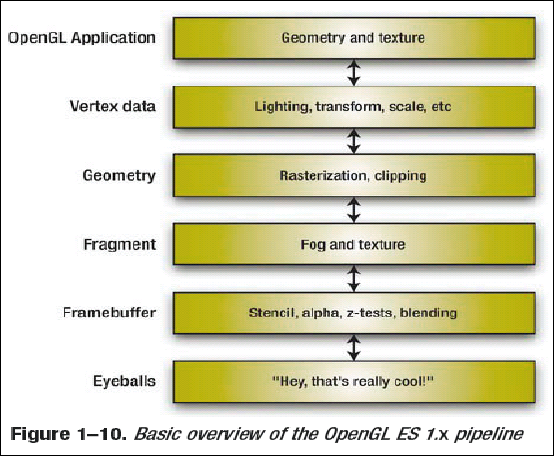
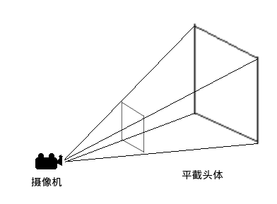
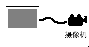
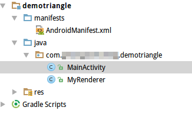
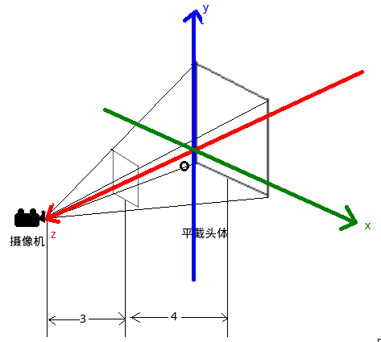
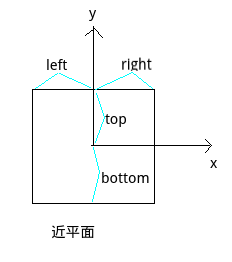
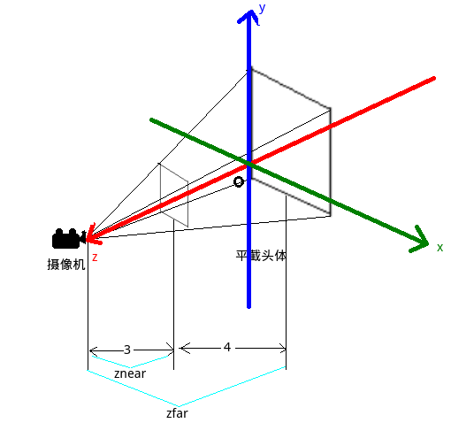
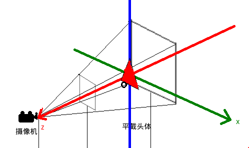
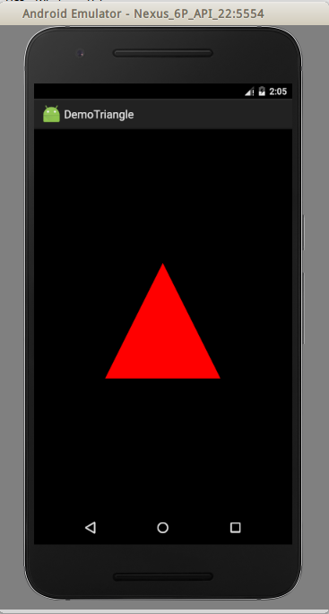

# 简介
OpenGLES是用于嵌入式设备的图形显示接口，是PC上OpenGL的简化版本。OpenGLES1.0对应于OpenGL1.3版本。虽然现在OpenGL已经出到了4.5，但是我尝试了很久，都感觉太复杂了，难以入门。最近偶然看了OpenGLES1.0，再加上最近了解了一下安卓SDK，跟着学了几天，终于入门了，我想如果以后继续深入学习，应该已经具备一些基本概念了。

# 基本概念

## OpenGL的状态机模型

OpenGL可以抽象看成一个机器，你在上面拨开关，机器一旦启动，你打开一个开关，它就会做出相应的反应，你不动那个开关，它就一直开着。

## 矩阵变换

如果掌握了高等数学的线性代数，OpenGL的三维世界就很容易理解，我们有一个三维的世界坐标系，因此在这个坐标系中，可以用(x,y,z)坐标确定一个点，两个点可以确定一个三维空间中的直线，三个点可以确定一个三维空间中的面，任何复杂的几何体由若干个面组成，因此任何几何体都能用一组点来表示，为了便于计算，这组点可以看成一个矩阵，任何对这个几何体的变换，都是对这个矩阵的变换。OpenGL是由显卡驱动实现的，它所做的，就是封装一些常用的矩阵变换提供给上层程序，以及指挥显卡将传入的各种矩阵（图形）显示出来。

## 矩阵模式和单位阵

由于绘制操作要设定不同类型的参数，也就是说在三维空间有不同矩阵要设定，因此OpenGL需要知道矩阵模式，也就是说，需要知道当前设定的是哪个矩阵。而在线性代数中，矩阵变换是原矩阵乘参数矩阵，得到变换后矩阵，因此在openGL中，设定矩阵前要用单位矩阵初始化。

而矩阵模式分为投影矩阵和模型视图矩阵，其实很好理解，你观察一个物体，投影矩阵就是站在你的角度，改变投影矩阵就是你从不同的地方观察这个物体，模型视图矩阵就是站在物体的角度，物体动来动去，展现出不同的角度让你观察。

## Pipeline（管线）



术语pipeline指彼此联系的一系列事件，OpenGL中，渲染管线就是绘制一幅图像需要的一系列工作。想要显示出一幅图像，大致流程是：应用程序阶段（根据业务逻辑编写的OpenGL代码）->几何阶段（OpenGL实现运算各种矩阵变换）->光栅阶段（指挥显卡显示图形）。实际上我们要做的就是调用OpenGL函数，基本流程包括：设置视口（Viewport），摆放摄像机（camera或eye），设置平截头体（frustum），绘制顶点矩阵（几何图形）。

## 投影和深度

现实世界中，观察远处物体和近处物体是有区别的，近处显得大一些，远处显得小一些，而计算机屏幕是平面，显示三维图形需要将逻辑上的三维物体（矩阵）投影到二维屏幕上，这就是投影。有深度区别的投影叫透视投影，没有深度区别的投影叫正投影。一幅风景画，显然应该使用透视以具有远近的感觉，而一个工业零件如果使用透视投影，可能变得很怪异，正方体可能感觉像是一个棱台，因此投影方式应该根据需求合理选择。

## 世界坐标系

绘制三维图形需要一个三维坐标系，矩阵变换就是依赖于顶点坐标。OpenGL中，使用一个世界坐标系确定所有的点。

## Frustum（平截头体）和摄像机



如图所示，在三维空间中，我们向前观察的区域可以简化看成一个四棱台，这个四棱台就是Frustum（平截头体），两个台面分别称作近平面和远平面，摄像机通过这个平截头体观察虚拟的三维世界，超出平截头体区域的几何体不会被绘制。

## Viewport（视口）



简单理解，视口就像电视屏幕，它有自己的大小，信号传进电视，它就显示出画面，如果信号里的画面和屏幕比例不太一样，画面就会向一个方向拉伸。

# 环境搭建

* Android Studio 现已在developers.google.cn提供下载
* Android SDK

我们先从绘制一个三角形开始。新建一个安卓项目，在安卓中使用OpenGL需要一个GLSurfaceView，因此新建一个Activity，绑定一个GLSurfaceView即可。

GLSurfaceView需要设置一个Renderer（渲染器）参数，这个渲染器类就是我们调用OpenGL函数，进行绘图的类，我们需要继承这个Renderer接口。



MainActivity.java
```java
public class MainActivity extends Activity
{   
    @Override   
    protected void onCreate(Bundle savedInstanceState)   
    {      
        super.onCreate(savedInstanceState);      
        GLSurfaceView glSurfaceView = new GLSurfaceView(this);      
        glSurfaceView.setRenderer(new MyRenderer());      
        setContentView(glSurfaceView);   
    }
}
```

# 怎样绘制第一个例子

## 确定基本参数



画图之前需要确定一些重要的参数，首先我们确定坐标系和平截头体，如图，方便起见，我们把世界坐标系原点放在平截头体中央，坐标轴正方向如图所示，同时规定摄像机到近平面距离为3，平截头体厚度为4，这样可以得知，摄像机坐标为（0,0,5），近平面z坐标位+2，远平面z坐标为-2。为了确定近平面的x和y坐标，我们假设视口宽高为width和height，比例ratio=width/height，因此我们规定近平面高度为1，宽度为ratio，这样是为了和视口保持一致的比例，防止画面走形，这样近平面也就确定了。

## 画一个三角形

MyRenderer.java
```java
package com.ciyaz.demotriangle;

import android.opengl.GLSurfaceView;
import android.opengl.GLU;

import java.nio.ByteBuffer;
import java.nio.ByteOrder;
import java.nio.FloatBuffer;

import javax.microedition.khronos.egl.EGLConfig;
import javax.microedition.khronos.opengles.GL10;

public class MyRenderer implements GLSurfaceView.Renderer
{

	//该方法在surfaceView初始化时调用
	@Override
	public void onSurfaceCreated(GL10 gl, EGLConfig config)
	{
		//启用顶点缓冲区
		gl.glEnableClientState(GL10.GL_VERTEX_ARRAY);
	}

    //SurfaceView初始化过程中，被指定大小时调用
	@Override
	public void onSurfaceChanged(GL10 gl, int width, int height)
	{
		//设置视口,输出画面的区域
		gl.glViewport(0, 0, width, height);
		//计算宽高比例用于设置平截头体
		float ratio = (float) width / (float) height;

		//设置矩阵模式为投影矩阵
		gl.glMatrixMode(GL10.GL_PROJECTION);
		//加载单位矩阵
		gl.glLoadIdentity();
		//设置平截头体
		//left right top bottom 前平面上下左右距离
		//znear zfar 前后平面距摄像机距离
		gl.glFrustumf(-ratio, ratio, -1, 1, 3, 7);
	}

    //画面刷新时调用
	@Override
	public void onDrawFrame(GL10 gl)
	{
		//设定矩阵模式为模型视图矩阵
		gl.glMatrixMode(GL10.GL_MODELVIEW);
		gl.glLoadIdentity();
		//设置摄像机
		//eyex eyey eyez 放置眼球坐标
		//centerx centery centerz 眼球观察点
		//upx upy upz 指定眼球向上的向量
		GLU.gluLookAt(gl, 0, 0, 5, 0, 0, 0, 0, 1, 0);

		//三角形顶点数组
		float[] coords = {0f, 0.5f, 0f, -0.5f, -0.5f, 0f, 0.5f, -0.5f, 0f};

		//为三角形顶点数组分配缓冲区
		ByteBuffer byteBuffer = ByteBuffer.allocateDirect(coords.length * 4);
		byteBuffer.order(ByteOrder.nativeOrder());
		FloatBuffer floatBuffer = byteBuffer.asFloatBuffer();
		floatBuffer.put(coords);
		floatBuffer.position(0);

		//设置绘图颜色为红色
		gl.glColor4f(1f, 0f, 0f, 1f);

		//将准备好的缓冲区送入顶点缓冲区
		//size 一个点由几个数据组成 type 数据类型 stribe 跨度 pointer 缓冲区
		gl.glVertexPointer(3, GL10.GL_FLOAT, 0, floatBuffer);
		//绘制三角形
		//mode 想要绘制的图元 first 起始点 count 点数
		gl.glDrawArrays(GL10.GL_TRIANGLES, 0, 3);
	}
}
```

onSurfaceCreated函数在GLSurfaceView创建时首先调用，在这里我们启用顶点缓冲区，上文说道几何体就是个矩阵，这个矩阵想要被绘制，就应该把它放置在顶点缓冲区里。

onSurfaceChanged函数在这个SurfaceView控件真正被绘制时回调，安卓框架绘制这个控件时会根据布局改变它的大小，并给我们传入宽和高，我们根据这两个数据求得ratio，并设置平截头体。在设置平截头体之前，需要告诉OpenGL我们要操纵投影矩阵（34行），然后加载单位阵（36行）。设置平截头体的参数作用如图：




onDrawFrame函数在画面每次渲染时调用。首先我们设定矩阵模式为模型视图矩阵，然后加载单位矩阵，紧接着设置摄像机。这里由三个参数确定摄像机，摄像机的坐标，摄像机的观察点，摄像机的向上的方向向量。可以想象，只给出摄像机坐标，摄像机是可以随意转动的，给定观察点，确定了摄像机的朝向，但摄像机的镜头仍然可以以朝向向量为轴旋转，再告诉摄像机哪里朝上，就可以最终把摄像机确定下来。

紧接着我们给定一个数组，实际上这是三角形三个点的坐标矩阵，这三个点在三维空间确定了一个唯一的三角形（如图）。



为了从Java数组传递给OpenGL，我们把顶点数组转换成FloatBuffer。64行指定OpenGL使用红色绘制三角形，71行将FloatBuffer数据指定给OpenGL的顶点缓冲区，74行告诉OpenGL，执行绘制命令，其中参数意义见代码注释。

## 运行结果


