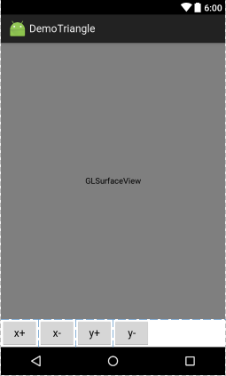

# 几何体如何转动

几何体是顶点矩阵组成的，因此这个几何体的旋转等变换操作都是通过矩阵变换实现的，OpenGL封装了这些操作，所以不需要我们手动计算了，只需要调用封装好的glRotate()函数即可。

# OpenGL绘图线程

根据以往经验，绘制一个物体的动态图像，其实就是计算一个每一帧该物体的位置，用背景清除上一帧，然后将新的物体位置画在屏幕上，这需要一个while(true)循环。但OpenGLES中，这些工作已经封装好了，OpenGL的绘图操作是单独的一个线程，并且onDrawFrame()函数会自动循环调用。我们可以打开DDMS观察这些线程，或者在renderer的三个函数中用Log观察其被调用情况。

# 调用glRotate()函数
首先在上一节三角形代码基础上添加一个布局文件，上方是GLSurfaceView，下方加入了4个按钮。



MyRenderer.java
```java
package com.ciyaz.demotriangle;

import android.opengl.GLSurfaceView;
import android.opengl.GLU;

import java.nio.ByteBuffer;
import java.nio.ByteOrder;
import java.nio.FloatBuffer;

import javax.microedition.khronos.egl.EGLConfig;
import javax.microedition.khronos.opengles.GL10;

public class MyRenderer implements GLSurfaceView.Renderer
{

	public float rotateX = 0;
	public float rotateY = 0;

	//该方法在surfaceView初始化时调用
	@Override
	public void onSurfaceCreated(GL10 gl, EGLConfig config)
	{
		//设置清屏颜色
		gl.glClearColor(0, 0, 0, 1);
		//启用顶点缓冲区
		gl.glEnableClientState(GL10.GL_VERTEX_ARRAY);
	}

	@Override
	public void onSurfaceChanged(GL10 gl, int width, int height)
	{
		//设置视口,输出画面的区域
		gl.glViewport(0, 0, width, height);
		//计算宽高比例用于设置平截头体
		float ratio = (float) width / (float) height;

		//设置矩阵模式为投影矩阵
		gl.glMatrixMode(GL10.GL_PROJECTION);
		//加载单位矩阵
		gl.glLoadIdentity();
		//设置平截头体
		//left right top bottom 前平面上下左右距离
		//znear zfar 前后平面距摄像机距离
		gl.glFrustumf(-ratio, ratio, -1, 1, 3, 7);
	}

	@Override
	public void onDrawFrame(GL10 gl)
	{
		//清屏
		gl.glClear(GL10.GL_COLOR_BUFFER_BIT);

		//设定矩阵模式为模型视图矩阵
		gl.glMatrixMode(GL10.GL_MODELVIEW);
		gl.glLoadIdentity();

		//设置摄像机
		//eyex eyey eyez 放置眼球坐标
		//centerx centery centerz 眼球观察点
		//upx upy upz 指定眼球向上的向量
		GLU.gluLookAt(gl, 0, 0, 5, 0, 0, 0, 0, 1, 0);

		//旋转坐标变换
		//angle 角度 xyz 旋转轴的方向向量
		gl.glRotatef(rotateX, 1, 0, 0);
		gl.glRotatef(rotateY, 0, 1, 0);

		//三角形顶点数组
		float[] coords = {0f, 0.5f, 0f, -0.5f, -0.5f, 0f, 0.5f, -0.5f, 0f};

		//为三角形顶点数组分配缓冲区
		ByteBuffer byteBuffer = ByteBuffer.allocateDirect(coords.length * 4);
		byteBuffer.order(ByteOrder.nativeOrder());
		FloatBuffer floatBuffer = byteBuffer.asFloatBuffer();
		floatBuffer.put(coords);
		floatBuffer.position(0);

		//设置绘图颜色为红色
		gl.glColor4f(1f, 0f, 0f, 1f);

		//将准备好的缓冲区送入顶点缓冲区
		//size 一个点由几个数据组成 type 数据类型 stribe 跨度 pointer 缓冲区
		gl.glVertexPointer(3, GL10.GL_FLOAT, 0, floatBuffer);
		//绘制三角形
		//mode 想要绘制的图元 first 起始点 count 点数
		gl.glDrawArrays(GL10.GL_TRIANGLES, 0, 3);
	}
}
```

渲染器代码中，加入了两个参数rotateX和rotateY，用于表示旋转的角度。

为了达到重绘效果，这里还进行了清屏操作。`gl.glClearColor(0, 0, 0, 1)`设置了清屏使用黑色，每次调用onDrawFrame()函数，清屏代码`gl.glClear(GL10.GL_COLOR_BUFFER_BIT)`就会执行，擦除上一帧的内容。

`gl.glRotatef()`是旋转函数，在OpenGL中，旋转是针对坐标轴的，也就是说glRotate()旋转的是整个坐标系，而不是某个几何体的矩阵，这也可以理解，因为OpenGL不是面向对象的，它不知道哪些点组成了一个可旋转的几何体。glRotatef()中，f表示使用浮点数参数，还有个glRotatex，x表示使用整数，glRotate()参数中，angle表示角度(单位是度)，xyz是旋转轴的方向向量。

MainActivity.java
```java
package com.ciyaz.demotriangle;

import android.app.Activity;
import android.opengl.GLSurfaceView;
import android.os.Bundle;
import android.view.View;

public class MainActivity extends Activity
{

	private MyRenderer renderer;

	@Override
	protected void onCreate(Bundle savedInstanceState)
	{
		super.onCreate(savedInstanceState);
		setContentView(R.layout.activity_main);

		GLSurfaceView glSurfaceView = (GLSurfaceView) findViewById(R.id.glsv);
		this.renderer = new MyRenderer();
		glSurfaceView.setRenderer(this.renderer);
	}

	public void xPositive(View v)
	{
		this.renderer.rotateX += 10;
	}
	public void xNegtive(View v)
	{
		this.renderer.rotateX -= 10;
	}
	public void yPositive(View v)
	{
		this.renderer.rotateY += 10;
	}
	public void yNegtive(View v)
	{
		this.renderer.rotateY -= 10;
	}
}
```

MainActivity中，添加相应按钮点击事件即可。

# 旋转和模型视图矩阵

其实旋转操作可以简单理解，glRotate()就是给模型视图矩阵乘一个参数矩阵，但是模型视图矩阵同时作用于摄像机和顶点矩阵，这种变换旋转的是摄像机还是顶点矩阵呢？其实旋转这两个是等价的，这里就不深究其数学原理了，这也是OpenGL中摄像机和顶点矩阵都使用模型视图矩阵的原因。
