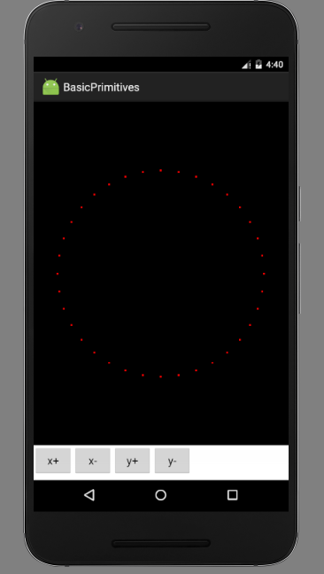
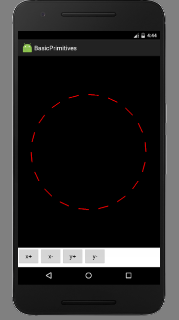
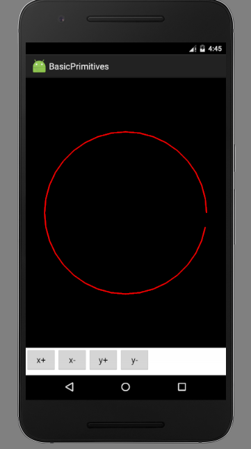
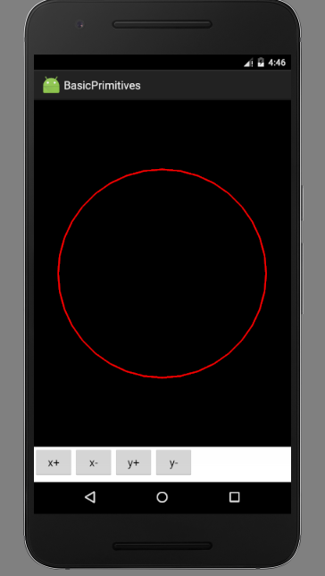
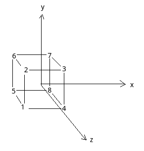
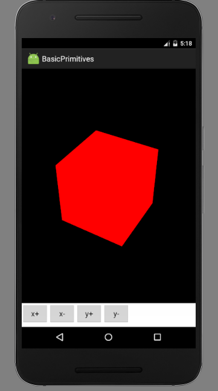
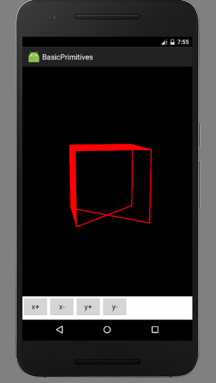

# 基本几何图元

OpenGLES中，基本几何图元包括点、线、三角形，可以想象，这三种图元足以表示整个三维世界了，现实中的物体模型，其实也都可以用大量三角形面表示出来。

# 画点

生成一些顶点，然后使用glDrawArrays()函数即可。之前画三角形，传入的参数是GL_TRIANGLES，画点就传入GL_POINTS。这里给出onDrawFrame()函数，其余两个函数和之前一样。

```java
@Override
public void onDrawFrame(GL10 gl)
{
	//清屏
	gl.glClear(GL10.GL_COLOR_BUFFER_BIT);

	//设定矩阵模式为模型视图矩阵
	gl.glMatrixMode(GL10.GL_MODELVIEW);
	gl.glLoadIdentity();

	//设置摄像机
	//eyex eyey eyez 放置眼球坐标
	//centerx centery centerz 眼球观察点
	//upx upy upz 指定眼球向上的向量
	GLU.gluLookAt(gl, 0, 0, 5, 0, 0, 0, 0, 1, 0);

	//旋转坐标变换
	//angle 角度 xyz 旋转轴的方向向量
	gl.glRotatef(rotateX, 1, 0, 0);
	gl.glRotatef(rotateY, 0, 1, 0);

	//生成一些顶点
	List<Float> vertexList = new ArrayList<>();
	float radius = 1f;
	for(int i = 0; i < 360; i += 10)
	{
		float x = (float) Math.cos(i * Math.PI / 180) * radius;
		float y = (float) Math.sin(i * Math.PI / 180) * radius;
		vertexList.add(x);
		vertexList.add(y);
		vertexList.add(0f);
	}

	//设置绘图颜色为红色
	gl.glColor4f(1f, 0f, 0f, 1f);

	//将准备好的缓冲区送入顶点缓冲区
	//size 一个点由几个数据组成 type 数据类型 stribe 跨度 pointer 缓冲区
	gl.glVertexPointer(3, GL10.GL_FLOAT, 0, BufferUtil.toFloatBuffer(vertexList));
	//绘制三角形
	//mode 想要绘制的图元 first 起始点 count 点数
	gl.glPointSize(9f);
	gl.glDrawArrays(GL10.GL_POINTS, 0, vertexList.size() / 3);
}
```

23-32行代码沿着一个圆生成了一些顶点，39行为了方便起见将List转FloatBuffer的过程封装进了一个类，这里就不展开了，42行指定绘制点的大小，默认大小实在太小了，根本看不清。43行调用glDrawArrays()函数，传入GL_POINTS进行绘制。



# 画线

现在利用画点代码中的顶点画线，只需向glDrawArray()传入画线参数即可。其中有三种不同的绘制方式：GL_LINES GL_LINE_STRIP GL_LINE_LOOP。假设有四个点p1,p2,p3,p4，GL_LINES模式绘制直线p1p2,p3p4。GL_LINE_STRIP绘制直线p1p2,p2p3,p3p4，GL_LINE_LOOP绘制直线p1p2,p2p3,p3p4,p4p1。

GL_LINES



GL_LINE_STRIP



GL_LINE_LOOP



# 画面

之前画的三角形就是进行了一个画面的操作。这次我们画一个立方体（Cube）。如图所示定义了立方体的顶点。立方体一共6个面，即12个三角形面，把所有三角形顺序绘制出来就行了。



原点处于立方体中心，立方体是正方体，边长2r。

```java
@Override
public void onDrawFrame(GL10 gl)
{
	//清屏
	gl.glClear(GL10.GL_COLOR_BUFFER_BIT);

	//设定矩阵模式为模型视图矩阵
	gl.glMatrixMode(GL10.GL_MODELVIEW);
	gl.glLoadIdentity();

	//设置摄像机
	//eyex eyey eyez 放置眼球坐标
	//centerx centery centerz 眼球观察点
	//upx upy upz 指定眼球向上的向量
	GLU.gluLookAt(gl, 0, 0, 5, 0, 0, 0, 0, 1, 0);

	//旋转坐标变换
	//angle 角度 xyz 旋转轴的方向向量
	gl.glRotatef(rotateX, 1, 0, 0);
	gl.glRotatef(rotateY, 0, 1, 0);

	//顶点
	float r = 0.5f;
	float[] vertex = {
			-r,-r,r,
			-r,r,r,
			r,r,r,
			r,-r,r,
			-r,-r,-r,
			-r,r,-r,
			r,r,-r,
			r,-r,-r,
	};
	//顶点索引
	byte[] indices = {
			0,3,1,
			1,3,2,
			5,4,0,
			5,0,1,
			2,3,7,
			2,7,6,
			6,7,5,
			7,4,5,
			5,1,6,
			6,1,2,
			0,4,3,
			3,4,7,
	};

	//设置绘图颜色为红色
	gl.glColor4f(1f, 0f, 0f, 1f);

	//将准备好的缓冲区送入顶点缓冲区
	//size 一个点由几个数据组成 type 数据类型 stribe 跨度 pointer 缓冲区
	gl.glVertexPointer(3, GL10.GL_FLOAT, 0, BufferUtil.toFloatBuffer(vertex));
	//线宽
	gl.glLineWidth(9f);
	//绘制三角形
	//图元 索引表长度 索引数据类型 索引缓冲区
	gl.glDrawElements(GL10.GL_TRIANGLES, indices.length, GL10.GL_UNSIGNED_BYTE, BufferUtil.toByteBuffer(indices));
}
```

为了简单，这里使用了顶点索引来画图，按上图中顺序定义好的顶点顺序绘制三角形面可能没法恰好构成一个立方体，所以用索引重新指定一下顶点绘制顺序，使其恰好构成一个立方体，60行调用glDrawElement()使用索引表进行绘制，参数见注释。注意：图里顶点标号是从1开始的，但代码中实际应该从0开始。



除了GL_TRIANGLES，还有GL_TRIANGLE_STRIP和GL_TRIANGLE_FAN，前两个类比直线很好理解，GL_TRIANGLE_FAN是绘制扇面，从第一个顶点出发，依次对其余顶点做三角形，这里就不演示了。

# 更简单的立方体

实际上上述绘制立方体的方式显然比较笨拙，可以用GL_TRIANGLE_STRIP显然可以减少索引的个数。然而，在OpenGL中，面是分正反的，默认面向观察者逆时针绘制的面是正面，另一面是反面，上述代码指定的索引都是使得立方体正面朝外的。如果一个面永远不可见，处于性能考虑，经常将其隐藏掉。因此，如果上图用GL_TRIANGLE_STRIP恐怕还要仔细思考一番，这里就偷懒了。

#深度测试和表面剔除

OpenGL中，后画上去的面会覆盖先画的面，启用深度测试，绘制时会考虑面的深度，也就是说，离观察者近的面如果挡住了远处的面，即使远处的面是后绘制的，也会被近处的面挡住。上一段说到了表面剔除的概念，OpenGL中默认定义：正对观察者的面，逆时针绘制的面是正面，当然顺时针还是逆时针，也是可以修改的。

开启深度测试：
```java
@Override
public void onSurfaceCreated(GL10 gl, EGLConfig config)
{
	//设置清屏颜色
	gl.glClearColor(0, 0, 0, 1);
	//启用顶点缓冲区
	gl.glEnableClientState(GL10.GL_VERTEX_ARRAY);
	//启用深度测试
	gl.glEnable(GL10.GL_DEPTH_TEST);
	//开启表面剔除
	gl.glEnable(GL10.GL_CULL_FACE);
	gl.glFrontFace(GL10.GL_CCW);
	gl.glCullFace(GL10.GL_BACK);

}
```

9行开启深度测试，11行开启表面剔除， 12行指定逆时针方向绘制的面为正面，13指定剔除正面。

启用表面剔除：
```java
@Override
public void onDrawFrame(GL10 gl)
{
	//清屏
	gl.glClear(GL10.GL_COLOR_BUFFER_BIT | GL10.GL_DEPTH_BUFFER_BIT);

	//设定矩阵模式为模型视图矩阵
	gl.glMatrixMode(GL10.GL_MODELVIEW);
	gl.glLoadIdentity();

	//设置摄像机
	//eyex eyey eyez 放置眼球坐标
	//centerx centery centerz 眼球观察点
	//upx upy upz 指定眼球向上的向量
	GLU.gluLookAt(gl, 0, 0, 5, 0, 0, 0, 0, 1, 0);

	//旋转坐标变换
	//angle 角度 xyz 旋转轴的方向向量
	gl.glRotatef(rotateX, 1, 0, 0);
	gl.glRotatef(rotateY, 0, 1, 0);

	//顶点
	float r = 0.5f;
	float[] vertex = {
			-r,-r,r,
			-r,r,r,
			r,r,r,
			r,-r,r,
			-r,-r,-r,
			-r,r,-r,
			r,r,-r,
			r,-r,-r,
	};
	//顶点索引
	byte[] indices = {
			0,3,1,
			1,3,2,
			5,4,0,
			5,0,1,
			2,3,7,
			2,7,6,
//			6,7,5,
//			7,4,5,
			5,1,6,
			6,1,2,
			0,4,3,
			3,4,7,
	};

	//设置绘图颜色为红色
	gl.glColor4f(1f, 0f, 0f, 1f);


	//将准备好的缓冲区送入顶点缓冲区
	//size 一个点由几个数据组成 type 数据类型 stribe 跨度 pointer 缓冲区
	gl.glVertexPointer(3, GL10.GL_FLOAT, 0, BufferUtil.toFloatBuffer(vertex));

	//线宽
	gl.glLineWidth(9f);
	//绘制三角形
	//图元 索引表长度 索引数据类型 索引缓冲区
	gl.glDrawElements(GL10.GL_TRIANGLES, indices.length, GL10.GL_UNSIGNED_BYTE, BufferUtil.toByteBuffer(indices));
	gl.glDrawArrays(GL10.GL_LINE_LOOP, 0, 8);
}
```

第5行初始化了颜色缓冲区和深度缓冲区，为了便于观察深度效果和剔除效果，42,43行注释掉了立方体的一个面，62行绘制了顶点连线。

运行结果如图（转动了一定角度）：


