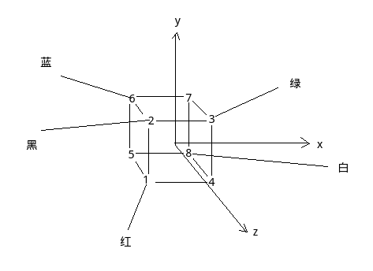
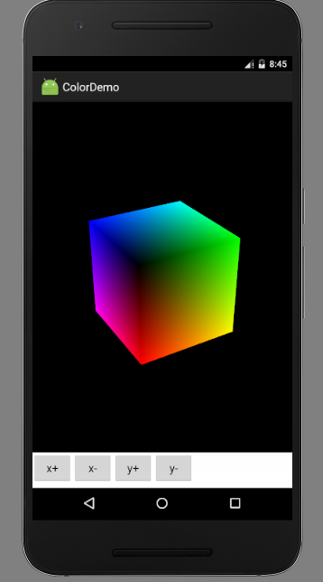

# 颜色的表示

OpenGL中使用RGBA四个参数表示颜色，分别代表红、绿、蓝、透明度，浮点值的RGB取值范围是0-1，Alpha值为1代表不透明，0为完全透明。

# 使用颜色

OpenGL中颜色对应顶点，颜色有颜色缓冲区，颜色缓冲区和顶点缓冲区就像两个一一对应的数组，每个顶点指定一个颜色。同时可以选择平滑着色和单调着色，平滑是指：一个面的三个顶点如果颜色不同，面上的颜色是平滑过渡的，单调着色则是根据三角形面最后绘制的一个顶点的颜色着色。

# 颜色立方体

这一节我们在上一节立方体的基础上绘制一些颜色。我们准备的颜色如图所示：



MyRenderer.java
```java
package com.ciyaz.colordemo;

import android.opengl.GLSurfaceView;
import android.opengl.GLU;

import javax.microedition.khronos.egl.EGLConfig;
import javax.microedition.khronos.opengles.GL10;

public class MyRenderer implements GLSurfaceView.Renderer
{

	public float rotateX = 0;
	public float rotateY = 0;

	//该方法在surfaceView初始化时调用
	@Override
	public void onSurfaceCreated(GL10 gl, EGLConfig config)
	{
		//设置清屏颜色
		gl.glClearColor(0, 0, 0, 1);
		//启用顶点缓冲区
		gl.glEnableClientState(GL10.GL_VERTEX_ARRAY);
		//启用颜色缓冲区
		gl.glEnableClientState(GL10.GL_COLOR_ARRAY);
		gl.glShadeModel(GL10.GL_SMOOTH);
		//启用深度测试
		gl.glEnable(GL10.GL_DEPTH_TEST);
		//开启表面剔除
		gl.glEnable(GL10.GL_CULL_FACE);
		gl.glFrontFace(GL10.GL_CCW);
		gl.glCullFace(GL10.GL_BACK);

	}

	@Override
	public void onSurfaceChanged(GL10 gl, int width, int height)
	{
		//设置视口,输出画面的区域
		gl.glViewport(0, 0, width, height);
		//计算宽高比例用于设置平截头体
		float ratio = (float) width / (float) height;

		//设置矩阵模式为投影矩阵
		gl.glMatrixMode(GL10.GL_PROJECTION);
		//加载单位矩阵
		gl.glLoadIdentity();
		//设置平截头体
		//left right top bottom 前平面上下左右距离
		//znear zfar 前后平面距摄像机距离
		gl.glFrustumf(-ratio, ratio, -1, 1, 3, 7);
	}

	@Override
	public void onDrawFrame(GL10 gl)
	{
		//清屏
		gl.glClear(GL10.GL_COLOR_BUFFER_BIT | GL10.GL_DEPTH_BUFFER_BIT);

		//设定矩阵模式为模型视图矩阵
		gl.glMatrixMode(GL10.GL_MODELVIEW);
		gl.glLoadIdentity();

		//设置摄像机
		//eyex eyey eyez 放置眼球坐标
		//centerx centery centerz 眼球观察点
		//upx upy upz 指定眼球向上的向量
		GLU.gluLookAt(gl, 0, 0, 5, 0, 0, 0, 0, 1, 0);

		//旋转坐标变换
		//angle 角度 xyz 旋转轴的方向向量
		gl.glRotatef(rotateX, 1, 0, 0);
		gl.glRotatef(rotateY, 0, 1, 0);

		//定义颜色数组
		float[] colors = {
				1,0,0,1,
				0,0,0,1,
				0,1,0,1,
				1,1,0,1,
				1,0,1,1,
				0,0,1,1,
				0,1,1,1,
				1,1,1,1,
		};
		//输入颜色缓冲区
		//size 几个数据表示一个颜色 type 数据类型 stride 跨度 pointer 缓冲区
		gl.glColorPointer(4, GL10.GL_FLOAT, 0, BufferUtil.toFloatBuffer(colors));

		DrawUtil.drawCube(gl);
	}
}
```

24行启用颜色缓冲区，25行指定平滑着色模式，75行按照预先的设计指定顶点颜色，87行将颜色数组送入缓冲区。上一节的立方体绘制代码封装进了DrawUtil类。


